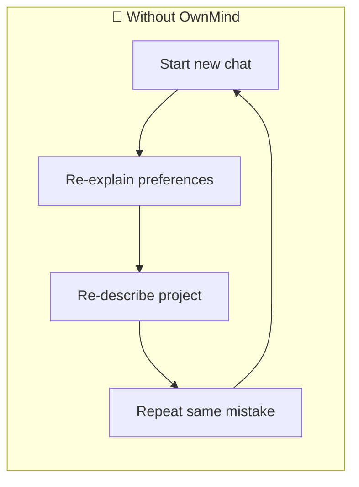
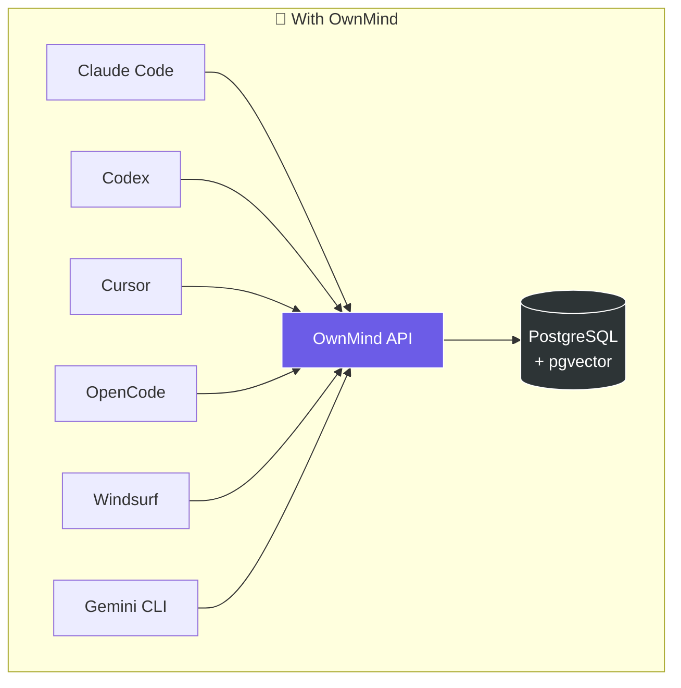
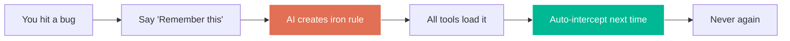
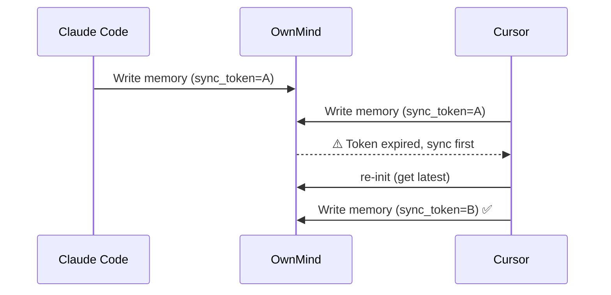

Personalized persistent memory for AI

[English](README.md) | [繁體中文](docs/README.zh-TW.md) | [日本語](docs/README.ja.md)

# OwnMind — Cross-platform AI Memory System

Let your AI tools share memory. Whether you use Claude Code, Codex, Cursor, Copilot, OpenCode, or any online AI, OwnMind lets all of them read and write your preferences, iron rules, and project context.

## Vision

OwnMind enables you to move freely across any LLM, editor, machine, project, or AI conversation — your memory is shared and switching is painless.

- **Install and forget** — After setup, OwnMind runs automatically. No learning curve, no manual steps. You won't even notice it's there.
- **Gets smarter over time** — The longer you use it, the richer your memory becomes. AI learns your work preferences, habits, and patterns — it gets better at helping you.
- **Data-driven evolution** — OwnMind collects usage data, friction points, and AI behavior metrics. This data feeds back into improving the product itself — better features, smarter defaults, continuous upgrades.
- **Seamless cross-platform** — One API for all tools. Switch from Claude Code to Cursor to Codex — your memory follows. Switch machines — your memory follows. No re-teaching.
- **Team standards enforcement** — Admins push company rules (git flow, coding standards, review policies) once. Every team member's AI auto-loads and enforces them. New hire? Standards apply from day one.

## Why OwnMind?

### Three fundamental problems with today's AI tools



**1. Every conversation starts from zero**
You've told your AI a hundred times "don't use var" or "check env vars before deploying," but next conversation it forgets everything. You waste time re-teaching the same things.

**2. Switch tools, lose memory**
You spent the morning coding with Claude Code, then switch to Cursor in the afternoon — it has no idea what you did. Your experience is locked inside a single tool.

**3. Past mistakes will happen again**
Last week's deployment crashed because of a missed env var. You remember, but the AI doesn't. Next time, it'll make the same mistake.

### How OwnMind solves this



**One API, shared memory across all tools.** Teach once, every AI knows.

## Who is OwnMind for?

- **Developers using multiple AI tools daily** — Stop re-explaining your preferences to each tool
- **People working across projects and devices** — Your memory follows you everywhere
- **Tech leads with team AI standards** — Push rules once, enforce everywhere
- **Power users who want AI that evolves** — Let your AI accumulate experience over time

## Top 3 phrases you'll use

| You say | AI does |
|---------|---------|
| **"Remember this"** | Saves it as an iron rule — persisted across all tools, never forgotten |
| **"What did you learn?"** | Reviews the conversation, lists new knowledge worth saving |
| **"What's left to do on this project?"** | Pulls up progress and TODOs from all projects |

## Core Features

### Memory & Protection



- **Cross-platform memory** — One API, all AI tools share it
- **Iron rule management** — Lessons learned are never forgotten, with full context
- **Real-time rule enforcement** — Rules auto-load at session start, AI proactively blocks violations
- **Trigger tags** — Rules tagged with triggers (`trigger:commit`, `trigger:deploy`), AI auto-checks before those actions
- **Rule version history** — Old versions preserved automatically, full evolution traceable

### Collaboration & Sync



- **Sync Token** — Auto-detect conflicts when multiple tools write simultaneously `v1.8.0`
- **Handoff** — Seamlessly hand off work between different tools
- **Team standards** — Admins push rules, members auto-load them `v1.8.0`
- **Rule quality tracking** — Auto-track enforced/missed/triggered counts, alert on low compliance `v1.8.0`

### Observability & Analytics `v1.9.0`

- **Activity logging** — All OwnMind events tracked locally + uploaded to server
- **Compliance reporting** — AI auto-reports whether iron rules were followed, skipped, or violated
- **Admin dashboard** — User stats, tool/model distribution, daily activity, compliance rates
- **Cross-dimensional analysis** — Compliance by tool, by model, by rule, by user
- **Context reporting** — AI reports friction points and improvement suggestions each session
- **Session auto-logging** — AI auto-logs work summary with structured context at end of each conversation
- **3-month compression** — Old session logs auto-compress into monthly summaries

### Infrastructure

- **Secret management** — Securely store API keys and passwords
- **Semantic search** — Powered by pgvector
- **Tiered compression** — Short-term memory auto-compresses, long-term persists forever
- **Windows native support** — `install.ps1` and `start.cmd` included

## Quick Start

### 1. Get an API Key

Contact the admin to get your API key.

### 2. Install

**Windows** users can install with PowerShell:
```powershell
irm https://raw.githubusercontent.com/miou1107/ownmind/main/install.ps1 -OutFile install.ps1
.\install.ps1 YOUR_API_KEY
```

**Mac / Linux / Git Bash** users:
```bash
curl -sL https://raw.githubusercontent.com/miou1107/ownmind/main/install.sh | bash -s -- YOUR_API_KEY
```

Or paste this prompt into your AI tool (Claude Code, Codex, Cursor, etc.):

```
Install OwnMind: curl -sL https://raw.githubusercontent.com/miou1107/ownmind/main/install.sh | bash -s -- YOUR_API_KEY YOUR_API_URL
```

If your tool can't run shell commands, use this prompt instead:

```
Clone https://github.com/miou1107/ownmind to ~/.ownmind/, run npm install in ~/.ownmind/mcp/, then run bash ~/.ownmind/install.sh YOUR_API_KEY YOUR_API_URL
```

### 3. Start Using

After installation, OwnMind auto-loads your memory at every new session. No manual steps needed.

## Use Cases

### 1. Make AI remember your lessons forever
> You: "Remember this — always check env vars before deploying"

AI creates an iron rule with full context. Next time, no matter which tool or AI, it won't repeat the mistake.

### 2. Ask what's left to do
> You: "What's left on the ring project?"

AI pulls up the project's TODO list and progress from OwnMind.

### 3. Seamless handoff between tools
> You (in Claude Code): "Wrap up and hand off to Codex"

AI packages progress, TODOs, and notes into OwnMind. Switch to Codex, start a new chat, and AI picks up right where you left off.

### 4. AI self-review
> You: "What did you learn today?"

AI reviews the entire conversation, lists undocumented knowledge, and asks which to save.

### 5. Proactive rule enforcement
> AI is about to deploy with multiple SSH sessions...
>
> 【OwnMind Triggered】You reminded me: "Don't open multiple SSH sessions" — I must follow this rule.

AI stops itself the moment it's about to violate a rule. No reminder needed.

### 6. Multi-tool, no conflicts
> You're working in Claude Code and Cursor simultaneously, both writing memory...
>
> 【OwnMind】State change detected, re-initializing to get latest memory...

Sync Token auto-detects conflicts. Validates before write, syncs if expired. No overwrites.

### 7. Team standards, set once for everyone
> Admin: "New team rule: all API responses must include request_id"
>
> 【OwnMind】⚠️ You're about to add a team standard. This will apply to all members. Type "I confirm".

Team rules pushed by admins, auto-loaded by members, enforced with reminders. Individual opt-out available but persistent reminders continue.

### 8. Rule compliance with data
> You: "How am I doing on my iron rules?"
>
> 【OwnMind】Rule stats: IR-001 SSH Rule — enforced 12 times, triggered 3 times, missed 0 (compliance: 100%)

Every rule auto-tracks enforced/missed/triggered counts. Low compliance rules trigger proactive alerts.

### 9. New machine, memory follows
> You (on a new computer): "Install OwnMind, API Key is xxx"

AI completes setup automatically. All your preferences, rules, and project context are instantly available.

## API Reference

### Authentication
All API requests require the header:
```
Authorization: Bearer YOUR_API_KEY
```

### Main Endpoints

| Endpoint | Description |
|----------|-------------|
| `GET /api/memory/init` | Load memory (profile + principles + instructions) |
| `GET /api/memory/type/:type` | Get memories by type |
| `GET /api/memory/search?q=` | Semantic search |
| `POST /api/memory` | Create memory |
| `PUT /api/memory/:id` | Update memory |
| `PUT /api/memory/:id/disable` | Disable memory |
| `POST /api/handoff` | Create handoff |
| `GET /api/handoff/pending` | Get pending handoffs |
| `POST /api/session` | Log session |
| `GET /api/export` | Export all memories |
| `GET /health` | Health check |

### Memory Types

| Type | Description |
|------|-------------|
| `profile` | Identity, communication preferences, work style |
| `principle` | Core principles and vision |
| `iron_rule` | Iron rules: inviolable rules created from past mistakes |
| `coding_standard` | Technical preferences and coding standards |
| `team_standard` | Team standards: admin-pushed, shared across members |
| `project` | Project context: architecture, environment, progress |
| `portfolio` | Portfolio |
| `env` | Development environment info |

## Tech Stack

- **Runtime:** Node.js + Express
- **Database:** PostgreSQL + pgvector
- **MCP:** @modelcontextprotocol/sdk
- **Deploy:** Docker Compose

## Contributors

- Vin (miou1107)

## License

MIT
