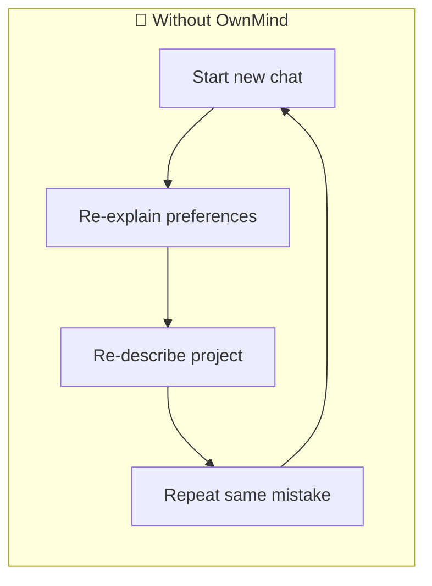
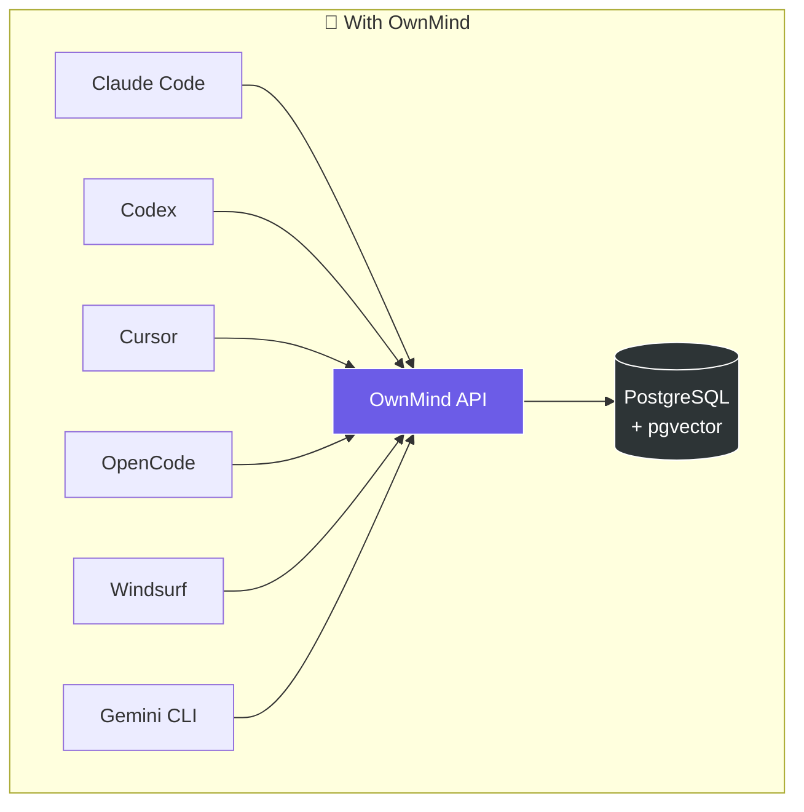
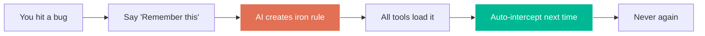
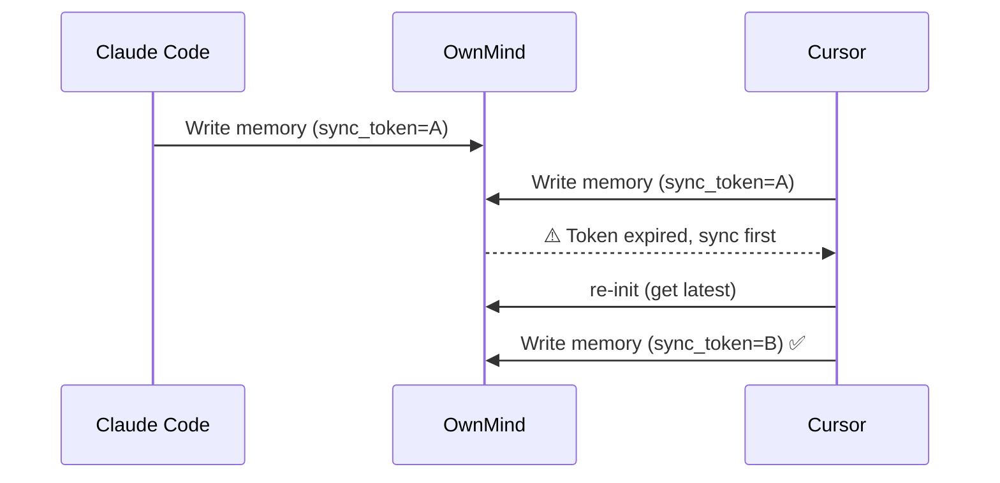

Personalized persistent memory for AI

[English](README.md) | [繁體中文](docs/README.zh-TW.md) | [日本語](docs/README.ja.md)

**Current version: v1.17.7** · see [CHANGELOG](CHANGELOG.md) for details

# OwnMind — Cross-platform AI Memory System

Let your AI tools share memory. Whether you use Claude Code, Codex, Cursor, Copilot, OpenCode, or any online AI, OwnMind lets all of them read and write your preferences, iron rules, and project context.

## Vision

OwnMind enables you to move freely across any LLM, editor, machine, project, or AI conversation — your memory is shared and switching is painless.

- **Install and forget** — After setup, OwnMind runs automatically. No learning curve, no manual steps. You won't even notice it's there.
- **Gets smarter over time** — The longer you use it, the richer your memory becomes. AI learns your work preferences, habits, and patterns — it gets better at helping you.
- **Data-driven evolution** — OwnMind collects usage data, friction points, and AI behavior metrics. This data feeds back into improving the product itself — better features, smarter defaults, continuous upgrades.
- **Seamless cross-platform** — One API for all tools. Switch from Claude Code to Cursor to Codex — your memory follows. Switch machines — your memory follows. No re-teaching.
- **Team standards enforcement** — Admins push company rules (git flow, coding standards, review policies) once. Every team member's AI auto-loads and enforces them. New hire? Standards apply from day one.
- **Multi-admin management** — Three-tier role hierarchy (super_admin > admin > user), password management, full audit trail `v1.12.0`

## Why OwnMind?

### Three fundamental problems with today's AI tools



**1. Every conversation starts from zero**
You've told your AI a hundred times "don't use var" or "check env vars before deploying," but next conversation it forgets everything. You waste time re-teaching the same things.

**2. Switch tools, lose memory**
You spent the morning coding with Claude Code, then switch to Cursor in the afternoon — it has no idea what you did. Your experience is locked inside a single tool.

**3. Past mistakes will happen again**
Last week's deployment crashed because of a missed env var. You remember, but the AI doesn't. Next time, it'll make the same mistake.

### How OwnMind solves this



**One API, shared memory across all tools.** Teach once, every AI knows.

## Who is OwnMind for?

- **Developers using multiple AI tools daily** — Stop re-explaining your preferences to each tool
- **People working across projects and devices** — Your memory follows you everywhere
- **Tech leads with team AI standards** — Push rules once, enforce everywhere
- **Power users who want AI that evolves** — Let your AI accumulate experience over time

## Top 3 phrases you'll use

| You say | AI does |
|---------|---------|
| **"Remember this"** | Saves it as an iron rule — persisted across all tools, never forgotten |
| **"What did you learn?"** | Reviews the conversation, lists new knowledge worth saving |
| **"What's left to do on this project?"** | Pulls up progress and TODOs from all projects |

## Core Features

### Memory & Protection



- **Cross-platform memory** — One API, all AI tools share it
- **Iron rule management** — Lessons learned are never forgotten, with full context
- **Real-time rule enforcement** — Rules auto-load at session start, AI proactively blocks violations
- **Trigger tags** — Rules tagged with triggers (`trigger:commit`, `trigger:deploy`), AI auto-checks before those actions
- **Rule version history** — Old versions preserved automatically, full evolution traceable

### Collaboration & Sync



- **Sync Token** — Auto-detect conflicts when multiple tools write simultaneously `v1.8.0`
- **Handoff** — Seamlessly hand off work between different tools
- **Team standards** — Admins push rules, members auto-load them `v1.8.0`
- **Team Standard RAG** — Hierarchical Markdown chunking (H1-H3) for precise semantic retrieval of complex standards. Upload via `ownmind_upload_standard`, confirm via `ownmind_confirm_upload` `v1.15.0`
- **Rule quality tracking** — Auto-track enforced/missed/triggered counts, alert on low compliance `v1.8.0`

### Smart Learning & Data-Driven Evolution `v1.10.0`

- **Weekly/monthly reports** — Auto-generated friction analysis and improvement suggestions
- **Pattern detection** — AI detects repeated issues and prompts to save as rules
- **Auto-staging** — Valuable learnings auto-saved to pending review queue
- **Weekly summary** — First init of the week shows last week's recap
- **Friction auto-issue** — High-frequency frictions (3+) auto-create project memories

### Observability & Analytics `v1.9.0`

- **Activity logging** — All OwnMind events tracked locally + uploaded to server
- **Compliance reporting** — AI auto-reports whether iron rules were followed, skipped, or violated
- **Admin dashboard** — User stats, tool/model distribution, daily activity, compliance rates
- **Cross-dimensional analysis** — Compliance by tool, by model, by rule, by user
- **Context reporting** — AI reports friction points and improvement suggestions each session
- **Session auto-logging** — AI auto-logs work summary with structured context at end of each conversation
- **3-month compression** — Old session logs auto-compress into monthly summaries

### Client Version Dashboard + Broadcast System `v1.17.0` *(in progress)*

- **Installation coverage at a glance** — `Settings > Client Status` lists every user with per-tool `scanner_version`, last heartbeat, and one of five states: 🟢 Active / 🟠 Stale / 🔴 Offline / 🟡 Needs Upgrade / ⚪ Not Installed
- **Semver-based upgrade flag** — client auto-flagged if `scanner_version < SERVER_VERSION`; null / `unknown` / pre-release versions treated as needs-upgrade (follows SemVer 2.0.0)
- **Multi-tool aggregation** — one user using Claude Code + Codex + Cursor shows up as a single row with all three listed
- **Broadcast system** (P2) — super_admin publishes any message type (announcement / maintenance / rule_change) via `Settings > Broadcast Management`. Version targeting (`min_version` / `max_version`), per-user targeting, and opt-in snooze all supported
- **Auto upgrade reminder** — nightly job (03:30 Asia/Taipei) creates an `upgrade_reminder` broadcast when the server version advances; uses `max_version=${SERVER_VERSION}-prev` + pre-release ordering so only outdated clients see it
- **Cooldown per broadcast** — `cooldown_minutes` field prevents repeated MCP response injection within a short window; "first call of the day" and "4h gap" still force-inject for high-salience reminders
- Interactive AI-assisted upgrade + MCP response injection coming in subsequent P3–P7 phases

### Token Usage Tracking `v1.16.0`

- **Cross-IDE usage capture** — Automatic token + cost tracking for Tier 1 tools (Claude Code, Codex, OpenCode) with per-message granularity
- **Tier 2 activity markers** — Cursor and Antigravity captured via daily `session_count` (no token data available but activity is observable)
- **Server-side cost calculation** — All pricing math runs server-side with historical `model_pricing` (effective_date), so client-reported costs can never skew the numbers
- **Always-on collector** — `launchd` (macOS) / `systemd` (Linux) / Task Scheduler (Windows) agents run every 30 minutes, no dependency on opening an IDE
- **Codex fingerprint audit** — Codex JSONL has no native message_id, so the server re-canonicalizes the full token breakdown and computes its own SHA-256 `expectedId`; client-supplied IDs become untrusted witnesses (collision / mismatch / missing-material audits)
- **Personal + team dashboards** — Per-user daily cost, tokens, work hours (wall vs active); admin team view with coverage panel (<80% triggers "data incomplete" watermark) and leaderboards
- **Super-admin pricing management** — Append-only price history via dashboard (new `effective_date` row, never overwrite); nightly recompute applies price changes to historical costs
- **Transparent opt-out** — Super-admin grants exemptions in-dashboard; suppressed ingestion writes to `usage_audit_log` with reason; affected users see "tracking exempt" status instead of a silent lie

### Iron Rule Enforcement Engine `v1.11.0`

- **7-layer defense** — git pre-commit hook (L1), PreToolUse hook (L2), MCP auto-verify (L3), Init reminder (L4), post-commit audit (L5), Session audit (L6), escalation warning (L7)
- **Automatic template matching** — Server auto-matches verification templates when creating iron rules, no manual config needed
- **Auto-numbering** — Iron rules automatically assigned sequential codes (IR-001, IR-002, ...) on creation `v1.13.0`
- **Verifiable conditions** — AND/OR/when-then condition combinator engine, rules become machine-checkable
- **Git hook enforcement** — pre-commit hook reads local JSONL compliance records and blocks commits that violate rules
- **Shared verification engine** — `shared/verification.js`, `shared/helpers.js`, `shared/compliance.js` — one codebase shared across all layers `v1.15.0`
- **L1 fail-closed** — pre-commit hook attempts API sync when cache is empty, with 3s timeout `v1.15.0`
- **L2 commit blocking** — PreToolUse hook runs verification engine for all triggers including commit, blocks on failure `v1.15.0`
- **Cache auto-refresh** — iron_rules.json cache refreshes automatically after save/update/disable operations `v1.15.0`
- **Actionable failure messages** — verification failures include fix hints (e.g., "please git add X") `v1.15.0`

### Infrastructure

- **Secret management** — Securely store API keys and passwords
- **Semantic search** — Powered by pgvector
- **Tiered compression** — Short-term memory auto-compresses, long-term persists forever
- **Windows native support** — `install.ps1` and `start.cmd` included
- **Adaptive Iron Rule Reinforcement** — automatically strengthens reminders for frequently violated rules based on compliance history
- **Offline resilience** — Local cache fallback + write queue for offline operations, auto-replay on reconnect `v1.14.0`

## Quick Start

### 1. Get an API Key

Contact the admin to get your API key.

### 2. Install / Upgrade / Repair — one universal entry (v1.17.6+)

**The easiest way — just talk to your AI** (Claude Code, Cursor, Codex, Antigravity, OpenCode, etc.):

```
Install OwnMind (my API key is YOUR_API_KEY, URL is YOUR_API_URL)
```

or, if OwnMind is already installed and you want to upgrade:
```
Upgrade OwnMind
```

AI auto-detects your OS + current state and runs the right command. Works for: fresh install / upgrade / repair (broken `~/.ownmind`).

**Or run the one-liner yourself** — the `bootstrap` script handles all three states (no install / broken / normal) by itself.

**Mac / Linux / Git Bash**:
```bash
# Fresh install (needs API key + URL)
curl -fsSL https://kkvin.com/ownmind/bootstrap.sh | bash -s -- YOUR_API_KEY YOUR_API_URL

# Already installed — upgrade only
curl -fsSL https://kkvin.com/ownmind/bootstrap.sh | bash
```

**Windows PowerShell**:
```powershell
# Fresh install
$env:OWNMIND_API_KEY='YOUR_API_KEY'; $env:OWNMIND_API_URL='YOUR_API_URL'; iwr -useb https://kkvin.com/ownmind/bootstrap.ps1 | iex

# Already installed — upgrade only
iwr -useb https://kkvin.com/ownmind/bootstrap.ps1 | iex
```

### 3. Start Using

After installation, OwnMind auto-loads your memory at every new session. No manual steps needed.

## Use Cases

### 1. Make AI remember your lessons forever
> You: "Remember this — always check env vars before deploying"

AI creates an iron rule with full context. Next time, no matter which tool or AI, it won't repeat the mistake.

### 2. Ask what's left to do
> You: "What's left on the ring project?"

AI pulls up the project's TODO list and progress from OwnMind.

### 3. Seamless handoff between tools
> You (in Claude Code): "Wrap up and hand off to Codex"

AI packages progress, TODOs, and notes into OwnMind. Switch to Codex, start a new chat, and AI picks up right where you left off.

### 4. AI self-review
> You: "What did you learn today?"

AI reviews the entire conversation, lists undocumented knowledge, and asks which to save.

### 5. Proactive rule enforcement
> AI is about to deploy with multiple SSH sessions...
>
> 【OwnMind vX.X.X】鐵律觸發：You reminded me: "Don't open multiple SSH sessions" — I must follow this rule.

AI stops itself the moment it's about to violate a rule. No reminder needed.

### 6. Multi-tool, no conflicts
> You're working in Claude Code and Cursor simultaneously, both writing memory...
>
> 【OwnMind vX.X.X】行為觸發：State change detected, re-initializing to get latest memory...

Sync Token auto-detects conflicts. Validates before write, syncs if expired. No overwrites.

### 7. Team standards, set once for everyone
> Admin: "New team rule: all API responses must include request_id"
>
> 【OwnMind vX.X.X】行為觸發：⚠️ You're about to add a team standard. This will apply to all members. Type "I confirm".

Team rules pushed by admins, auto-loaded by members, enforced with reminders. Individual opt-out available but persistent reminders continue.

### 8. Rule compliance with data
> You: "How am I doing on my iron rules?"
>
> 【OwnMind vX.X.X】規則自評：IR-001 SSH Rule — enforced 12 times, triggered 3 times, missed 0 (compliance: 100%)

Every rule auto-tracks enforced/missed/triggered counts. Low compliance rules trigger proactive alerts.

### 9. New machine, memory follows
> You (on a new computer): "Install OwnMind, API Key is xxx"

AI completes setup automatically. All your preferences, rules, and project context are instantly available.

## API Reference

### Authentication
All API requests require the header:
```
Authorization: Bearer YOUR_API_KEY
```

### Main Endpoints

| Endpoint | Description |
|----------|-------------|
| `GET /api/memory/init` | Load memory (profile + principles + instructions) |
| `GET /api/memory/type/:type` | Get memories by type |
| `GET /api/memory/search?q=` | Semantic search |
| `POST /api/memory` | Create memory |
| `PUT /api/memory/:id` | Update memory |
| `PUT /api/memory/:id/disable` | Disable memory |
| `POST /api/handoff` | Create handoff |
| `GET /api/handoff/pending` | Get pending handoffs |
| `POST /api/session` | Log session |
| `GET /api/export` | Export all memories |
| `POST /api/memory/batch-sync-standard` | Batch sync team standard chunks (RAG) |
| `GET /health` | Health check |

### Memory Types

| Type | Description |
|------|-------------|
| `profile` | Identity, communication preferences, work style |
| `principle` | Core principles and vision |
| `iron_rule` | Iron rules: inviolable rules created from past mistakes |
| `coding_standard` | Technical preferences and coding standards |
| `team_standard` | Team standards: admin-pushed, shared across members |
| `project` | Project context: architecture, environment, progress |
| `portfolio` | Portfolio |
| `env` | Development environment info |
| `standard_detail` | Team standard chunks (RAG): hierarchical sections for semantic retrieval |

## Tech Stack

- **Runtime:** Node.js + Express
- **Database:** PostgreSQL + pgvector
- **MCP:** @modelcontextprotocol/sdk
- **Deploy:** Docker Compose

## Contributors

- Vin (miou1107)

## License

MIT
