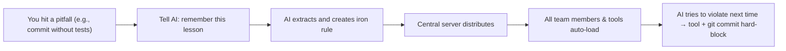

Personalized persistent memory for AI

[English](README.md) | [繁體中文](docs/README.zh-TW.md) | [日本語](docs/README.ja.md)

**Current version: v1.26.100** · see [CHANGELOG](CHANGELOG.md) for details

# OwnMind — Cross-platform AI Memory & Iron-Rule Enforcement System

Stop letting AI forget your preferences and repeat the same dumb mistakes. Whether you use Claude Code (Claude's CLI), Codex (OpenAI's CLI), Cursor (AI editor), Gemini CLI (Google's CLI), or any online AI, OwnMind locks in your development preferences, project context, and unbreakable "iron rules" across every tool, machine, and AI model.

---

## Who Is OwnMind For?

### 👤 Solo Developer — Set preferences once, they follow you everywhere

The "commit messages must be in Traditional Chinese" rule you set on your work laptop? It still applies when you open a new conversation on your home machine, on a borrowed laptop on a business trip, anywhere. **Your dev persona doesn't reset when your environment changes.**

### 🔁 Multi-Tool User — Same rules across Claude / Cursor / Codex / Copilot

Backend in Claude Code in the morning, frontend in Cursor in the afternoon, scripts in Codex CLI at night. Every tool auto-loads the same personal preferences and iron rules — **no need to re-teach each one**. Add a new editor next month (OpenCode, Windsurf, whatever) and it inherits everything as soon as it connects to OwnMind.

### 👥 Team Lead — Push standards once, dashboard shows real compliance

Publish a team rule in the admin console (e.g., "PRs must include tests") and every team member's AI auto-loads it. Local pre-commit hooks (small programs that intercept `git commit` to inspect changes) block non-compliant code before it can be committed. The admin dashboard (data dashboard: web page showing data as charts) shows real per-rule, per-member compliance rates, the team's most-hit pitfalls, and who uses `OWNMIND_BYPASS` (rule-bypass env var) the most — **manage your team with data, not gut feel.**

### 🛡️ Security-Conscious Engineer — Sensitive data never leaks through AI

- Trying to commit passwords/API keys (credentials for calling online services) → pre-commit hook blocks via pattern match (new in v1.19.7)
- AI tries to write a password into memory → memory API rejects with HTTP 400 and routes to the encrypted vault
- AI reply accidentally includes the user's national ID / email / mobile → reply-lint (reply quality linter: auto-scans AI responses for rule violations) emits a `privacy_check` event; whether to block is decided by each user's own iron rule (new detector in v1.19.7, neutralized in v1.19.10)

Especially useful in finance, healthcare, legal, and other sensitive industries.

---

## Before vs After Installing OwnMind

AI is powerful but **has no long-term memory by design**, and different models (e.g., Anthropic's Claude vs Google's Gemini) interpret rules differently. Add multiple machines into the mix and the friction multiplies. Here are five typical pain points before and after:

### Pain Point 1: Re-explaining preferences in every new conversation

- **Half the memory index had stopped reaching the session, and nothing said so** — the index file grows one line per memory and the thing that reads it stops at 200 lines, asking for under 140. Measured on a real install: 284 lines, 143 iron rules plus 130 projects. Iron rules are listed first and run out by line 151, so **everything that never arrived was projects** — 47 of 130 made it, the other 83 had not reached a session in some time. Nothing marked the file and neither side warned at load time, so it went on reading as a complete index. What pushed it over was listing every iron rule, which the SessionStart hook already injects into the session in full, so those lines bought nothing. The index now has a line budget it cannot cross: entries are chosen most-recently-updated first, a type needing fewer lines than its share releases the rest, entry lines are capped at 200 characters with a visible `…`, titles are flattened so a newline cannot turn one entry into three lines, and **each section states how many it left out and where to find them**. Same data: 139 lines, 126 of 273 memories listed, the other 147 named out loud. Projects go from 47 to 63; iron rules drop from 143 to 63, which costs only the link to the local file since the hook injects the rules themselves either way. No memory file is deleted and nothing becomes unreachable `v1.26.100`
- **The "most common project" column was blank because nothing sent a project** — the team page reads a field only `ownmind_log_session` writes, and when the AI does not call it the server rebuilds the session from the activity log, where no event carried one. Measured over one week: four members had every session rebuilt that way and a fifth had 76 of 95, so the column was empty for four people entirely and four fifths of the fifth. This was first written off as unrecoverable, which was wrong — the value has been derived from `CLAUDE_PROJECT_DIR` since v1.17.37 and simply never travelled with anything else. The fix is to send it, not to recover it: one shared `resolveProjectName()`, every activity event from the MCP and both SessionStart hooks carries it, and the recovery takes the most common one it sees rather than the first. **The directory name only, never the path** — the name is work context, the path is where somebody keeps their files `v1.26.98`
- **The secret scanner was reporting one token in three as a credential** — the last-resort heuristic fired on "20+ characters from the key character set", which does not distinguish a key from an identifier. It blocked two commits in one day over a filename and a variable name, each time telling the user their code looked like an API key. Measured against every 20-character-or-longer token in this repository's own tracked files: **3438 of 10486 were false positives**. Three exemptions had already been added, one per incident, and a fourth would have been more of the same — the rule was measuring length when the distinguishing property is word structure. It now takes the longest run of key-shaped characters (`- _ .` break a run, the base64 symbols do not) and measures how much of it is covered by word-shaped segments. False positives fell to 333 on the same sample — 279 of which are npm integrity hashes, which are random by construction — and to 51 of 9082 (0.6%) across code and docs alone. All thirteen real key formats are still caught, and a genuine hole closed on the way: any value with three or more slash-separated chunks used to be waved through as a file path, which is a shape a base64 secret can take. Two of the three old exemptions were deleted as redundant, and the guarantee is now expressed as a measured rate rather than a list of allowed strings `v1.26.98`
- **An upgrade failure recorded a guess, not a reason** — every error report the upgrade scripts raised passed a hand-written sentence as its `detail`, and `detail` is what reaches the server, the admin console and the health broadcast. `"git pull --ff-only failed (network or non-ff merge)"` reads identically whether the remote was unreachable, the branch had diverged, or a file was locked. One machine failed a pull, restored its backup and self-checked clean seven seconds later, and there was no way to say why. The `context` field that should carry the log tail arrived empty; where it is lost is not established, and a cause that cannot be demonstrated is not written down as one. So the real tail of the failing command's log now goes into `detail` as well — one line, control characters stripped, capped identically on both platforms. The list of call sites is derived at test time rather than written down, which immediately turned up one the edits had missed `v1.26.98`
- **The update lock did not lock** — three programs share `~/.ownmind/.update-lock` so that only one of them runs the daily `git pull` in `~/.ownmind`; only the MCP ever took it. The shell hook tested for the file's absence ten lines above a `touch`, which both leaves a gap and succeeds on a file that already exists, so four concurrent hooks all "acquired"; the Node hook checked the lock and then created nothing at all. Found while reading one account's activity log, where four hooks started in the same second every morning, three recorded `update_failed` and one recorded success — the upgrade worked every time, and the eighteen "failures" over six days were the losing side of a race. Acquiring is now an exclusive create on all three sides, reclaiming a dead run's lock is serialised behind its own file and re-checked so it cannot delete a lock taken while it waited its turn, and losing the race records `update_skipped` with reason `lock_held` rather than a failure `v1.26.98`
- **The submit-confirmation gate was never a gate** — `ownmind_report_bug` told the AI it must not fill `confirm_string` itself because "the backend rejects auto-filled submissions with HTTP 400". It does not: the field is a string, and the server sees only that a string with the expected value arrived. Demonstrated by filing two bug reports that way. A server-issued one-time phrase does not close it either, because the AI is the caller that fetches the phrase; nor does approving in the console, since `POST /me/login` returns the same api_key the AI already holds. While both authenticate as the same principal, no server-side check can separate them. So the claim is gone and the distinction is recorded instead: `confirmation_declared` is `user_typed` / `ai_filled` / `unknown`, named for what it is, with anything absent or unrecognised becoming `unknown` rather than the stronger value `v1.26.97`
- **A hand-written list does not report the file it is missing** — `.gitattributes` pinned the git hooks to LF one line per file, and `hooks/ownmind-git-commit-msg` was added after that list was written. On a Windows clone it was the one hook of three that arrived CRLF. Scanning the whole repository found 32 tracked files carrying a shebang with no `eol=lf` rule. Impact today is zero — Git for Windows executes a CRLF shebang either way, verified with `GIT_TRACE=1` — but it becomes a fault the moment the shell provider changes. The rules are globs now, a test derives the list from `git ls-files` and fails on anything uncovered, and `install.sh` strips CR when copying the hooks into place, because `.gitattributes` governs checkout only: a machine already holding CRLF is never rewritten by git, since normalised comparison hides it from `status` and `pull` alike `v1.26.96`
- **Before**: You open a new conversation, ask AI to write some code, and it produces outdated syntax or ignores your style preferences. You re-type the same explanation again: "Remember, our project uses this pattern..."
- **After**: The moment the conversation opens, OwnMind has already injected your preferences, style, and iron rules into the AI. You state the requirement; AI produces compliant code the first try.

### Pain Point 2: IQ reset across machines and models

- **Before**: Morning on the work desktop with Claude Code, afternoon at home on a laptop with Cursor + Gemini. Crossing **different machines** + **different AI models** wipes your memory context — re-copy code, re-tune for each model's quirks, painful.
- **After**: Whichever machine you switch to, whichever model you pick, OwnMind silently unifies the memory core in the background. **Open a conversation anywhere; the experience is continuous and consistent.**

### Pain Point 3: AI repeats the same dumb mistakes

- **Before**: Last week production DB crashed because a deploy missed an env var. You stayed up all night fixing it. Today you ask AI to deploy a new feature and it produces the same instruction missing the same env var, nearly repeating the disaster.
- **After**: When the mistake happened, you said "remember this lesson" to AI. That iron rule got uploaded to OwnMind. Today when AI tries to deploy, the system intercepts at the kernel level, forces AI to self-check, and prevents the disaster from repeating.

### Pain Point 4: Team works in silos with no unified standards

- **Before**: As the team grows, everyone uses AI differently. Someone lets AI write code without tests; someone accidentally commits a password. The dev standards doc nobody reads. Code quality spirals.
- **After**: Lead publishes a team rule once in the admin console; every member's AI auto-loads and enforces it. Non-compliant code? The local pre-commit hook hard-blocks it, forcing dev + AI to fix before commit. Fully automated team standardization and quality gates.

### Pain Point 5: No central management, no visibility into team AI usage

- **Before**: The lead has zero visibility into how the team uses AI. Who uses what tools? Which technical frictions hit most often? What's the actual rule-compliance rate? Manage blind without data, can't evaluate real productivity or risk.
- **After**: A dedicated **central admin console + data dashboard**. Team-wide AI usage, per-member per-rule compliance rates, the team's most-hit pitfalls — all key metrics at a glance. Compliance analytics and audit logs (audit log: tamper-proof record of every action) are aggregated automatically.

---

## Pitfall Evolution: From Mistake to Iron Rule

OwnMind's core value is turning "pitfalls you stumbled into" into "AI's genetic rules" — guaranteeing the same mistake never happens twice on your team:


```mermaid
graph LR
    A["You hit a pitfall (e.g., commit without tests)"] --> B["Tell AI: remember this lesson"]
    B --> C["AI extracts and creates iron rule"]
    C --> D["Central server distributes"]
    D --> E["All team members & tools auto-load"]
    E --> F["AI tries to violate next time → tool + git commit hard-block"]
```

1. **Capture**: After hitting a deploy or dev pitfall, just say "remember this lesson: always verify DB connection before deploy"
2. **Extract**: AI integrates current context, distills a machine-verifiable iron rule (e.g., `IR-038`), uploads to OwnMind
3. **Continuous gating**: The rule syncs immediately to all your dev tools. Next time, wherever you work, the moment AI tries to "deploy without checking connection", the system intercepts at the kernel level

---

## Team Enforcement Defense Lines

When projects scale, team management is where disasters start — dev standards docs no one reads, juniors writing buggy code. OwnMind ships a hardcore enforcement system for teams:

### 1. Three-tier role hierarchy

Built-in **Super Admin** > **Admin** > **User** roles. The first two have absolute control over team iron rules — preventing regular users or AI from silently editing or disabling core safety rules in conversation.

### 2. One-click team standard broadcast

Lead publishes a team rule once (e.g., "every response must include a request ID") via the admin console. The system slices it semantically via RAG (Retrieval-Augmented Generation: fetches external knowledge before AI answers). When any team member opens a new conversation, AI hard-loads the rule summary and enforces it, pulling the sliced detail on demand. Zero manual training, zero standard-sync cost.

### 3. Local Git pre-commit hard gate

The strongest physical defense for team management. OwnMind installs a pre-commit hook on every member's machine. If a member's AI writes code that violates team rules (e.g., secret in source, or missing doc sync), `git commit` is hard-rejected — forcing dev + AI to fix before submission.

### 4. Compliance dashboard + audit log

The admin console auto-tracks per-member, per-AI-model execution metrics (compliance count, trigger count, violation count) for each rule and plots them as compliance-rate trend charts. Every AI action, every violation, every bypass — all recorded in tamper-proof audit logs for solid data-driven quality management.

---

## Three Defense Lines: Rule Enforcement Without Begging the AI

Prompting the AI to behave doesn't work. OwnMind builds three physical defense lines at the OS and tool level that AI can't bypass without leaving a trace:

1. **Defense 1: Spec unification** — When a conversation opens, the system calls the API to inject base prompts. Semantic line of defense.
2. **Defense 2: Execution-side control** — Before AI actually modifies code or runs commands, **PreToolUse intercept** (PreToolUse: pre-tool-call safety gate). If it tries to edit code without reading it first, the system rejects and rolls back, preventing **blind edit** (modifying files without reading them).
3. **Defense 3: Output-side review** — When AI finishes a response, the Stop hook (Stop hook: post-output review program triggered when AI completes a turn) auto-runs reply-lint. If it detects Chinese-English mixing, unexplained jargon, or accidental leak of user national ID / email / mobile (privacy_check detector, new in v1.19.7), the system commands AI to **rewrite** in the background until compliant. **After 3 consecutive blocks, the system auto-downgrades to a warning** to prevent infinite rewrite loops.

---

## Why not `.cursorrules` or `CLAUDE.md`?

"I'll just use project-level static rule files (`.cursorrules`, `CLAUDE.md`). Why OwnMind?"

Because static rule files are fragile — AI hallucinations bypass them silently. OwnMind is a stateful enforcement system:

| Aspect | Project-level static rules | OwnMind stateful enforcement |
|:---|:---|:---|
| **Maintenance** | Files scattered across projects, hard to sync | Edit once on central server; all machines and tools sync immediately |
| **Enforcement** | Relies on AI self-discipline; hallucinations bypass | Critical-tier rules: programmatic hard-stop. Local pre-commit hook blocks `git commit` itself |
| **Learning from errors** | Every conversation starts blank; same pitfalls repeat | Auto-record violations; adaptive reinforcement (the system dynamically strengthens prompts based on AI's violation history) |
| **Security** | Easy to accidentally commit credentials | Auto-filter sensitive strings and hard-block; route to secure vault |
| **Team rollout** | Manual file copy; missed copies = no enforcement | Lead pushes once; new hires auto-align from day one |

> **Honest disclosure**: The `OWNMIND_BYPASS` env var (rule-bypass switch) allows you to skip a single iron rule in emergencies — but every bypass is logged in the audit trail. AI cannot bypass without leaving a trace.

---

## Core Features

### Memory & Protection

- **Memory / secret routing** — Three data classes: profile / memory / secret (encrypted vault). AI tries to write a password to plain memory → blocked with HTTP 400 and redirected to the vault `v1.19.1`
- **Privacy detector (optional)** — Each AI reply can be scanned for Taiwan national ID (with official checksum validation), email, Taiwan mobile patterns. Strings the user themselves prompted are exempted (treated as the user actively sharing). Matches emit a `privacy_check` event; whether to block is decided by each user's own iron rule `v1.19.7`
- **Pre-commit secret content scan** — On top of the existing filename-pattern block, scans staged diff added lines for OpenAI / GitHub PAT (Personal Access Token) / JWT (JSON Web Token) / AWS key patterns as IR-002 violations `v1.19.7`

### Collaboration & Sync

- **Cross-tool handoff** — Before logging off, say "wrap up and prepare handoff" to AI; it packages incomplete tasks and design context, uploads. Tomorrow, on a different editor with a different AI, it resumes seamlessly `v1.13.0`
- **Multi-client conflict lock** — When multiple editors write memory simultaneously, sync tokens (tags identifying write order) block stale versions and force AI to refetch latest. Your hard-won dev rules aren't overwritten
- **Cross-machine auto-sync** — Switch laptops, travel, new hire's day one — login pulls memory and rules immediately, zero wait

### Observability & Analytics

- **Every field the shell hooks logged was discarded on arrival** — `log_event` wrote its key/value pairs flat, beside `ts` and `event`, and posted that same object to the batch endpoint, which reads `e.details` and nothing else. `details` was never present, so every row stored `{}`. The upgrade hook distinguishes six failure steps — lock / cd / fetch / pull / npm / update_sh — and none of them ever left the user's own machine: measured on 2026-08-07, one user had 18 failed upgrades and another 9, with no recorded reason for any of them. The same silence covered which trigger fired and the `edit_reminder_failed` channel added one release earlier, which was therefore born broken. The pairs now go inside `details`; the server needed no change, it had always read the right key `v1.26.95`
- **The Windows MCP path is no longer destroyed on the way into settings.json** — `cygpath -w` returns backslashes, and install.sh interpolated that path into the source text of `node -e`. What the parser received was `const p = 'C:\Users\Vin\.ownmind\mcp\start.cmd'.replace(/\\/g, '\\\\')`, and `\U`, `\V`, `\.`, `\m`, `\s` are not escape sequences: JavaScript dropped each backslash and kept the letter, so `p` was already `C:UsersVin.ownmindmcpstart.cmd` before the `.replace` that existed to double the backslashes ever ran. Every `bootstrap.sh` upgrade wrote that unusable command into `~/.claude/settings.json`. It stayed invisible because Claude Code launches the MCP server from `~/.claude.json`, which no installer writes — the broken value sat in the file nothing reads, and the next install.ps1 run quietly repaired it. Escaping cannot fix this: the string is destroyed by the JS parser, not by the shell. Both branches now hand the path to Node as an argv element `v1.26.94`
- **Re-running the installer with a new key now changes the key** — Both installers skipped the Claude Code MCP block whenever the settings file already contained the string `"ownmind"`. That block is where the API key lives, so every re-run meant to change it — switching accounts, rotating a credential, fixing one typed wrong — did nothing and then printed an installation summary. The check asked whether OwnMind was configured; the question that mattered was whether it was configured with *this* key. Cursor's MCP block carried the same guard and the same key. Both now always write, merging so an existing entry keeps fields the installer does not manage, and each run reports which of written / updated / unchanged happened. The remaining `already configured` skips append rule text and hold no credential, so they stay `v1.26.93`
- **Two config files holding two different keys is now visible** — The installers write `~/.claude/settings.json` and nothing else, while Claude Code keeps its MCP config in `~/.claude.json`. `resolveCredentials` returns the first key it finds, so after an account switch the two files could disagree while every check passed and the process launched from the other file acted as the other account — nothing compared the values. `resolveCredentials` now returns `conflicts`, and a new `credential_agreement` self-check warns and names the disagreeing file. Files only: the environment is searched last and can never be the losing side, and counting it would warn everyone whose shell still holds the key they installed with. Locations, never values — this is uploaded with the report `v1.26.93`

- **Three-tier rule classification** — Every rule labeled `critical` (red, hard-block) / `default` (yellow, depends on settings) / `advisory` (gray, log-only). SessionStart digests group by tier `v1.19.0`
- **Compliance dashboard** — Tracks per-member, per-AI-model compliance / trigger / violation counts per rule; plots trend charts
- **Reply quality lint** — Stop hook scans for Chinese-English mixing (IR-037), unexplained jargon (IR-036), privacy patterns (`privacy_check` event; user's own iron rule decides whether to block). 4th violation per session → `process.exit(2)` with directive-style rewrite prompt on stderr. After 3 consecutive hard blocks, auto-downgrades to warning to prevent rewrite deadlock `v1.19.7`
- **Forced version check** — Each new conversation calls API to verify client / server version. Prevents using outdated versions with already-fixed bugs `v1.19.4`
- **Install-check failure rendering** — Pure function renders grouped install-check failures into a readable message. Multiple machines with the same problem collapse into one row. Written to fit what the reader is actually shown — both delivery paths keep only the first 5 lines and 400 characters — so one failure is one line, the omitted-count footer is the last line, and a shortened entry always carries a visible cut marker `v1.26.87`
- **Install-check alert job** — `runInstallCheckAlerts` reads each machine's newest self-check report (ordered by server-assigned id, never the client-supplied timestamp), records new/resolved failures, and drafts a 48-hour broadcast for the oldest super admin. Each new failure is claimed before the broadcast is written, and every claim plus the broadcast insert run inside one transaction: if anything between them fails, the whole thing rolls back and the error is rethrown. So two overlapping sweeps announce once between them, and no partial write — not even a claim that commits while its response is lost — ever leaves a failure marked announced with no broadcast to show for it. Runs after every stored report (`POST /api/debug/install-check`, failures logged not thrown) and once per server boot to sweep pre-existing reports `v1.26.87`

### Iron Rule Enforcement Engine

- **The most-tagged rules were the ones that never fired** — the hook was registered for `Bash` only, so a rule could fire only while a shell command ran. Editing a file is not a shell command, so nothing tagged `trigger:edit` had ever been surfaced while the AI was changing code. On one real account that was 56 rules, the most-used tag on it, and 68 counting aliases and the untagged rules that match everything — against 0 shown. It now also runs on the file-editing tools, throttled to one full listing per hour: every edit after that in the same hour gets a single line, `AI 改檔案要遵守的鐵律 68 條 · 本小時第 4 次`. The line names the AI because a bare "68 rules in effect" reads as an instruction to whoever is watching, and it says the rules apply rather than that they were obeyed — the hook can see the first and not the second. Reminder only: the edit trigger never reaches the verification engine, which is the only path here that can block, and the throttled line makes no network request `v1.26.92`
- **A rule is matched by what it means, not by three exact words** — `detectCommandTrigger` answers only `commit` / `deploy` / `delete`, and the hooks kept a rule only when one of its tags was literally `trigger:<that word>`. Nothing states that those three words are the entire vocabulary and `ownmind_save` accepts any tag, so rules get filed under the words their author thinks in — `trigger:回滾`, `trigger:cleanup`, `trigger:升級` — and are then dropped at the filter with a silent exit that never says why. One real account had three iron rules and no trigger could reach any of them. Each trigger now accepts a set of equivalent tags (`delete` also takes 刪除/cleanup/清理/rollback/回滾/還原/restore, and so on), compared case-insensitively. This widens which stored rules a trigger matches; it does not widen when the hooks run, which is still `detectCommandTrigger` unchanged — so no new noise and no new blocking. Tags outside a risky operation, like `trigger:install`, still do not fire, because `npm install` is not an operation the hook runs on `v1.26.91`
- **The pre-action iron rule reminder now actually fires** — The PreToolUse hook read the command from a top-level `.command`, but Claude Code sends `{ tool_name, tool_input: { command } }`. The extraction returned `''` on every platform and the hook exited at its empty-command guard — a silent, successful exit, so nobody saw a reminder anywhere. On Windows it failed one step earlier still: `readFileSync('/dev/stdin')` resolves to `C:\dev\stdin` and throws outside the `try`, with the error discarded by `2>/dev/null`. Both hook copies now read fd 0 and prefer `tool_input.command`, falling back to the bare shape for manual invocation `v1.26.90`
- **A matched verification template is a suggestion, never an action** — Saving an iron rule used to have the server attach `metadata.verification` to it silently, and every template in the set carries `block_on_fail: true`. You wrote a reminder and got back a rule that would stop your work, announced only by a bare id buried in the response. One incidental keyword in a long rule was enough: a rule about preserving logs during rollback, tagged `trigger:deploy` and containing 測試 once, was given "run tests before deploying", whose block message says something the author never wrote. The match is still computed and returned as `template_suggestion` — name, `applied: false`, whether it blocks work, and a sentence the caller can relay — but nothing is written until somebody asks for it `v1.26.89`

- **Shared rule-enforcer core** — Pure function `enforceRule(ruleCode, context, options)` returns `allow` / `block` / `warn` / `log_only` / `bypass` by tier. **Status:** v1.19.7 wires `bypass-handler.js` into git pre-commit + reply-lint (so `OWNMIND_BYPASS` works); full `enforceRule` integration replacing direct `evaluateConditions` loops is deferred to v1.19.8 `v1.19.6`
- **Adaptive reinforcement** — System dynamically strengthens prompts based on AI's violation history (3+ violations of the same rule per session → that rule's prompt auto-upgrades to a strong warning)

### Infrastructure

- **Secret management** — Securely store API keys and passwords with double encryption (master key + per-row salt)
- **Keyword search** — Multi-keyword AND search across title, content, tags, and code fields (a pgvector column is provisioned for a future semantic-similarity upgrade, not yet in use)
- **Tiered compression** — Short-term memory auto-compresses, long-term memory persists forever
- **Native Windows support** — `install.ps1` and `start.cmd` included, no WSL (Windows Subsystem for Linux) needed
- **Source-file hygiene guard** — Test suite fails if any file under `src/`, `scripts/install-helpers/` or `hooks/` contains a raw control byte (e.g. NUL) or a literal invisible character that would make `grep`/`file` treat it as binary and skip it silently `v1.26.87`
- **Windows-native paths in inline Node** — Under Git Bash a POSIX path (`/c/Users/...`) interpolated into `node -e` source reaches `node.exe` unconverted and resolves against the drive root, so the installer died mid-file with no output at all. Every such path now goes through the shared `to_win_path` (`cygpath -m`, identity off Windows), and a guard test derives the offender list from the scripts themselves — failing closed on any block it cannot parse `v1.26.88`
- **Installers never discard a Node error stream** — `2>/dev/null` on a `set -e` script turns a fatal error into a script that merely stops. Installer stderr goes to a log, an ERR trap names the line that aborted, and the upgrade log lives outside the directory rollback replaces — so "see the log" stops naming a file the rollback just deleted `v1.26.88`
- **Install-completeness assertion** — The version number is not evidence that installation completed: a machine can report the current version because something else moved its working tree forward while the installer aborted before producing anything. One shared artifact list (SessionStart hook, iron-rule hook, `hooks/lib`, git hooks, skill file, MCP entry point) is asserted at the end of every install and reported as the `install_complete` self-check item, so a truncated install announces itself instead of waiting to be noticed `v1.26.88`

---

## System Requirements

- **Client**: Node.js 20+, Git 2.30+
- **Server**: Self-host (Docker Compose one-click deploy provided) or use a licensed hosted service
- **Platforms**: macOS / Linux / Windows (Windows users need full Git for Windows installer for sh.exe used by Git hooks)
- **Supported AI tools**: Claude Code, Codex CLI, Cursor, Copilot, OpenCode, Windsurf, Gemini CLI, or any client that reads MCP (Model Context Protocol: standard for AI ↔ external tool integration) or hooks

---

## Quick Start

### 1. Get API key and URL

After installing OwnMind, log in to the admin console as admin to obtain your access key (API key) and server path (API URL).

### 2. Pick an install path (choose one)

#### Option A: Let AI install (easiest)

In your AI editor (e.g., Cursor or Claude Code) chat, type:

- **Fresh install**: `Install OwnMind (my key is YOUR_API_KEY, URL is YOUR_API_URL)`
- **Auto upgrade**: `Upgrade OwnMind`

AI auto-detects your OS and runs the installer.

#### Option B: One-line shell install

macOS or Linux:

```bash
# Fresh install
curl -fsSL https://raw.githubusercontent.com/miou1107/ownmind/main/scripts/bootstrap.sh | bash -s -- YOUR_API_KEY YOUR_API_URL

# Upgrade
curl -fsSL https://raw.githubusercontent.com/miou1107/ownmind/main/scripts/bootstrap.sh | bash
```

Windows PowerShell:

```powershell
# Fresh install
$env:OWNMIND_API_KEY='YOUR_API_KEY'; $env:OWNMIND_API_URL='YOUR_API_URL'; iwr -useb https://raw.githubusercontent.com/miou1107/ownmind/main/scripts/bootstrap.ps1 | iex

# Upgrade
iwr -useb https://raw.githubusercontent.com/miou1107/ownmind/main/scripts/bootstrap.ps1 | iex
```

> **Windows note**: OwnMind depends on the Bash shell (sh.exe) bundled with Git for Windows to run Git hooks. Install the full Git for Windows installer (not Lite or Portable), or commits will error out.

### 3. Verify installation

After installing, open a new conversation and ask AI:

> "Which OwnMind iron rules are currently loaded? Show me the first 5."

If AI lists them (with codes like IR-002, IR-008), hooks are correctly injecting memory.

If not, check:

```bash
cat ~/.ownmind/credentials   # confirm key exists
cat ~/.ownmind/cache/iron_rules.json | head -3   # confirm rule cache
```

---

## Emergency Bypass: What if I'm stuck?

OwnMind provides env-var escape hatches. **Every bypass writes an audit log** that your team lead (or future self) can review.

### Pre-commit blocked, need to commit anyway

```bash
# Bypass a single rule
OWNMIND_BYPASS=IR-002 git commit -m "hotfix: emergency"

# Bypass everything (extreme cases)
OWNMIND_BYPASS=all git commit -m "hotfix: emergency"
```

### Reply-lint too aggressive

```bash
# Warn only, don't block AI replies
export OWNMIND_REPLY_LINT_MODE=warn

# Or fully skip
export OWNMIND_REPLY_LINT_DISABLE=1
```

### Disable OwnMind entirely

```bash
export OWNMIND_DISABLED=1
```

> **Key point**: These are escape hatches, not long-term settings. If you find yourself bypassing a rule constantly, that rule is probably mis-designed — fix it in the admin console rather than disabling OwnMind.

---

## Useful Chat Commands

Talk to your AI in plain English:

- **"Remember this lesson: [content]"** — Auto-generate an iron rule, sync to every tool
- **"What's left to do on this project?"** — AI pulls cross-session TODO list from OwnMind
- **"Wrap up today's work and prepare handoff"** — Auto-package progress; tomorrow on a different machine or tool, resume at full speed
- **"Am I on the latest version?"** — Force a fresh online version check
- **"Show me the first 10 iron rules"** — Verify local rule cache state

---

## FAQ

### Installation

#### Q: Fresh server deployment — how do I get into the admin console the first time?

**v1.19.8+ recommended flow (zero friction)**:
1. `docker compose up -d` to start the server
2. Open browser to `https://your-server/admin` — system detects an empty `users` table and auto-redirects to `/setup`
3. Fill in email + password to create the first super_admin
4. Page then displays your api_key (one-click copy) + a client install template (auto-filled with current server URL)
5. Click "Go to login" to enter the admin console; create other members and manage iron rules from there

Total: about 2 minutes. The wizard auto-closes permanently after the first admin is created.

**Advanced / rescue path (legacy v1.19.7 and earlier)**:

If your deployment hits one of these scenarios, the wizard won't apply:

| Scenario | Path to take |
|:---|:---|
| Restore from backup; `users` table has a super_admin but `password_hash IS NULL` | Set env `SETUP_TOKEN`, then sign in at the console — it offers the password-setup form (`POST /api/admin/setup`) |
| Admin forgot password, wants to reset | SSH into DB, `UPDATE users SET password_hash = NULL WHERE id = ...`, then use setup token path |
| Migrating server, importing old DB | pg_dump / pg_restore + either rescue path above |

Normal first-time install **does not need** `SETUP_TOKEN` — the wizard handles it.

#### Q: Admin forgot their password — what now? (v1.19.9+ three-tier recovery)

The right path depends on "are there other admins":

**Scenario A: Team has other admins (most common)**
- Any other super_admin logs in, goes to "User Management", finds the locked-out admin, clicks "Reset Password"
- System generates a 12-char random temporary password (avoiding confusable chars 0/O/I/l/1), copy it to the affected user
- They log in with the temp password and are forced to set a new one

**Scenario B: Sole admin forgot password (you are the only one)**
- SSH into the server host and run the rescue script:
  ```bash
  node scripts/reset-admin-password.js
  ```
- Script interactively: lists all super_admins, asks which one to reset, requires typing `yes` to confirm
- Auto-generates a `SETUP_TOKEN`, prints it to your terminal
- Then `export SETUP_TOKEN=<token>`, restart the server, open the console login page and enter that account's email with any password. The console detects the account has none and shows the setup form. (Before v1.26.59 this step said `/admin/setup`; the legacy console was retired in that release.)

**Scenario C: No SSH access at all (cloud SaaS mode)**
- Currently no built-in path — contact the service operator
- v1.20+ plans to add email-based reset (depends on SMTP integration)

**Prevention beats cure**: v1.19.9+ shows an orange warning banner in the admin console when there's only one admin, strongly suggesting you create a second one for mutual rescue.

#### Q: Can it coexist with `.cursorrules` or `CLAUDE.md`?

Yes. OwnMind is central, `.cursorrules` is project-local. Recommended: cross-project personal preferences and iron rules → OwnMind; single-project-specific rules → `.cursorrules`. No conflict.

#### Q: Why does AI sometimes seem to say the same thing twice?

That's not a bug — it's a visible side-effect of the reply quality check. The flow:

1. AI's first response gets emitted; the lint hook detects a violation (Chinese-English mixing, unexplained jargon, or PII leak)
2. After 4 consecutive violations in the session, the hook blocks and tells AI to rewrite
3. AI emits a compliant rewrite — you see two similar paragraphs

v1.19.11 added three mitigations:

- **AI self-annotation** (85% reliability): rewrite begins with a quote block "⚠️ Previous version violated IR-XXX, re-adjusting" + separator
- **Tiered display**: first block shows full message; 2nd-3rd show short "↻ previous version violated IR-XXX, rewritten"
- **Permanent log**: every block event is appended to `~/.ownmind/logs/reply-lint-events.jsonl`; query anytime "how many times was I blocked this week, which rule most often"

If AI skips annotation (15% case), check the log to know what happened:

```bash
tail -5 ~/.ownmind/logs/reply-lint-events.jsonl
```

### Privacy & Security

#### Q: Where does my conversation data go? Does OwnMind itself collect PII?

OwnMind's design principle is "don't collect user privacy unless directly work-related". Specifically:

**Uploaded to server**:
- Iron rules, memory entries, and profile preferences you actively create
- Compliance events (which rule triggered when, result: comply / violate / bypass) — for compliance analytics

**Never uploaded**:
- Full AI conversation contents (your prompts + AI responses)
- Your source code / file contents
- System paths, filenames (except those you actively store as memory)
- Keystrokes, mouse trails, or any behavioral telemetry (user-action monitoring data)

**Self-hosted = 100% on your own server**; even the "uploaded" data only goes to your database.

#### Q: How are API keys and passwords stored? Is transport secure?

- **Storage**: API keys and `/api/secret` entries use double encryption (master key + per-row salt — a primary key plus a unique salt per record). Even a full DB dump can't be decrypted directly
- **Transport**: HTTPS enforced (HTTP auto-redirected; you can put nginx/caddy in front for SSL termination)
- **Local**: client `~/.ownmind/credentials` is mode 0600 (only current user can read)
- **Audit**: every API action writes an audit log with timestamp + actor user ID, tamper-resistant

#### Q: Does OwnMind see my source code?

No. OwnMind hooks only intercept **rule-violation events** (e.g., staged file contains a credential pattern; AI response Chinese-English mixing over threshold) and send violation metadata (data describing the event itself, not the code) back to the server. Original source code and AI conversation contents **never leave your machine**.

Exception: if you explicitly tell AI "store this code snippet as memory", that snippet is uploaded.

### Cost & Performance

#### Q: Will using OwnMind increase my AI token bill?

Yes, slightly. OwnMind itself **does not call any LLM** (no GPT/Claude API calls), so there's no extra LLM API cost. But because each new conversation injects the iron-rule list (30-50 rules, ~2-5 KB of text) into the AI's system prompt, your AI's input tokens per new conversation go up by 1500-3000 tokens (depending on rule count).

At Claude Sonnet pricing (input $3 / 1M tokens): about $0.005-0.01 extra per new conversation. Twenty new conversations a day → $0.10-0.20/day extra. Compared to the time saved from not re-explaining preferences, ROI (return on investment) is strongly positive.

> To optimize: in the admin console, mark non-current-work rules as `disabled` or set them to `advisory` tier (log-only, not auto-injected). Reduces token overhead.

#### Q: Will the hooks slow down my dev workflow?

Measured latencies (M1 MacBook, with local cache warm):

| Hook | Latency | Triggered by |
|---|---|---|
| pre-commit | < 50 ms | Every `git commit` |
| reply-lint | < 30 ms | Every AI reply turn |
| session-start | 200-500 ms | Opening a new AI conversation (includes rule loading) |
| version-check | < 100 ms | Opening a new conversation (parallel API call, non-blocking) |

The only one you might perceive is session-start at 200-500 ms; the rest are below the perception threshold (humans don't notice < 100 ms). Network sync runs asynchronously in the background and never blocks a commit.

#### Q: What if the server goes down? Will my work get stuck?

No. Fail-open by design — when the server doesn't respond, hooks skip the check and don't block commits or AI replies. Local rule cache covers offline operation for 24h. After 24h, hooks try to re-sync; if sync fails, still fail-open.

### Other

#### Q: Does it work offline?

Yes. All iron rules cache to `~/.ownmind/cache/iron_rules.json`; offline operation within 24 hours is normal.

#### Q: Can iron rules be imported/exported? Shared across teams?

Yes. Each rule has a unique UUID; the admin console supports JSON export. Move rules between OwnMind instances, or open-source them on GitHub for other teams.

#### Q: Why "OwnMind"?

"Own your mind" — your memory belongs to you, not some AI vendor. Re-teaching your style to every new tool effectively rents your mental model (how you think about things) to the vendor. OwnMind hands ownership back to you.

---

## API Reference

### Authentication

All API requests require `Authorization: Bearer YOUR_API_KEY` header.

### Main Endpoints

```
GET    /api/memory               # List memories
POST   /api/memory               # Create memory
PUT    /api/memory/:id           # Update memory
DELETE /api/memory/:id           # Delete memory
GET    /api/memory/type/:type    # Fetch by type (e.g., iron_rule)

POST   /api/secret               # Create encrypted secret
GET    /api/secret/:key          # Retrieve decrypted secret
DELETE /api/secret/:key          # Delete secret

POST   /api/activity/batch       # Batch report compliance events
GET    /api/compliance/stats     # Query compliance stats
```

Full API docs in [OpenAPI spec](openapi.yaml) (if available).

### Memory Types

- `profile` — Personal preferences (nickname, preferred tools, writing style)
- `iron_rule` — Iron rules (with verification conditions, tier, block_on_fail flag)
- `project` — Project context (architecture, stack, TODOs)
- `principle` — Working principles (non-machine-verifiable, AI reference only)
- `learning` — Pitfall records (drafts before being distilled into iron rules)

---

## Tech Stack

- Backend: Node.js 20+ / Express
- Database: PostgreSQL 16 + pgvector
- Deployment: Docker Compose
- Client hooks: Node.js (macOS / Linux / Windows)
- Sync protocol: HTTPS REST + MCP (Model Context Protocol)

---

## Contributors

- Vin (miou1107)

Issues, PRs, and usage feedback welcome.
Repo: [github.com/miou1107/OwnMind](https://github.com/miou1107/OwnMind) (if public)

---

## License

MIT
