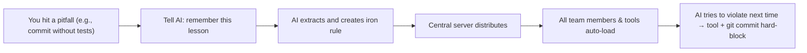

Personalized persistent memory for AI

[English](README.md) | [繁體中文](docs/README.zh-TW.md) | [日本語](docs/README.ja.md)

**Current version: v1.26.160** · see [CHANGELOG](CHANGELOG.md) for details

# OwnMind — Cross-platform AI Memory & Iron-Rule Enforcement System

Stop letting AI forget your preferences and repeat the same dumb mistakes. Whether you use Claude Code (Claude's CLI), Codex (OpenAI's CLI), Cursor (AI editor), Gemini CLI (Google's CLI), or any online AI, OwnMind locks in your development preferences, project context, and unbreakable "iron rules" across every tool, machine, and AI model.

---

## Who Is OwnMind For?

### 👤 Solo Developer — Set preferences once, they follow you everywhere

The "commit messages must be in Traditional Chinese" rule you set on your work laptop? It still applies when you open a new conversation on your home machine, on a borrowed laptop on a business trip, anywhere. **Your dev persona doesn't reset when your environment changes.**

### 🔁 Multi-Tool User — Same rules across Claude / Cursor / Codex / Copilot

Backend in Claude Code in the morning, frontend in Cursor in the afternoon, scripts in Codex CLI at night. Every tool auto-loads the same personal preferences and iron rules — **no need to re-teach each one**. Add a new editor next month (OpenCode, Windsurf, whatever) and it inherits everything as soon as it connects to OwnMind.

### 👥 Team Lead — Push standards once, dashboard shows real compliance

Publish a team rule in the admin console (e.g., "PRs must include tests") and every team member's AI auto-loads it. Local pre-commit hooks (small programs that intercept `git commit` to inspect changes) block non-compliant code before it can be committed. The admin dashboard (data dashboard: web page showing data as charts) shows real per-rule, per-member compliance rates, the team's most-hit pitfalls, and who uses `OWNMIND_BYPASS` (rule-bypass env var) the most — **manage your team with data, not gut feel.**

### 🛡️ Security-Conscious Engineer — Sensitive data never leaks through AI

- Trying to commit passwords/API keys (credentials for calling online services) → pre-commit hook blocks via pattern match (new in v1.19.7)
- AI tries to write a password into memory → memory API rejects with HTTP 400 and routes to the encrypted vault
- AI reply accidentally includes the user's national ID / email / mobile → reply-lint (reply quality linter: auto-scans AI responses for rule violations) emits a `privacy_check` event; whether to block is decided by each user's own iron rule (new detector in v1.19.7, neutralized in v1.19.10)

Especially useful in finance, healthcare, legal, and other sensitive industries.

---

## Before vs After Installing OwnMind

AI is powerful but **has no long-term memory by design**, and different models (e.g., Anthropic's Claude vs Google's Gemini) interpret rules differently. Add multiple machines into the mix and the friction multiplies. Here are five typical pain points before and after:

### Pain Point 1: Re-explaining preferences in every new conversation

- **The new line shipped in one language** — v1.26.151 wrote the five category names as Chinese string literals. The issue that asked for the line asked for the opposite, in the same sentence: an English source with the model translating on delivery, the route already used for the startup tip in `hooks/lib/render-session-context.js`. The parenthetical naming that route was read past, the cross-reference beside it pointed at a closed issue about something else, and "no route to follow" became a reason to defer — when the route was in the sentence. Labels are English source now, and the rendered line carries the instruction that makes them arrive in the user's own language. The instruction names what must survive the translation: without pinning the counts and the version tag, a model paraphrases the numbers away, and the numbers are the entire point — they are what separates "looked, found none" from "never asked". A test walks every label and fails on any CJK character, so the next person to add a category cannot quietly pin one language into the source. The fallback path's existing Chinese is deliberately untouched: it is what users on an un-upgraded server have been reading all along, and translating it too would turn a degraded path into a third thing nobody asked for. `v1.26.152`
- **The reminder consulted one memory category out of five** — before a risky operation a hook prints one line, and that line has three jobs: say what OwnMind thinks is happening, show that it actually consulted the user's memories, and leave a way to read them. It did none of them. It printed `鐵律觸發（install）` — an internal trigger name, no counts, no next step — and the second job was impossible in the data rather than merely in the rendering, because both hooks fetched `/api/memory/type/iron_rule` and nothing else. A user could not distinguish "no team standard applies to this operation" from "team standards were never looked at", which are different facts, one of them a defect, and the display had no way to say which had occurred. The label was the same failure in miniature: someone debugging an auth header watched `鐵律觸發（install）` appear under every `curl` carrying an `X-API-KEY` and asked what was being installed — nothing was, `install` is an internal bucket that happens to contain credential work and had no business being shown to a person. One new endpoint now returns all five categories filtered for the trigger, in a single request: this sits in front of every risky command and the shell hook's curl is synchronous with a 5-second ceiling, so five in sequence is a 25-second worst case ahead of a `git commit`, and a delay like that is how the whole mechanism gets switched off. Four categories send counts rather than contents, because a few hundred titles in front of a command is how a reminder becomes something people scroll past. Untagged rows no longer flood the four new categories — measured on one account, commit went 63 → 38 and install 38 → 13, with no iron rule lost at all — since "untagged means relevant to everything" was written for a path that had only iron rules on it and does not survive contact with project notes. A category at 0 is still printed: the zero is the informative part, the sentence the old display could not form. The shell hook's inline `node -e` rendering moved into its own file, which retires the copy of the trigger alias table it had to carry, so both hooks now print the same line instead of two translations of one idea. And because hooks and server deploy separately, anything other than a 200 falls back to the endpoint every server has and writes `hook_context_fallback` to the activity log — a permanently degraded reminder that never says so looks exactly like a working one, and the four unasked categories are not printed as zeroes, which would be the same lie told by the fix. `v1.26.151`
- **Two copies of one decision, made one** — v1.26.149 made the two command classifiers agree; it did not make them one thing, so they could still be edited apart. The open question was whether the shell copy still had to run without node. It does not, and has not for a long time: `hooks/ownmind-iron-rule-check.sh` calls node more than a dozen times, the first of them near the top of the file and before any classification, purely to read a version string out of `package.json`. Credentials, the rule fetch, the payload parse, the verification pass and the output rendering all go through node too. A machine without node does not get a degraded hook, it gets one that fails at line 23 — so the cost of removing the duplication was already being paid and the duplication was buying nothing. The grep chain is deleted. The shell hook now pipes the command into a four-line wrapper that calls the same `detectCommandTrigger()` the `.js` hook imports, on stdin rather than argv because a `git commit -m` message is routinely multi-line and stdin has neither the length cap nor the quoting rules. The wrapper's exit status is checked and its stderr is deliberately left alone: a silently broken classifier returns an empty answer, which is indistinguishable from "this command triggers nothing" — the most common true answer, and so the best hiding place a defect could ask for. That failure mode then showed up for real. The first run after the change classified *every* command as no-trigger, because the throwaway `$HOME` the tests build for the shell hook had no link to the new file; eight tests across four files went red for one missing symlink, since the same staging block had been hand-copied into five test files and nobody remembered all five. That is this same defect one layer down, so the staging moved into `tests/helpers/hook-home.js`, which owns the list. No trigger pattern changed: all 18 commands in the guard test classify exactly as they did before. `v1.26.150`
- **Two copies of one decision, answering differently** — before a risky command runs, a hook names the iron rules that apply to it. The decision "which rules apply" is written twice: once in `shared/helpers.js`, once as a `grep` chain inside the shell copy that `install.sh` registers on mac and Linux. Both copies are deliberate — the shell one runs without node on `PATH` and avoids handing node a path, the move behind two silent Windows failures — but nothing held them to the same answers. The `KEEP IN SYNC` note covered the tag-alias table beside it; the classification itself was unguarded, and the unguarded copy is the one most users run. Of 17 sample commands, 7 were classified differently, and three of those are failures rather than opinions: `git tag` reached no trigger at all on mac and Linux, so the hook was silent through the one operation the version-sync rules are written for; `docker compose build` and `docker compose push` likewise, because the deploy pattern was `docker.*up` and contains neither — a rule written for a command, invisible to the implementation that sees that command; and in the other direction `docker.*up` matched `docker logs backup` and `docker ps | grep uptime`, since `up` sits inside `backup` and `uptime`, so reading a log printed a full deployment listing. The guard was written first and run first: 7 red, exactly the seven predicted. It spawns the real shell hook and reads the trigger back out of the hook's own banner rather than restating the patterns, because a test that re-transcribes the logic is a third copy that agrees with whichever copy its author read, and unreadable output throws instead of resolving to "no trigger" — which would have turned the whole file green while measuring nothing. The chain is now a line-by-line transcription of the reference, order included, since a command can belong to two families and the first match wins. One pattern moved the other way: `docker stack deploy` existed only in the shell copy and was promoted into the reference rather than dropped, because a Swarm deploy is a deploy. The duplication itself stays — removing it needs a decision about whether the shell copy's independence from node still holds, and that decision is better taken with the parity test already in place, since either route has to satisfy it. `v1.26.149`
- **A tip that names the standards you can actually ask for** — every response ends with one line of tip, and one of them announced that team standards exist. It told a member nothing they could act on: a standard for publishing to `pages.fontrip.com` went up on 2026-08-11, and from then on any colleague saying 「幫我發 pages」 would have had the whole flow carried out for them — which none of them could know unless somebody said it out loud. Reading the titles aloud, which is what the issue first proposed, was rendered against the real account and rejected: of 32 standards, 17 are discipline the AI follows silently, 8 are content written for the AI to read, and 6 are things a person can ask for, so five titles in six are noise — and a title is written to be recognised by whoever manages the standards, which is why one of them is cut off mid-parenthesis. So the standard now says both things itself: `user_invocable`, and `invocation_hint`, the sentence in the words a user would say. Marking one without the sentence is refused at write time with an example of what to write, because the flag alone degrades to reading the title and would be discovered by whoever saw the tip rather than whoever set the flag. The sentences replace the static team-standard tip rather than joining the pool — six standards would otherwise make a quarter of a 25-line pool one company's, and twenty would drown it. Nothing is inferred: an unmarked standard never appears, because a missed one costs an unadvertised capability while a wrong guess costs every member a tip they cannot act on, on every response. An account with none marked sees exactly what it saw before. Two reviews found the two ways it would have shipped dark and neither is subtle: nothing in the product named the two fields, so an admin asking their AI to mark a standard had nothing to work from (both tool descriptions now say it, with the example sentence); and the per-response tip learned the list only from `ownmind_init`, which Claude Code never calls because the SessionStart hook loads memory instead — so on the surface users see most the list would have stayed empty for the life of the process, and it now falls back to what the hook wrote to disk. They also found a multi-line hint reaching the screen: the write path refuses newlines, both read filters checked only emptiness and length, and `trim()` leaves an interior newline alone — in text another member's AI is told to relay. Verified by 35 tests with six mutations watched to fail, 4,712 passing overall. `v1.26.148`
- **Only its author could change a team standard** — issue #85 needed a flag on each standard, and setting the first one failed with 404. Measured against production as a super_admin: reading standard 108 returns 200, writing to it returns 404 Memory not found. Every write route opened with `WHERE id = $1 AND user_id = $2`, and the check that reads "team standards may only be edited by admins" sits thirty lines below it — a non-owner was already gone, so that check had only ever gated a non-admin editing their own. The capability it appears to describe never existed. The cost, measured: 32 standards across 2 owner accounts, 6 of them the ones issue #85 wants flagged, and **no single account able to flag them all**; a standard whose creator leaves the company can no longer be corrected or even retired, while it keeps being served to every member's assistant as policy; and `disable` required admin while `enable` did not, so a member could put back what an admin had retired. Now one helper answers "may this caller write to this row" for update, disable, enable, revert and history: its owner, or an admin — on the two types that are already readable by everyone, and nothing else. An admin still gets 404 on another account's iron rules, byte-identical to the answer for an id that does not exist, so the endpoint cannot enumerate other people's memories. The previously unreachable gate now runs, unchanged, and covers enable and revert for the first time. The write binds the row's owner rather than the caller — rebinding the caller there would be the same 404 one statement later, except silent. An admin write records who made it and whose row it was in version history; an owner writing their own leaves history exactly as it was. Issue #85 itself is not implemented here: this removes the wall in front of it. Two reviewers on different models found no path to a row a caller should not reach, and four things worth fixing: the new audit record was forgeable by the party it audits (memory metadata is caller-written and the history entry inherited it wholesale), the audit tests passed with the guard mutated to a constant, disable's gate was the one verb no test scoped (inverting it — members through, admins refused — passed the whole suite), and nothing pinned that the gate runs before the write, which is this bug one handler along. Verified by 37 tests with six mutations watched to fail, 4,676 passing overall, and three checks against the production database — the new lookup finds another account's row, the owner-bound write matches it, and the old predicate matches 0 rows, which is exactly why it 404'd. `v1.26.147`
- **A standard that reads as one line** — a team standard is stored one of two ways: its text on its own record, or split into child fragments with the record itself holding a line of upload boilerplate. Both are read the same way, by id, and the second shape answered with the boilerplate. Nothing marked the answer as partial, so a short standard and a standard read short were indistinguishable: an assistant asked 「幫我 push 一下」 recognised the `git-push` standard, fetched it exactly as instructed, received one sentence, and pushed the way it always would — none of its six steps applied and nobody the wiser. Seven standards on the reporting account are that shape (issue #89). This had already been answered twice with a better sentence, and v1.26.141's rewrite fixed one shape while breaking the other, because a single instruction cannot be true of both and the session context has room for one. So the read now returns the fragments instead of advice about finding them: `GET /api/memory/:id` attaches them as `fragments` when they exist. The record's own `content` is untouched — merging there would turn `ownmind_get`'s own "read it in full before you update, or you will overwrite the rest" into an instruction to flatten every fragment into the parent. Only the read-one path merges; listing all 32 standards stays at 38,108 characters rather than becoming ~74,000 for a caller that asked for an index. Ordering moved off row id, which a heading rename scrambles (rename a top-level heading and its whole subtree is disabled and re-inserted at the end): the sync now records each chunk's position, and standards not yet re-synced fall back to the old behaviour. Truncation is declared at 20,000 characters — today's largest is 14,091 — and names the call that reaches the rest. Verified by 17 unit tests with seven mutations watched to fail, and eleven checks against a real Postgres covering document order, empty sections, retired fragments, non-owner reads and an opted-out member. `v1.26.146`
- **The thing guarding the door was being deleted by the people outside** — three programs share `~/.ownmind/.update-lock` so only one runs `git pull` in that directory at a time, and a lock older than ten minutes is reclaimed. Deleting a path and re-creating it cannot be made atomic, so the reclaim is serialised behind a second file: a mutex for the one section where deletion happens. CI caught two processes inside it (a leg that passed on re-run of the same commit, so load-dependent). Reproduced with sixteen contenders against a leaked marker under CPU saturation: **56 double acquisitions in 500 rounds**, and a trace showing three processes in a section built for one. Clearing a *leaked* marker is itself a delete-and-recreate, so it lands on markers that are alive; v1.26.111 saw half of that and made the process that moved a live marker stand down, which keeps that process out and does nothing about the marker it has already deleted — and the marker is the mutex, so its owner is now inside an unguarded section and the next arrival joins it. Each then deletes the lock on the strength of an age read before somebody else's fresh lock existed. The shared comment called this residual "a few microseconds after its own check"; measured, it was 11% of rounds under load. The marker now carries an owner token, exactly as the lock already did, and its holder proves the marker is still its own immediately before deleting the lock and again before removing the marker. Same scenario afterwards: **0 in 500**. Two other approaches were tried and measured worse than the bug — restoring a live marker (45 in 120, because a restore is a second window with no mutex and `rename` clobbers) and taking the lock out of the path before measuring it (53 in 120, because a live lock then goes briefly missing on every attempt) — and both are recorded in the code, since each is the obvious next idea. Both implementations changed together, the regression tests drive the window with an injected pause rather than scheduling luck and each carries a control that fails if nothing is reclaimed at all, and the harness's list of lifted shell functions now grows from the source: adding a helper had made every contender die on `command not found`, which reads as "the lock admitted nobody". `v1.26.145`
- **The upgrader called its own output "your changes"** — the upgrade asks whether the checkout has been edited, and answers yes by backing up, filing an `upgrade_dirty_tree` report and running `git reset --hard origin/main`. Measured on an untouched installation on 2026-08-11, the answer was yes: ` M hooks/ownmind-usage-scanner.js`, `?? bin/`, `?? reports/` — all three written by OwnMind itself. The tracked one repeats forever: the file is committed `100644` and both `install.sh` and `scripts/update.sh` `chmod +x` it, so reset restores `644` and the sync script at the end of the same upgrade sets `755` again. The untracked ones cannot be cleared at all, because `git reset --hard` does not remove untracked files — one member's machine has reported `?? standards/` on every upgrade for that reason. The cost is not the reset, which is backed up first; it is that the branch which overwrites uncommitted work became the default branch and its warning became noise, so a real edit scrolls past inside it. The exec bit is now committed, the dirty decision reads tracked changes only (untracked paths are still logged, just not acted on), and a test grows the list of `chmod +x` targets out of the installers — `.gitignore` has been short by however many paths appeared since somebody last looked, twice. Found while tracing it: `hooks/ownmind-session-start.sh` ran `git stash` before its pull with no `stash pop` on any path out of the block, the successful one included — the same bug v1.17.22 shipped in the MCP, where it made uncommitted work disappear; that fix never reached the hook. One machine held 30 stash entries, one per upgrade back to v1.17.x. It now pulls with `--autostash`, and a grown test fails on any script in the repository that stashes without restoring. `v1.26.144`

- **The flake fix from v1.26.139 named the wrong cause** — that release read the suite's random red as a race (`address()` returning nothing usable under parallel load, `undefined` reaching the URL), added a wait and an address check, saw three consecutive identical runs and called it fixed. That was luck: the next run brought it back, inside an already-migrated file, at the fetch *after* a validated address. The measured cause: the failing URLs were `http://127.0.0.1:5060`, `:5061`, `:6000`, `:6566` — all valid ports, all on the WHATWG fetch **blocked-port list**, which `fetch` refuses outright whether or not anything is listening (`:5060` → `bad port`; `:54321` → `ECONNREFUSED`, allowed but empty). `listen(0)` asks for any free port and occasionally gets one of those. Reproduced deterministically with a stress probe: 400 parallel servers → 2 refused, 800 → 2 refused. That accounts for every symptom, including why a single file passed alone and why three clean runs proved nothing. `startServer` now draws again when it lands on a blocked port, giving up loudly after twenty attempts rather than retrying forever. The wait and address check stay — wrong explanation, still correct behaviour. And the retry is asserted through a fake that forces the branch, not through a probe that might draw no blocked ports, because that is precisely the mistake the previous release made `v1.26.143`
- **Collectors that fail in private** — three findings, one shape: something goes wrong on a machine, the machine knows, and it writes it only to its own disk. **(1)** A member who works in Codex all day has a `claude-code` heartbeat updated every two hours and no `codex` row at all, ever. That is not a state a returning adapter can produce: every outcome `runScan` reaches sends a heartbeat, including nothing-installed, nothing-new and could-not-read. The only ways to end with no row are to throw, to hang, or to be skipped by configuration — and all three ended in a line in `~/.ownmind/logs/scanner.log`, correct, complete, and on the one computer nobody reads. From the server it was indistinguishable from someone who has never installed the tool, which is how it was read for six weeks. All three now report: `adapter_error` with the message, `adapter_timeout`, `skipped_by_config`. The hang is new coverage — a throw is caught and reported, a scan that never returns holds the loop, starves every adapter behind it and dies when the scheduler gives up, which is the shape of the same member's records: first tool current, the four behind it frozen on a date in July. The message goes to the audit table truncated, not into the closed reason set. **(2)** `usage_roundtrip` is the one check of fifteen that asks whether the data is arriving rather than whether things are installed. v1.26.81 removed it from the `--quick` set because scanning every local database daily in the background is too much — sound, and unmeasured on the other side: `--quick` is the auto-update path, so for anyone who does not re-run the installer by hand it is the *only* path, and "not daily" became "not ever". That machine has uploaded fourteen checks a day for weeks and has never run the fifteenth. Now weekly, and every failure to read the marker means run it. **(3)** Found while reading the same table: another member's five heartbeat rows are all current and all report the version she installed on 18 June. The full upgrade lived only in the MCP and fired when an AI tool opened an MCP session; the SessionStart hooks run the sync script alone, which repairs an installation and never advances it. Her editor does not open one. Nothing was broken — there was nobody to ask that machine to update, for eight weeks, and no fix shipped in that time could reach her. The upgrade now lives in `shared/auto-update.js` and the scheduled scanner runs it: no AI tool, no model, no decision. `v1.26.142`
- **A memory that only answered when the wording matched** — two reports, one root cause: everything the session context does is a push. It states what is known; nothing in it tells the assistant when to go and look, so the system worked whenever the user's words happened to collide with a title in a list and failed silently the rest of the time. **(1)** The context ends its team-standards list with `ownmind_get("standard_detail")`, and measured against production that returns `{"data": []}` for a standard whose text lives on its own record — which is the case for the ones written most recently, i.e. exactly the standard being asked about. Found by giving two independent assistants only what a colleague's machine gets at session start, with no local skill for the task: both recognised the standard from its title, both went to fetch it, both reached for that call, and both flagged it themselves as suspicious. They were right, and only their own care caught it. **(2)** The word "search" did not appear in the context at all. It listed titles and gave two ways to fetch something whose name you already know, so 「發 pages」 got looked up (it matches a title) and 「公司 pages」 did not. The sharper case, reported the same day: a production server's access details had been in memory for weeks and the assistant still answered "I have no information about kkvin.com", then found them the moment it was told to look — a confident false statement, and an explicable one, because the context renders profile, iron rules and standard titles and **no project memories at all**, so having no information and there being none look identical from where it sits. `kkvin` appeared 0 times in 18 KB of context. Fixed with three sentences — the context does grow, by 621 bytes on a minimal fixture, but no new lists are added: read a listed standard by resolving its title through search; an unrecognised internal term is a reason to search before answering (scoped to unfamiliar terms — "search every message" is noise, and noise gets ignored); and never claim to have no information about something of the user's without having searched, because that is a claim about their memory rather than about the world. Review then caught the delivery: the first draft put those sentences in the operations manual, which rides on `instructions`, which the init route sends only when `compact` is false — and every caller including `ownmind_init` asks for compact, so that half reached nobody. It had been placed in the one part of the payload that is stripped, and the tests could not see it because they read the source as a text file. They now live where they survive: the `ownmind_search` and `ownmind_get` tool descriptions, which every tool reads on every turn, and all seven `configs/*.md` templates. Review also reported that the rendered `[團隊] ` prefix would make the prescribed search return nothing; measured against production it returns the standard as row one, as does 「公司 pages」 and `kkvin.com` — recorded because the reasoning was careful, specific and wrong. **Vin then asked the question that found the other half:** should the installer be writing this into CLAUDE.md? It should, and it was not — `install.sh` wrote a five-line block once and skipped the file forever after on the strength of the word "OwnMind" appearing in it, and no update script touched it at all, so every machine's copy was frozen on its install date; one was still carrying a version superseded three times. The rules now live in one source file, injected as a marked block into the user's own instruction files by a single Node helper that all four install/upgrade scripts call, rewritten on every upgrade with nothing outside the markers touched. An older unmarked block is replaced only when every line of it matches something this project shipped, and left alone with a note when it does not, because that file is where people keep their own rules. A second review round then cut "before you act" — a coding agent edits a file nearly every turn, so it fires every turn, returns nothing, and teaches the model the whole block is ignorable — replacing it with a trigger on the referent rather than the vocabulary; and it fixed a correction rule that named a call the assistant had no id for, an update path that would have overwritten a memory from its 400-character preview, and the absence of anything stopping one person's assistant from rewriting a company-wide standard `v1.26.141`
- **Two failures that both printed OK** — one reported from a Windows machine, one found while checking the release. **(1)** `update.ps1` threw twice mid-run and then printed `[ OK ] Upgrade rules synced to detected AI tools`. `Get-Content -Raw` returns `$null` for a zero-byte file, not `''`; `[regex]::Replace()` rejects a null input, so the assignment never completed and the next line called `.TrimEnd()` on null as well. Reproduced under pwsh before touching anything: an existing *empty* target throws, a missing one and a non-empty one are fine — so exactly one of that machine's six AI tools silently never received the rule, and the summary line, being a fixed string, could not have said otherwise. The write moved into `scripts/windows/lib/append-upgrade-rule.ps1` where it can be exercised directly, a null read is treated as the empty string it was always meant to be, each target reports written or skipped, failures are named, and the summary prints a count. It writes BOM-less UTF-8 now too — `Set-Content -Encoding UTF8` adds a BOM on PowerShell 5.1 to files other vendors' tools read. **(2)** The 14-day and 30-day 整體分析 reports were failing again, and v1.26.137's explanation — a hard 40 KiB ceiling on the LLM gateway, found by bisection — turned out to be wrong. The probe bodies had been built by repeating one short phrase, which costs far fewer tokens per byte than a real report, so the boundary bisection found was not a boundary in bytes: a 40,214-byte probe went through while the route's real 35,301-byte body was refused, and that same refused body then succeeded on three sequential and three concurrent replays twenty minutes later. The gateway refuses on the capacity it has at that moment. The 7-day report kept working only because it is smaller, which is precisely what made this look like a size limit. `callLLMSwitch` now retries 408, 429, 5xx and outright connection failures — twice, three seconds apart, under a 60-second deadline that also clamps each attempt so nobody waits ninety seconds for three stalls — and leaves the other 4xx alone — 408 is a 4xx, and it is the gateway asking for another go. It keeps 2,000 characters of the upstream reply instead of 200, which is the gap v1.26.137 listed and did not close: diagnosing this needed the request replayed by hand from the server, because the log was cut off exactly where the second and third providers' reasons would have been. **Two review rounds caught seven things in the new code, none of them visible to the tests as first written.** The line appending `(after N attempts)` assigned to `lastError.message` — and a genuinely aborted fetch rejects with a DOMException whose `message` is getter-only, so in a module that assignment throws: every timeout would have reached the log as `TypeError: Cannot set property message`, with the 2,000-character excerpt thrown away. The test covering that scenario passed because it built the abort as `new Error()` with `name = 'AbortError'`, whose message is writable — both ends fabricated, so the fakes only agreed with each other; it now uses a `fetchImpl` that honours the signal. Retrying was being decided by a substring match on the error message, which embeds the model's own output, so a report mentioning a network error was retried three times; classification moved to the point of failure. The deadline was checked only after a failure and before the sleep, letting a doomed attempt start with a millisecond of budget. And writing BOM-less UTF-8 while reading with `Get-Content -Raw` is a corruption loop on Windows PowerShell 5.1, where a file with no BOM is decoded in the system code page — both reads now use `ReadAllText`, which also fixes a defect older than this change: the snippet itself is UTF-8 Chinese with no BOM, so every Traditional-Chinese Windows machine has been writing a mangled copy of the rule into every AI tool it found. A second round found the same timeout one door further in — `res.json()` sat outside the classification, so a gateway that returns 200 headers and then stalls streaming the body escaped as a raw DOMException, unretried, with no attempt count in the log — plus an unclamped inter-attempt sleep that made the "60-second deadline" really 63, `retries: NaN` reaching the same undefined dereference `retries: -1` had, and an unparseable `apiBase` being retried three times over a fixed answer. `update.sh` got the counted summary too, lost the `|| true` that let a failed strip pass as a sync, and now checks `cat` on its own — a command group reports its last command's status, so an unreadable snippet was writing an empty rule block and reporting success `v1.26.140`
- **Every test run had red in it, and never the same red twice** — four consecutive runs of `npm test` failed 3, then 4, then 4, then 2 tests, a different set each time. Every one passed when its own file ran alone; the four that failed most often passed 43/43 three times in a row when run together; and a serial run of all 4375 tests (`--test-concurrency=1`) failed only the two that need a console build. So none of those tests was broken — the harness they shared was. Thirty-two files open a server per request (`app.listen(0)` → read `address()` → fetch → `close()`), `node --test` runs files in parallel, and under that load `address()` does not reliably come back usable. Nothing checked it, so the port went into the URL as `undefined` and the failure surfaced as `[TypeError: fetch failed] { cause: Error: bad port }` against whichever test the scheduler happened to reach. Two of the four read `address()` on the line straight after `listen(0)`, without waiting for the `listening` event at all. A red nobody can attribute is worse than a real one, because the habit it teaches is "re-run until green" — which is how an actual regression ships. Fixed with a shared helper that waits for `listening`, refuses to build a URL out of an address it cannot use, surfaces a `listen` error instead of hanging until the timeout, and closes live connections so a file does not linger. Only the four files that measurably failed were migrated — a 32-file diff for files nothing has been seen to fail in is not worth it — and a test pins them against regressing. Verified the way the problem was found: three consecutive full runs now fail *identically*, which is evidence the flake is gone rather than evidence this run got lucky. Two things found alongside it: `update.sh` synced only `hooks/*.sh`, leaving the `.js` copies under `~/.claude/hooks` three versions stale while printing "Hook scripts synced" (now synced rather than deleted, because an install old enough to point at them would break silently), and the `cp … 2>/dev/null || true` beside it, which let a failed module copy pass as success `v1.26.139`
- **The session banner loaded no memories at all, and reported `init: ok`** — measured on Windows straight after updating to 1.26.137: `[OwnMind v?] Memory loaded`, zero iron rules, an empty profile line. Nothing failed — no stderr, exit 0, a success event in the log — the load simply contained nothing. Two programs kept a cache at `~/.ownmind/cache/memories.json` in two incompatible shapes: the SessionStart hook stores the init response verbatim, the MCP stores one array per memory type. Step 2 of the hook's conditional sync returns `cache.data` as the init payload whenever the cached sync_token matches the server's, so after any MCP init the renderer was handed a type-keyed object and read `.profile` and `.iron_rules_digest` off it. What had hidden the collision until v1.26.133 was an accident: the MCP wrote no `account` field, so the cache was refused under the v1.26.82 rule that an unattributed file belongs to somebody else, and the hook quietly re-downloaded. Stamping the MCP's cache — right on its own terms, it is what stops one account inheriting another's memories — removed that accidental protection. Fixed in two independent places, because either alone leaves a way back: the MCP now has its own file, and `readCache` refuses a payload shaped for the other consumer so a machine already holding the wrong file heals on its next session instead of needing it deleted by hand. The shape test is deliberately negative — the singular type keys, since a positive one would have to name a field every account is guaranteed to have, and an account with no rules and no profile has almost none `v1.26.138`
- **The installer said "API key updated" on the strength of its own intention** — a static review of both installers, prompted by the three rules that came out of them. The good news first: the original defect behind each of those rules is fixed — the skip-the-write-if-already-configured branch (v1.26.91), the silencers that turned failures into nothing (each remaining one now has a guard or an explicit default), and the rollback that restored `~/.ownmind` over the log it told you to read (v1.26.98, the log now lives outside the restore). What remained was smaller and the same shape. **(1)** Both installers wrote the settings file and then reported on `prevKey` vs `nextKey` — what the run meant to do, never what landed — while thirty lines below, the same key going into `~/.claude.json` is confirmed by reading the file back and says `(verified by reading it back)` in its message, with a comment naming the rule. Two halves of one credential write, two standards of evidence, and the unverified half is the file every hook reads its key from: one of the two locations an account switch has to change. It now re-reads, parses, compares, and says plainly when the key is not there — neither silenced nor fatal. **(2)** `ConvertTo-Json -Depth 10` against a file that is five levels deep before the user adds a hook. Exceeding the depth is a *warning* in PowerShell: measured on 5.1 with `$ErrorActionPreference = 'Stop'`, `-Depth 3` on a four-level object wrote `{"a":{"b":{"c":{"d":"System.Collections.Hashtable"}}}}`. All four writes are at 100 now, the maximum the cmdlet takes. Stacked, those two were a complete failure chain: truncated write, no read-back, "API key updated" printed anyway. **(3)** And the claim arrived before the evidence — `OwnMind installation complete` printed above the checks, so `install.sh` could follow it with `[FAIL] Installation did not complete.` in the same run. Both banners moved below the checks, and the empty `catch` around the self-check now says something when the check itself cannot run `v1.26.134`
- **Three Windows-only defects, none of which could report itself** — found by running every feature on one machine (Windows 10, Claude Code desktop app, client 1.26.132): 19 MCP tools, 5 Claude Code hooks, 3 git hooks, the scheduled scanner, 9 PowerShell scripts, the offline fallback. **(1)** The SessionStart hook printed the header *"messages queued from your last session"*, handed the flush to a helper that ignores all three streams — while the flush writes its blocks to stderr — and truncated the spool on the very next line. Measured: a 77-byte spool produced a header with nothing under it and a 0-byte file. That spool is not a rare path on this platform, it is the only one — both writers fall back to it because the console device cannot be opened under the desktop app — so 19 banners accumulated in a 25-minute session and every one was destroyed at the next start. Printing now happens in-process, the truncation is conditional on having written something, and a non-empty spool nothing can be read from is moved aside rather than deleted. **(2)** `ownmind_init` requests `compact=true`, and a compact response carries a rendered digest instead of an `iron_rules` array — so `data.iron_rules || []` filtered an empty list on every init and wrote `[]` over the rule cache. The account's only rule carrying a `lint_validator` was in the cache at 20:25 and gone at 20:30 after one init, leaving the reply-lint Stop hook with zero validators while a reply scoring 67.3% mixed language passed in silence. It looked intermittent only because the pre-commit hook rebuilds the cache when it finds it empty: the rule was enforced after a commit and nowhere else. The same expression blanked team standards, coding standards, projects, envs and portfolios in the offline cache. **Absent is not empty** — when the response cannot answer, the endpoint that can is asked, and if that fails too both caches keep what they hold. **(3)** `safe-spawn` replaces the home directory with `~` in the stdout it returns, which is right for an uploaded report and wrong for a comparison; the scheduler check used one string for both, asking whether an action list reading `"~\.ownmind\…"` contains the absolute install directory. It never can, so **every install under the user's home failed this check while being perfectly healthy** — measured on a task that was Ready with LastTaskResult 0x0, told to re-register something that was not broken, whose fresh registration would fail the same comparison the next day. The PowerShell half of the same rule reads the actions directly and never saw a `~`, so check and repair disagreed again `v1.26.133`
- **The two rules written for installing could not fire during an install** — the trigger gate recognised four command shapes (git commit/reset/rebase/merge, git push, the delete family, the deploy family) and exited before the credential read on everything else. Measured on this account: `bash install.sh --api-key <k>` produced no output and exit 0, while IR-001 — a rule whose entire content is *"the install script reporting success does not count, go and read the config file yourself"* — sat tagged `trigger:install`, `trigger:setup`, `trigger:config`, `trigger:api_key`. The tags were never wrong; **no trigger category was named `install`, so nothing ever asked for them**. Install and key rotation is one of the highest-risk operations this system has and was the only class with no gate at all. The same fetch also carried three silencers on one line — `curl -sf --max-time 3 … 2>/dev/null` — where `-f` returns an empty body on any 4xx/5xx and an empty result is the same code path as "no rule matched", so a dead server, a revoked key and a genuinely quiet operation were indistinguishable to the hook and to the user. A safety mechanism that can switch itself off without a word is worse than a missing one, because a missing one is visible; failures now land in the activity log with the HTTP status or curl's exit code, never on stdout, which has to stay a valid envelope. This is the same shape as v1.26.131: a comment elsewhere **in this very file** already said not to turn failures into silence (v1.26.120), and the one call that mattered was not changed with it. One boundary condition nearly repeated the whole thing: `\bAPI[_-]?KEY\b` cannot match `OWNMIND_API_KEY`, because an underscore is a word character and no `\b` exists between the `D` and the `A` — the prefixed form every real environment variable uses was the single shape the pattern could not see `v1.26.132`
- **The block was right and the name on it was wrong, so the user was sent after a key they never had** — Anthropic and OpenAI both prefix API keys with `sk-`, and one regex named `openai_api_key` owned the whole family. Seen in the wild while committing v1.26.124, when that release's own new baseline scan blocked the release: `value 符合 openai_api_key 格式 (detected_by=regex:openai_api_key) matched="sk-ant-a…AAAA"` — the masked fragment says `sk-ant-` and the rule name says OpenAI, in one sentence. Stopping the commit is half the job; the half the user acts on is the name, and this is the same failure v1.26.28 fixed by adding `matched_text` after a hidden match got bug id=6 misdiagnosed. Anthropic keys now match their own rule, listed before OpenAI's because the loop returns on first match — and the OpenAI pattern independently refuses `ant-`, so neither a reorder nor an edit to one pattern can quietly hand them back to the wrong vendor. The exclusion is the four characters `ant-` rather than the letters `ant`, so `sk-antelope…` is still OpenAI; a `(?!ant)` there would misfile it in the direction nobody notices, because a user with no Anthropic key has nothing to fail to find. Every existing assertion on `regex:openai_api_key` was checked first and uses `sk-proj-…`, which is genuinely OpenAI, so the rename splits the family without moving anyone's ground. The new fixtures are assembled at runtime and carry a comment saying not to tidy them into single literals — a literal key makes its own test file un-committable by the scanner it tests, which is precisely what happened to `pre-commit-secret-baseline.test.js` one release earlier `v1.26.125`
- **Two of the four defence lines had never blocked anything, for one shared reason** — verifying install, config, telemetry, iron-rule triggering and updating on a real Windows machine, by running them rather than reading their tests. A scratch repository staging a well-formed AWS key and an Anthropic key committed cleanly: no output, exit 0. A chained probe hook proved the wrapper and the hook both ran, so nothing was misconfigured — the secret scan simply sat inside the per-rule loop, behind `isSecretGuardRule`, below two exits that fire whenever the user owns no machine-verifiable commit rule. All three of this account's iron rules are reminder-only, which is the **default state of a new account**, so both exits fired and the advertised commit hard-block was inert for everyone who had never hand-authored a verification block. The scan now runs before every rule exit, because a leaked credential is not a preference; the rule-driven path is unchanged and stands the baseline down so one leak is never printed twice, and `OWNMIND_BYPASS=all` still releases it with an audit row — the one check nothing can turn off forces `--no-verify`, which disables everything at once and records nothing. The same root cause disabled the reply lint: `iron_rules.json` was built as "the verifiable rules" and v1.21.0 pointed a second consumer at it looking for `lint_validator`, without widening the filter, so a rule carrying only a validator was fetched and dropped on the way to disk. Measured: a two-byte cache, zero validators resolved, and "no violations" reported for a reply the engine scores at 79.3% mixed language — indistinguishable from a clean one. The predicate now lives in `shared/cacheable-rules.js` and both writers of that file share it; the global default that a user who configured nothing is linted on nothing is **deliberately left alone**, because v1.26.13 set it for a reason. Three more, from the same session: the Node hooks computed "today" in UTC while both shell hooks and the MCP used the local date, so on a UTC+8 machine the two registered SessionStart hooks spent every midnight-to-08:00 window overturning each other's update marker and splitting the day's log across two files — reproducible only where local ≠ UTC, which is never CI; `install.sh` had no `msys*` branch at all, so every Windows install through `bootstrap.sh` scheduled no usage scanner and printed one warning line, the exact death its own neighbouring comment describes; and the self-check credited that missing schedule as `[ OK ]` because `Get-ScheduledTask` is machine-global and it found the task belonging to a different installation — meaning any machine that ever ran OwnMind would pass that check forever `v1.26.124`
- **On a half-installed machine the iron-rule check was not running at all, and said nothing** — the shell hook reads the API key out of `~/.claude/settings.json` by splicing the path into `node -e` source. That is safe only while `to_win_path` returns `cygpath -m` output with forward slashes — and it silently is not whenever `path-helpers.sh` is missing, because the fallback hands back whatever `$HOME` held. On Windows that is a backslash path, so `C:\Users\...` reached the JS parser as escape sequences, the read threw, the catch printed an empty key, and the hook exited 0 without a word. Same class as v1.26.94 and v1.26.112, and the `2>/dev/null` wrapped around it is the red flag the user's own iron rule names: it turns a failure into silence. The path is now passed as **argv**, which is immune to backslashes, spaces and apostrophes alike — the shape `path-helpers.sh`'s own header recommended and nothing here had adopted — and the credential read no longer discards its stderr. **The change that mattered most was to the test**: it threw the hook's stderr away and its failure message was a guess ("the command was not extracted"), which is exactly what a reader then spends an afternoon disproving. A boolean `reached: false` looks identical for a payload that would not parse, a guard higher up that exited first, and a crash — and all three write different stderr. With exit code, stdout and stderr attached, the real cause took two minutes. Two more rulers went with it: `chmod 0o500` cannot make a directory unwritable on NTFS, so the "degradation is announced" test never produced the degradation it was checking for (a regular file standing where the directory belongs fails on every platform, and now does), and a bare `rmSync` in a `finally` threw EPERM on a temp directory the hook's own update child still held open — failing the test **after its assertions had passed**, under a name that had nothing to do with it `v1.26.120`
- **Chasing red Windows tests turned up a real one: memory files had never been written there** — the ticket was a list of assertions that only fail on Windows, all of them assumed to be broken rulers. One was not. `projectSlugFromPath` replaced the slashes in a project path and nothing else, and a Windows project path begins `C:\` — a colon cannot appear in a directory name there at all, because NTFS reads it as the alternate-data-stream separator. So `mkdir` failed — measured on the machine as ENOENT, Windows collapsing yet another shape into that one errno — the write was swallowed, and the SessionStart hook **never wrote a single memory file on Windows**. The caller's own comment, added in v1.26.83, says it exists to stop precisely that ("without it the AI reads whatever snapshot was last written, which on Windows was never") — that release fixed every part of the path except the one line that builds the directory name. The slug now drops the colon too, producing `C--Users-Vin-X`, which is also the spelling Claude Code uses for its own project directories, so the files land where the AI already looks. The rest of the batch really were rulers: repo-relative paths compared against POSIX literals (`src\app.js` vs `src/app.js` — the right file found, the wrong separator compared), a fake home spelled `/abs/path` that `path.join` turns into backslashes while the property under test, an absolute path rather than a bare filename, held all along, and a comment claiming a regular-file-as-directory gives ENOTDIR "on every platform, including Windows" — measured there, it gives ENOENT, as do illegal characters, reserved device names and over-long paths, so the operating system's own answer is "absent" and the product was right. That last rule — only ENOENT means not installed — is now assertable with an injected error instead of a conjured OS one, so it holds on every platform rather than only where the errno can be produced `v1.26.119`
- **An assertion that cannot pass on Windows, about two files that are fine** — `chmod` is a no-op on NTFS: measured on the machine this was fixed on, a file set to 755 reads back as 666. So `statSync(f).mode & 0o100` reported `scripts/bootstrap.sh` and `scripts/run-migrations.sh` broken there regardless of their real state — the ruler was wrong, not the product. Skipping the assertion on Windows would have been the worse repair, leaving that platform with no answer at all, which is the shape of every defect in this list that survived for months. It now asks the **git index** instead — `100755` — which is the better question on every platform anyway: the local bit says what one machine happens to have right now, while the index mode decides what everybody who clones will get, and a script committed as `100644` is unrunnable for all of them whatever the author's working copy says. The POSIX bit is still asserted where it means something. One case has no index to ask — a fresh copy in a temp directory, made by the installer's hook-copying function — so on Windows it asserts the half that is answerable there, that the function asks for the bit, and keeps the real observation where it can be made. The new helper carries its own reverse control: a file committed as `100644` must fail it, or "passes on Windows" and "passes on anything" are the same test `v1.26.118`
- **The self-check confirmed the MCP server was registered, never that it starts** — `mcp_registered` (v1.26.112) reads `~/.claude.json` and confirms an `mcpServers.ownmind` entry is there, which is exactly what that release needed: on the machine that prompted it, the key was absent entirely. What it cannot see is the entry that is present and does not start — and this repository has broken that stretch four separate times, each leaving a registration that reads perfectly: a `cygpath -w` path interpolated into `node -e` source, where the JS parser ate the backslashes `v1.26.94`; PowerShell 5.1 stripping the double quotes off that same source, while its own parser pronounced the result flawless `v1.26.112`; Git Bash rewriting cmd.exe's `/c` into `C:/` and that rewritten form reaching the launch command `v1.26.112`; and `start.cmd`'s node-not-found ladder, whose failure is a file in the error spool rather than a wrong entry in the config `v1.17.77/79`. A new `mcp_launches` check does what Claude Code does at the start of a session: takes the `command`, `args` and `env` **exactly as written in that file**, spawns it, completes the JSON-RPC handshake and counts the `ownmind_*` tools — 693ms warm on the machine it was built on. Reconstructing the command from what the installer intended would test the intention; the line on disk is the thing that has been wrong four times. **It fails open on purpose**: a timeout means *cannot tell*, never *broken*, because a cold or loaded machine can exceed any budget while being healthy and self-check runs at the end of an install, the busiest moment there is — v1.26.106 already uploaded one fabricated FAIL from a check that read slow as broken. That is the opposite of `lock_age_seconds` (v1.26.113), and the difference is what the answer is for: that one gates an *action*, where a bad reading corrupts something, while this one is a *diagnosis*, where a bad reading accuses a machine that is fine. Splitting them keeps the cheap certainty — `mcp_registered` stays a pure file read that always has an answer. One consequence had to be closed off as well: the server sends a heartbeat when it starts, and `collector-silence` reads that heartbeat to decide a machine has gone quiet, so a check that starts a server daily and unattended would keep vouching for a machine nobody is using — a check that quietly vouches for the thing it is checking is worse than no check. The diagnostic start is now marked, and the heartbeat skipped. Every test runs on any platform against a fake server in a temp directory, which is the point: all four defects above survived because every test that could reach them needed a working Windows machine `v1.26.117`
- **A test run that hangs says nothing about what it is stuck on** — the day after CI landed, the macOS leg on `main` printed its last line 20 seconds into the suite and then went silent for twenty minutes, until the job's own limit ended it. GitHub records that as `cancelled`, which reads like somebody pressed a button. A re-run of the same commit passed in 74 seconds, so nothing was left to look at; the same thing had happened earlier that day on another commit and was never even noticed, because a newer push cut it short. `node --test` has no deadline of its own, and it reports files in dispatch order, so one file that never finishes silences every file behind it too. The runner now carries `--test-timeout=300000`: five minutes against a suite that takes 30s on ubuntu and 47s on macOS, so nothing legitimate is near it, and anything that exceeds it is named in the report and turns the job red in minutes instead of quiet for twenty. **This does not fix the hang** — it did not reproduce in five full-suite runs locally or in 120 runs of the file the stall points at, and the one occurrence with a full log passed on re-run. It makes the next occurrence produce a name. The net also has a hole, measured rather than assumed: on node 20 a test that never settles fails on its own and a file that leaks a handle is caught, while on node 24 it is the other way round and the leaked handle stays unbounded `v1.26.114`
- **A stub `stat` cannot ask this machine whether the helper works here** — v1.26.111 pinned the dialect handling with a stubbed `stat` on `PATH`, which is the important property and the reason those tests exist. Four things stayed out of their reach, and each was a way the defect hid or could return. A stub only ever answers the dialect the test chose, so nothing asked *this* machine — which is exactly the question answered "no" on Linux for nine releases while every suite was green on macOS. The stub tests also call the helper directly, so nothing covered the consequence that actually bit users: `acquire_update_lock` reading an empty age as "cannot tell" and skipping its entire staleness branch, meaning a lock left by a killed run was never reclaimed. A future change could break the age again with no caller exercised. Third, the helper returned non-zero **silently** when neither form worked — and silence is precisely how this survived nine releases, with two `2>/dev/null` covering the complaint and nothing at any layer saying a word; it now names the file and both attempted forms on stderr, with callers still failing closed and the dialect logic untouched. And fourth, the routine case — the file simply not being there, which is every session, since `acquire_update_lock` asks for the age of an absent `.reclaim` marker each time — must stay silent, or that diagnostic becomes startup noise for everybody. Reverting the helper turns three of the four red; the fourth is green either way by design, because it guards against over-correcting `v1.26.113`
- **The MCP server was never registered in the file Claude Code reads** — Claude Code launches MCP servers from `~/.claude.json`; every installer wrote `~/.claude/settings.json` and nothing else. So the `ownmind_*` tools did not exist in anybody's session — not broken, not degraded, never registered. It hid because **the visible half worked**: the SessionStart hook is configured in `settings.json`, which Claude Code does read for hooks, and it makes its own HTTP call, so memory appeared in context and nobody asked where the other half was. Measured 2026-08-09: a complete, correct `mcpServers.ownmind` block in `settings.json`, no `mcpServers` key at all in `.claude.json`, no `ownmind_*` tool in the session — while `node ~/.ownmind/mcp/index.js` answered `initialize` perfectly by hand. The repository half-knew: `resolve-credentials.cjs` searches both files and the v1.26.93/94 notes call `~/.claude.json` "the file nothing writes", but nobody finished the sentence — nothing writes it, so nothing is registered. **The updaters were the harder half**: nobody re-runs an installer, the auto-update path is `git pull` → `npm install` → `update.sh`, so an install-only fix would have let this release claim the repair while every existing machine stayed exactly as broken — the same trap v1.26.104 fell into with the git-hook wrappers. Implementing it reproduced the bug twice more in miniature, both caught by the same question the original defect never asked, *which file?*: the helper defaulted to `os.homedir()` (Windows `USERPROFILE`) while the installer used bash `$HOME`, and an updater read credentials from one home while writing another. Both wrote correctly, read back correctly, and reported success — somewhere nobody was looking. The home directory is now an explicit argument that rejects a non-absolute or POSIX-on-Windows path, and a new `mcp_registered` self-check asks the file itself, because `mcp_files` and `mcp_node_modules` were both green on a machine where the tools did not exist `v1.26.112`
- **`stat -f` is a format string on BSD and `--file-system` on GNU, so the update lock could not tell how old it was on Linux** — CI's first day found it. The session hook computed a file's age with `stat -f %m … || stat -c %Y …`, assuming the first form would fail quietly. On Linux it prints a five-line filesystem report to **stdout** and only then exits non-zero, so the `||` appends the correct epoch underneath it and the arithmetic on the next line dies. The comment on the line above already named the difference between the two platforms; the code below it assumed one of them would be silent, and `2>/dev/null` only ever covered stderr. Each form is tried separately now and the result checked for digits. Tested with a stub `stat` on PATH so it runs on macOS too — the point being that this is a defect a macOS developer cannot otherwise see; confirmed in an alpine container, and the whole suite passes on Linux node 20 and node 24. **The mirror image of the Windows releases above**: developed on a Mac, broken somewhere else. Fixing it also made the stale-lock takeover reachable on Linux for the first time, which exposed a race that had been sitting in it: clearing a marker left behind by a killed reclaimer moved it aside without checking that what moved was the stale marker it had measured, so a fresh one created in between could be taken instead and two processes ended up updating at once. Closed in both implementations, with the reverse check on each. **One window remains and is written down rather than papered over** — with eight hooks contending, one test still fails once or twice in sixty runs on a single CPU; tracing it shows four processes becoming reclaimer in turn, each of them by the rules, which is the protocol's shape rather than that window, and the protocol already says delete-and-recreate cannot be made atomic `v1.26.111`
- **This repository now has CI, and on its first day it found three tests that had never run anywhere** — before this, `.github/` held a `CODEOWNERS` file and nothing else, so tests ran only where somebody ran them, which in practice was one macOS machine. **On a Mac, a test that only breaks on Windows is not a failing test — it is an invisible one**, and that is how the whole previous release's worth of defects survived. The workflow gates on ubuntu × node 20, ubuntu × node 24 and macOS × node 20; Windows runs and reports but does not block, because users pull updates straight from `main` and merging is shipping — 109 pre-existing Windows failures cannot hold a release hostage. It is a separate job rather than a `continue-on-error` matrix leg: such a leg still reports `failure` in `needs.<job>.result`, so a gate reading that value cannot tell "only Windows is red" from "everything is red". What it caught immediately: `install-failed-beacon-ps1` **had never passed anywhere** — its harness extracted `function Fail` alone while `Fail` interpolates a helper defined further down the file, so PowerShell threw while building the arguments, before reaching the call being tested, and `Fail`'s own `catch { }` swallowed it; and it only looked for `pwsh`, which macOS lacks and Windows calls `powershell`, so it was skipped on both — **and a skip looks exactly like a pass in the summary**. Two `scanner-schedule-repair` cases called `plutil`, which is macOS-only, so "macOS: …" meant "nowhere". Both now assert the generated XML directly and use the platform tool as cross-checking when it exists.`v1.26.107`
- **Four defects that only break on Windows, and that a Mac cannot see** — this repository has no CI: `.github/` holds a `CODEOWNERS` file and nothing else, so tests run only where somebody runs them, and a Windows-only path is either skipped on a Mac or never reached. A test that is green on macOS is not a passing test to the person on macOS — it is an invisible one. **(1)** The diagnostic log uploaded to the server was mojibake carrying 148 NUL bytes: `install.ps1` wrote it through `Tee-Object -FilePath`, and Windows PowerShell 5.1's `Tee-Object` has no `-Encoding` parameter at all — it was added in PS 6 — so it always writes UTF-16LE, while `self-check.cjs` read it as UTF-8. Every `register-task-*.log` on the affected machine began `fffe`, the oldest dated 2026-05-09. This is the raw material of the v1.17.83 incident: one NUL makes Postgres reject the whole JSONB document, the INSERT fails, and the client's retry spool resends the same row forever. That was fixed on the server by stripping before INSERT; this is the other half. The file now decodes **by BOM rather than by assumption**, and the first fix for it was itself wrong in a way a test caught — `JSON.stringify` turns a NUL into an escape sequence, so searching the serialized text for a raw NUL found nothing and reported success, while what Postgres objects to is precisely that escape sequence. **(2)** The scheduler check uploaded a fabricated FAIL: `Get-ScheduledTask` is a CIM cmdlet that must autoload its module and open a CIM session, measured at ~1.5s on an idle Windows 10 against a 5s budget — three times the headroom, except self-check runs at the one moment the machine is busiest, right after an install or upgrade. Reproduced verbatim by lowering the timeout to 600ms. `launchctl list` takes about 20ms, so the same constant was 250× headroom on macOS; it was never sized for this call. Underneath it, `safeSpawn` returned `killed`/`signal` and the caller kept only `error`, so a timeout was reported to the user as "Requires Windows + PowerShell" — on a machine that visibly has both. **(3)** Four test files were not testing anything on Windows: `new URL(...).pathname` yields `/C:/Users/...` there, which node joins onto the current drive root, so `install-artifacts.test.js` died with `MODULE_NOT_FOUND: C:\C:\Users\...` **before its first assertion** and three others raised ENOENT. On macOS that same pathname happens to be a valid path, so all four were green. **(4)** The one test that actually executes the Git Bash detector could not pass on any platform — it spawned PowerShell without `-ExecutionPolicy Bypass`, and a Windows client that has never set a policy defaults to Restricted, which blocks dot-sourcing a `.ps1`; macOS has no PowerShell, so the whole block was skipped. Every shipping caller passes that flag; only the test did not. Fixing it exposed a second layer: the `.cmd` stub did not escape cmd.exe metacharacters, and a real `bash --version` ends its third line with `<http://gnu.org/licenses/gpl.html>`, which cmd reads as input redirection — so both Git Bash cases were rejected and the test accused a detector that was fine. **Both new test files run anywhere**, which is the point: these survived because every test that could reach them needed a working Windows machine. Review then found the guard had the same blind spot it was written to remove — it scanned `tests/` only, while the same bare `.pathname` was live in a shipping hook, the commit-message hook added one release earlier; on Windows its own imports could not resolve, and that hook exits 0 on any error by design, so **every commit-message rule was silently unenforced there**. It now scans `hooks/`, `mcp/`, `scripts/`, `shared/` and `src/` too, and picks its PowerShell subjects case-insensitively — the old pattern needed a quoted lowercase `powershell` and so skipped a file that was breaking the very rule it enforces. One more: the NUL stripper removed the escape sequence wherever it appeared, including where the leading backslash was itself escaped, which turns a payload whose text legitimately contains those six characters into a document that no longer parses — rejected by the server, retried by the spool, the same loop it exists to prevent `v1.26.106`
- **One iron-rule hook was running and the other had been dead for months, in the same settings file** — on a Windows machine upgraded to v1.26.102, `~/.claude/settings.json` held two PreToolUse entries for the same hook. The `Edit|Write|MultiEdit|NotebookEdit` one exited 0. The `Bash` one exited 1 with `ERR_MODULE_NOT_FOUND` on every single Bash call. **The two files were byte-identical** — only the directory differed: the copy under `~/.claude/hooks` imports `../shared/helpers.js`, and `~/.claude/shared/` is a directory no installer has ever created, so node exited before reading the first byte of the payload. Hooks are supposed to be silent, which is why nobody noticed the iron-rule check dying under every command. v1.26.92 already knew that path was broken and pointed new installs at the checkout, but its test was "does any command under this matcher mention `ownmind-iron-rule-check`" — and the broken one **did**. The broken command satisfied its own repair condition, so it was never going to be rewritten; v1.26.92 only ever reached fresh installs, and upgrades are the entire population. Four copies of that same logic sat in install.ps1, install.sh, update.ps1 and update.sh, and only the bash one was reachable from CI — the half that rotted was the half no test could touch. It is now one shared helper all four call, it **rewrites a command that differs** rather than treating presence as correctness, and the install self-check reads the registered command instead of asking whether a copy exists somewhere. Reading the command is still not enough on this machine, which is the sharper version of the same lesson: the two copies are byte-identical, so the registered file **is** there — what is missing is the module it imports on its first line, and an import that cannot resolve kills node before the payload runs. **Existing is not starting**, so both are now checked, which is how a machine reporting 6/6 with a dead hook stops being possible. One more, found in review: `install.sh` invoked the helper as a bare `VAR=$(...)`, and under `set -eE` that carries the helper's exit status — one unreadable settings file would have aborted the installer at that line, silently, with everything below it including the self-check never running. And the updaters now take that health report **after** their repairs rather than before: run first, it uploads a failure the same run then fixes, which is one alert per machine about a machine that is healthy by the time anybody reads it. Separately, `.gitignore` now names the six runtime files the installers write into the checkout — that list stopped at `.update-lock*`, so every upgrade on a real machine judged the tree dirty and took the `git reset --hard` branch, and the warning became noise on every run, which is where an edit somebody actually made scrolls past `v1.26.105`
- **The commit-message check was reading the previous commit's message** — git writes `.git/COMMIT_EDITMSG` *after* pre-commit has run, so a pre-commit hook reading that file sees whatever the last commit, or the last abandoned attempt, left behind. Measured with a hook printing each stage: pre-commit saw `FIRST MESSAGE` while commit-msg saw `SECOND MESSAGE`. Found the hard way — a commit rejected for a forbidden trailer, the trailer removed, and the retry rejected again quoting text the message no longer contained. **The quiet direction is the worse one**: a clean first attempt leaves clean text behind, so a violation introduced on the second attempt is waved through, and nobody would ever notice. It survived because the fallback to a `GIT_COMMIT_MSG` env var fired only when the file read threw — which is exactly what happens in a fresh test repo, so the tests only ever exercised the path production never takes. Message rules now live in the commit-msg hook, which git hands the real message; pre-commit **excludes** them rather than letting them evaluate to "pass", because counting an unexamined rule in `all N rules passed ✓` is a stronger claim than saying nothing. Selection is by condition type, never by rule code, so it works whatever numbering someone uses. The hardcoded `Co-Authored-By:` guard deliberately **stays** — removing it was the first attempt and it opened a hole, since the rule engine's substring match is case-sensitive and would miss `Co-authored-by:`, git's own spelling; the pre-existing tests caught that, unchanged. Review then caught what would have made this release a net *loss* of protection: `~/.ownmind` is the git checkout, so a pull swaps the hook logic instantly, but the installed wrappers are copies that the auto-update path never refreshed — so a user would have received the new pre-commit, which no longer checks messages, alongside an old commit-msg that never calls the new script, with the one still-working rule masking the silence. Both updaters now recopy the wrappers they find installed, and never create ones they don't. Three false blocks went with it: `git commit --verbose` puts the staged diff below the scissors line **uncommented**, so a diff adding the forbidden trailer blocked the commit over text the message never contained; `set -e` plus a `git rev-parse` command substitution killed the hook at exit 128 with nothing printed outside a repo; and the comment character is configurable rather than always `#` `v1.26.104`
- **Moving a file no longer counts as writing it** — `git mv` of 22 archived folders, not one byte edited, was blocked by the pre-commit secret scan for containing suspected credentials. Both named files were byte-identical to their committed versions and git itself reported `R100`; the same content had been committed for versions without ever being flagged. The scan was not misreading anything — it asks git for the diff of a **single path**, and scoped to one path git has no deleted counterpart to pair the addition with, so rename detection cannot run and it hands back the entire file as newly added. Comparing blob hashes, the obvious fix, would have hidden the identical case and left the worse one untouched: **move a file and edit one line of it**, and the other 400 lines are still presented as new, with a hash that genuinely changed. So both paths are handed to git instead, and `-M` is passed explicitly on both calls — with `diff.renames=false` in someone's config a move arrives as an unrelated delete plus add and the bug returns, and whether a commit is blocked must not depend on that preference. Review then caught the one way this could scan *less* than before: git hands those paths back and reads them again as **pathspecs**, and `--` does not disable that, so a file legally named `:!victim.txt` is also an exclude pattern that cancels its own destination out of the diff — measured, the scanner passed a freshly added `sk-proj-…` line. Fixed with `--literal-pathspecs` and pinned by a test, which also repairs the mirror-image false block. **No new exemption was added**: a blob-SHA skip was written and then removed, because with the pairing in place no test could tell whether it was there, and in a blocking security check an untested branch that skips scanning is an extra hole rather than extra safety. This matters past the one commit — the documented way past a false block is a bypass, and a bypass switches off every other rule at the same time `v1.26.103`
- **A collector that stopped is now announced, to the person and to the admin** — usage collection depends on a scheduled scanner, and when its schedule dies the person's MCP keeps heartbeating daily while nothing is uploaded, so the dashboard reads exactly like "this person did no work". Two releases already fixed mechanisms that caused it (v1.26.65, v1.26.79) and a machine measured on 2026-08-07 was still eleven days silent, on a client too old to have received either repair. A "nobody has reported for N days" rule cannot see this at all — the tell is that **one machine disagrees with itself**: its `claude-code` row was 0.2 days old while its other three were 11.2, and on the same snapshot all ten healthy machines had every tool row written within the same second. So that is the rule, with a deliberate gap between the two thresholds so an ambiguous machine produces no message rather than a maybe. The person is told what stopped, since when, that their usage was not uploaded, and how to repair it; the admin gets a separate list with no repair line, because they cannot run it on somebody else's computer. Repairing it ends the notice early rather than leaving it to expire. Nothing is announced the first time a machine is seen broken: a computer switched on after a fortnight away shows exactly this shape until the scanner's next run — two hours on Windows, longer on battery — so a finding must survive six hours before anybody is told, and a machine still broken a fortnight later is raised again, because the notice itself only lives 48 hours. **A machine that went entirely quiet is deliberately not reported** — in this data that is indistinguishable from a switched-off computer, a person on leave, or a laptop that was replaced `v1.26.102`
- **Half the index budget was being spent saying something the session already had** — v1.26.100 gave the index a line budget and split it by entry count, which is neutral, and neutral is wrong here: the two things in the index do not cost the same to leave out. Every iron rule is injected into the session in full by the SessionStart hook, so an index line for one adds only the link to its local file. A project that is not listed is not in the session at all. Splitting by count spent half the budget re-listing rules — 63 rules against 63 projects, with 67 projects left off. Iron rules now take a fixed 20 lines and the rest goes to the types with no second route in. Same data: **106 projects listed, up from 47 before any of this**. A capped type still reports the real number it left out, so there is one honest count rather than two `v1.26.101`
- **Half the memory index had stopped reaching the session, and nothing said so** — the index file grows one line per memory and the thing that reads it stops at 200 lines, asking for under 140. Measured on a real install: 284 lines, 143 iron rules plus 130 projects. Iron rules are listed first and run out by line 151, so **everything that never arrived was projects** — 47 of 130 made it, the other 83 had not reached a session in some time. Nothing marked the file and neither side warned at load time, so it went on reading as a complete index. What pushed it over was listing every iron rule, which the SessionStart hook already injects into the session in full, so those lines bought nothing. The index now has a line budget it cannot cross: entries are chosen most-recently-updated first, a type needing fewer lines than its share releases the rest, entry lines are capped at 200 characters with a visible `…`, titles are flattened so a newline cannot turn one entry into three lines, and **each section states how many it left out and where to find them**. Same data: 139 lines, 126 of 273 memories listed, the other 147 named out loud. Projects go from 47 to 63; iron rules drop from 143 to 63, which costs only the link to the local file since the hook injects the rules themselves either way. No memory file is deleted and nothing becomes unreachable `v1.26.100`
- **The "most common project" column was blank because nothing sent a project** — the team page reads a field only `ownmind_log_session` writes, and when the AI does not call it the server rebuilds the session from the activity log, where no event carried one. Measured over one week: four members had every session rebuilt that way and a fifth had 76 of 95, so the column was empty for four people entirely and four fifths of the fifth. This was first written off as unrecoverable, which was wrong — the value has been derived from `CLAUDE_PROJECT_DIR` since v1.17.37 and simply never travelled with anything else. The fix is to send it, not to recover it: one shared `resolveProjectName()`, every activity event from the MCP and both SessionStart hooks carries it, and the recovery takes the most common one it sees rather than the first. **The directory name only, never the path** — the name is work context, the path is where somebody keeps their files `v1.26.98`
- **The secret scanner was reporting one token in three as a credential** — the last-resort heuristic fired on "20+ characters from the key character set", which does not distinguish a key from an identifier. It blocked two commits in one day over a filename and a variable name, each time telling the user their code looked like an API key. Measured against every 20-character-or-longer token in this repository's own tracked files: **3438 of 10486 were false positives**. Three exemptions had already been added, one per incident, and a fourth would have been more of the same — the rule was measuring length when the distinguishing property is word structure. It now takes the longest run of key-shaped characters (`- _ .` break a run, the base64 symbols do not) and measures how much of it is covered by word-shaped segments. False positives fell to 333 on the same sample — 279 of which are npm integrity hashes, which are random by construction — and to 51 of 9082 (0.6%) across code and docs alone. All thirteen real key formats are still caught, and a genuine hole closed on the way: any value with three or more slash-separated chunks used to be waved through as a file path, which is a shape a base64 secret can take. Two of the three old exemptions were deleted as redundant, and the guarantee is now expressed as a measured rate rather than a list of allowed strings `v1.26.98`
- **An upgrade failure recorded a guess, not a reason** — every error report the upgrade scripts raised passed a hand-written sentence as its `detail`, and `detail` is what reaches the server, the admin console and the health broadcast. `"git pull --ff-only failed (network or non-ff merge)"` reads identically whether the remote was unreachable, the branch had diverged, or a file was locked. One machine failed a pull, restored its backup and self-checked clean seven seconds later, and there was no way to say why. The `context` field that should carry the log tail arrived empty; where it is lost is not established, and a cause that cannot be demonstrated is not written down as one. So the real tail of the failing command's log now goes into `detail` as well — one line, control characters stripped, capped identically on both platforms. The list of call sites is derived at test time rather than written down, which immediately turned up one the edits had missed `v1.26.98`
- **The update lock did not lock** — three programs share `~/.ownmind/.update-lock` so that only one of them runs the daily `git pull` in `~/.ownmind`; only the MCP ever took it. The shell hook tested for the file's absence ten lines above a `touch`, which both leaves a gap and succeeds on a file that already exists, so four concurrent hooks all "acquired"; the Node hook checked the lock and then created nothing at all. Found while reading one account's activity log, where four hooks started in the same second every morning, three recorded `update_failed` and one recorded success — the upgrade worked every time, and the eighteen "failures" over six days were the losing side of a race. Acquiring is now an exclusive create on all three sides, reclaiming a dead run's lock is serialised behind its own file and re-checked so it cannot delete a lock taken while it waited its turn, and losing the race records `update_skipped` with reason `lock_held` rather than a failure `v1.26.98`
- **The submit-confirmation gate was never a gate** — `ownmind_report_bug` told the AI it must not fill `confirm_string` itself because "the backend rejects auto-filled submissions with HTTP 400". It does not: the field is a string, and the server sees only that a string with the expected value arrived. Demonstrated by filing two bug reports that way. A server-issued one-time phrase does not close it either, because the AI is the caller that fetches the phrase; nor does approving in the console, since `POST /me/login` returns the same api_key the AI already holds. While both authenticate as the same principal, no server-side check can separate them. So the claim is gone and the distinction is recorded instead: `confirmation_declared` is `user_typed` / `ai_filled` / `unknown`, named for what it is, with anything absent or unrecognised becoming `unknown` rather than the stronger value `v1.26.97`
- **A hand-written list does not report the file it is missing** — `.gitattributes` pinned the git hooks to LF one line per file, and `hooks/ownmind-git-commit-msg` was added after that list was written. On a Windows clone it was the one hook of three that arrived CRLF. Scanning the whole repository found 32 tracked files carrying a shebang with no `eol=lf` rule. Impact today is zero — Git for Windows executes a CRLF shebang either way, verified with `GIT_TRACE=1` — but it becomes a fault the moment the shell provider changes. The rules are globs now, a test derives the list from `git ls-files` and fails on anything uncovered, and `install.sh` strips CR when copying the hooks into place, because `.gitattributes` governs checkout only: a machine already holding CRLF is never rewritten by git, since normalised comparison hides it from `status` and `pull` alike `v1.26.96`
- **Before**: You open a new conversation, ask AI to write some code, and it produces outdated syntax or ignores your style preferences. You re-type the same explanation again: "Remember, our project uses this pattern..."
- **After**: The moment the conversation opens, OwnMind has already injected your preferences, style, and iron rules into the AI. You state the requirement; AI produces compliant code the first try.

### Pain Point 2: IQ reset across machines and models

- **Before**: Morning on the work desktop with Claude Code, afternoon at home on a laptop with Cursor + Gemini. Crossing **different machines** + **different AI models** wipes your memory context — re-copy code, re-tune for each model's quirks, painful.
- **After**: Whichever machine you switch to, whichever model you pick, OwnMind silently unifies the memory core in the background. **Open a conversation anywhere; the experience is continuous and consistent.**

### Pain Point 3: AI repeats the same dumb mistakes

- **Before**: Last week production DB crashed because a deploy missed an env var. You stayed up all night fixing it. Today you ask AI to deploy a new feature and it produces the same instruction missing the same env var, nearly repeating the disaster.
- **After**: When the mistake happened, you said "remember this lesson" to AI. That iron rule got uploaded to OwnMind. Today when AI tries to deploy, the system intercepts at the kernel level, forces AI to self-check, and prevents the disaster from repeating.

### Pain Point 4: Team works in silos with no unified standards

- **Before**: As the team grows, everyone uses AI differently. Someone lets AI write code without tests; someone accidentally commits a password. The dev standards doc nobody reads. Code quality spirals.
- **After**: Lead publishes a team rule once in the admin console; every member's AI auto-loads and enforces it. Non-compliant code? The local pre-commit hook hard-blocks it, forcing dev + AI to fix before commit. Fully automated team standardization and quality gates.

### Pain Point 5: No central management, no visibility into team AI usage

- **Before**: The lead has zero visibility into how the team uses AI. Who uses what tools? Which technical frictions hit most often? What's the actual rule-compliance rate? Manage blind without data, can't evaluate real productivity or risk.
- **After**: A dedicated **central admin console + data dashboard**. Team-wide AI usage, per-member per-rule compliance rates, the team's most-hit pitfalls — all key metrics at a glance. Compliance analytics and audit logs (audit log: tamper-proof record of every action) are aggregated automatically.

---

## Pitfall Evolution: From Mistake to Iron Rule

OwnMind's core value is turning "pitfalls you stumbled into" into "AI's genetic rules" — guaranteeing the same mistake never happens twice on your team:


```mermaid
graph LR
    A["You hit a pitfall (e.g., commit without tests)"] --> B["Tell AI: remember this lesson"]
    B --> C["AI extracts and creates iron rule"]
    C --> D["Central server distributes"]
    D --> E["All team members & tools auto-load"]
    E --> F["AI tries to violate next time → tool + git commit hard-block"]
```

1. **Capture**: After hitting a deploy or dev pitfall, just say "remember this lesson: always verify DB connection before deploy"
2. **Extract**: AI integrates current context, distills a machine-verifiable iron rule (e.g., `IR-038`), uploads to OwnMind
3. **Continuous gating**: The rule syncs immediately to all your dev tools. Next time, wherever you work, the moment AI tries to "deploy without checking connection", the system intercepts at the kernel level

---

## Team Enforcement Defense Lines

When projects scale, team management is where disasters start — dev standards docs no one reads, juniors writing buggy code. OwnMind ships a hardcore enforcement system for teams:

### 1. Three-tier role hierarchy

Built-in **Super Admin** > **Admin** > **User** roles. The first two have absolute control over team iron rules — preventing regular users or AI from silently editing or disabling core safety rules in conversation.

### 2. One-click team standard broadcast

Lead publishes a team rule once (e.g., "every response must include a request ID") via the admin console. The system slices it semantically via RAG (Retrieval-Augmented Generation: fetches external knowledge before AI answers). When any team member opens a new conversation, AI hard-loads the rule summary and enforces it, pulling the sliced detail on demand. Zero manual training, zero standard-sync cost.

### 3. Local Git pre-commit hard gate

The strongest physical defense for team management. OwnMind installs a pre-commit hook on every member's machine. If a member's AI writes code that violates team rules (e.g., secret in source, or missing doc sync), `git commit` is hard-rejected — forcing dev + AI to fix before submission.

### 4. Compliance dashboard + audit log

The admin console auto-tracks per-member, per-AI-model execution metrics (compliance count, trigger count, violation count) for each rule and plots them as compliance-rate trend charts. Every AI action, every violation, every bypass — all recorded in tamper-proof audit logs for solid data-driven quality management.

---

## Three Defense Lines: Rule Enforcement Without Begging the AI

Prompting the AI to behave doesn't work. OwnMind builds three physical defense lines at the OS and tool level that AI can't bypass without leaving a trace:

1. **Defense 1: Spec unification** — When a conversation opens, the system calls the API to inject base prompts. Semantic line of defense.
2. **Defense 2: Execution-side control** — Before AI actually modifies code or runs commands, **PreToolUse intercept** (PreToolUse: pre-tool-call safety gate). If it tries to edit code without reading it first, the system rejects and rolls back, preventing **blind edit** (modifying files without reading them).
3. **Defense 3: Output-side review** — When AI finishes a response, the Stop hook (Stop hook: post-output review program triggered when AI completes a turn) auto-runs reply-lint. If it detects Chinese-English mixing, unexplained jargon, or accidental leak of user national ID / email / mobile (privacy_check detector, new in v1.19.7), the system commands AI to **rewrite** in the background until compliant. **After 3 consecutive blocks, the system auto-downgrades to a warning** to prevent infinite rewrite loops.

---

## Why not `.cursorrules` or `CLAUDE.md`?

"I'll just use project-level static rule files (`.cursorrules`, `CLAUDE.md`). Why OwnMind?"

Because static rule files are fragile — AI hallucinations bypass them silently. OwnMind is a stateful enforcement system:

| Aspect | Project-level static rules | OwnMind stateful enforcement |
|:---|:---|:---|
| **Maintenance** | Files scattered across projects, hard to sync | Edit once on central server; all machines and tools sync immediately |
| **Enforcement** | Relies on AI self-discipline; hallucinations bypass | Critical-tier rules: programmatic hard-stop. Local pre-commit hook blocks `git commit` itself |
| **Learning from errors** | Every conversation starts blank; same pitfalls repeat | Auto-record violations; adaptive reinforcement (the system dynamically strengthens prompts based on AI's violation history) |
| **Security** | Easy to accidentally commit credentials | Auto-filter sensitive strings and hard-block; route to secure vault |
| **Team rollout** | Manual file copy; missed copies = no enforcement | Lead pushes once; new hires auto-align from day one |

> **Honest disclosure**: The `OWNMIND_BYPASS` env var (rule-bypass switch) allows you to skip a single iron rule in emergencies — but every bypass is logged in the audit trail. AI cannot bypass without leaving a trace.

---

## Core Features

### Memory & Protection

- **Memory / secret routing** — Three data classes: profile / memory / secret (encrypted vault). AI tries to write a password to plain memory → blocked with HTTP 400 and redirected to the vault `v1.19.1`
- **Privacy detector (optional)** — Each AI reply can be scanned for Taiwan national ID (with official checksum validation), email, Taiwan mobile patterns. Strings the user themselves prompted are exempted (treated as the user actively sharing). Matches emit a `privacy_check` event; whether to block is decided by each user's own iron rule `v1.19.7`
- **Pre-commit secret content scan** — On top of the existing filename-pattern block, scans staged diff added lines for OpenAI / GitHub PAT (Personal Access Token) / JWT (JSON Web Token) / AWS key patterns as IR-002 violations `v1.19.7`

### Collaboration & Sync

- **Cross-tool handoff** — Before logging off, say "wrap up and prepare handoff" to AI; it packages incomplete tasks and design context, uploads. Tomorrow, on a different editor with a different AI, it resumes seamlessly `v1.13.0`
- **Multi-client conflict lock** — When multiple editors write memory simultaneously, sync tokens (tags identifying write order) block stale versions and force AI to refetch latest. Your hard-won dev rules aren't overwritten
- **Cross-machine auto-sync** — Switch laptops, travel, new hire's day one — login pulls memory and rules immediately, zero wait

### Observability & Analytics

- **Every field the shell hooks logged was discarded on arrival** — `log_event` wrote its key/value pairs flat, beside `ts` and `event`, and posted that same object to the batch endpoint, which reads `e.details` and nothing else. `details` was never present, so every row stored `{}`. The upgrade hook distinguishes six failure steps — lock / cd / fetch / pull / npm / update_sh — and none of them ever left the user's own machine: measured on 2026-08-07, one user had 18 failed upgrades and another 9, with no recorded reason for any of them. The same silence covered which trigger fired and the `edit_reminder_failed` channel added one release earlier, which was therefore born broken. The pairs now go inside `details`; the server needed no change, it had always read the right key `v1.26.95`
- **The Windows MCP path is no longer destroyed on the way into settings.json** — `cygpath -w` returns backslashes, and install.sh interpolated that path into the source text of `node -e`. What the parser received was `const p = 'C:\Users\Vin\.ownmind\mcp\start.cmd'.replace(/\\/g, '\\\\')`, and `\U`, `\V`, `\.`, `\m`, `\s` are not escape sequences: JavaScript dropped each backslash and kept the letter, so `p` was already `C:UsersVin.ownmindmcpstart.cmd` before the `.replace` that existed to double the backslashes ever ran. Every `bootstrap.sh` upgrade wrote that unusable command into `~/.claude/settings.json`. It stayed invisible because Claude Code launches the MCP server from `~/.claude.json`, which no installer writes — the broken value sat in the file nothing reads, and the next install.ps1 run quietly repaired it. Escaping cannot fix this: the string is destroyed by the JS parser, not by the shell. Both branches now hand the path to Node as an argv element `v1.26.94`
- **Re-running the installer with a new key now changes the key** — Both installers skipped the Claude Code MCP block whenever the settings file already contained the string `"ownmind"`. That block is where the API key lives, so every re-run meant to change it — switching accounts, rotating a credential, fixing one typed wrong — did nothing and then printed an installation summary. The check asked whether OwnMind was configured; the question that mattered was whether it was configured with *this* key. Cursor's MCP block carried the same guard and the same key. Both now always write, merging so an existing entry keeps fields the installer does not manage, and each run reports which of written / updated / unchanged happened. The remaining `already configured` skips append rule text and hold no credential, so they stay `v1.26.93`
- **Two config files holding two different keys is now visible** — The installers write `~/.claude/settings.json` and nothing else, while Claude Code keeps its MCP config in `~/.claude.json`. `resolveCredentials` returns the first key it finds, so after an account switch the two files could disagree while every check passed and the process launched from the other file acted as the other account — nothing compared the values. `resolveCredentials` now returns `conflicts`, and a new `credential_agreement` self-check warns and names the disagreeing file. Files only: the environment is searched last and can never be the losing side, and counting it would warn everyone whose shell still holds the key they installed with. Locations, never values — this is uploaded with the report `v1.26.93`

- **Three-tier rule classification** — Every rule labeled `critical` (red, hard-block) / `default` (yellow, depends on settings) / `advisory` (gray, log-only). SessionStart digests group by tier `v1.19.0`
- **Compliance dashboard** — Tracks per-member, per-AI-model compliance / trigger / violation counts per rule; plots trend charts
- **Reply quality lint** — Stop hook scans for Chinese-English mixing (IR-037), unexplained jargon (IR-036), privacy patterns (`privacy_check` event; user's own iron rule decides whether to block). 4th violation per session → `process.exit(2)` with directive-style rewrite prompt on stderr. After 3 consecutive hard blocks, auto-downgrades to warning to prevent rewrite deadlock `v1.19.7`
- **Forced version check** — Each new conversation calls API to verify client / server version. Prevents using outdated versions with already-fixed bugs `v1.19.4`
- **Install-check failure rendering** — Pure function renders grouped install-check failures into a readable message. Multiple machines with the same problem collapse into one row. Written to fit what the reader is actually shown — both delivery paths keep only the first 5 lines and 400 characters — so one failure is one line, the omitted-count footer is the last line, and a shortened entry always carries a visible cut marker `v1.26.87`
- **Install-check alert job** — `runInstallCheckAlerts` reads each machine's newest self-check report (ordered by server-assigned id, never the client-supplied timestamp), records new/resolved failures, and drafts a 48-hour broadcast for the oldest super admin. Each new failure is claimed before the broadcast is written, and every claim plus the broadcast insert run inside one transaction: if anything between them fails, the whole thing rolls back and the error is rethrown. So two overlapping sweeps announce once between them, and no partial write — not even a claim that commits while its response is lost — ever leaves a failure marked announced with no broadcast to show for it. Runs after every stored report (`POST /api/debug/install-check`, failures logged not thrown) and once per server boot to sweep pre-existing reports `v1.26.87`

### Iron Rule Enforcement Engine

- **The most-tagged rules were the ones that never fired** — the hook was registered for `Bash` only, so a rule could fire only while a shell command ran. Editing a file is not a shell command, so nothing tagged `trigger:edit` had ever been surfaced while the AI was changing code. On one real account that was 56 rules, the most-used tag on it, and 68 counting aliases and the untagged rules that match everything — against 0 shown. It now also runs on the file-editing tools, throttled to one full listing per hour: every edit after that in the same hour gets a single line, `AI 改檔案要遵守的鐵律 68 條 · 本小時第 4 次`. The line names the AI because a bare "68 rules in effect" reads as an instruction to whoever is watching, and it says the rules apply rather than that they were obeyed — the hook can see the first and not the second. Reminder only: the edit trigger never reaches the verification engine, which is the only path here that can block, and the throttled line makes no network request `v1.26.92`
- **A rule is matched by what it means, not by three exact words** — `detectCommandTrigger` answers only `commit` / `deploy` / `delete`, and the hooks kept a rule only when one of its tags was literally `trigger:<that word>`. Nothing states that those three words are the entire vocabulary and `ownmind_save` accepts any tag, so rules get filed under the words their author thinks in — `trigger:回滾`, `trigger:cleanup`, `trigger:升級` — and are then dropped at the filter with a silent exit that never says why. One real account had three iron rules and no trigger could reach any of them. Each trigger now accepts a set of equivalent tags (`delete` also takes 刪除/cleanup/清理/rollback/回滾/還原/restore, and so on), compared case-insensitively. This widens which stored rules a trigger matches; it does not widen when the hooks run, which is still `detectCommandTrigger` unchanged — so no new noise and no new blocking. Tags outside a risky operation, like `trigger:install`, still do not fire, because `npm install` is not an operation the hook runs on `v1.26.91`
- **The pre-action iron rule reminder now actually fires** — The PreToolUse hook read the command from a top-level `.command`, but Claude Code sends `{ tool_name, tool_input: { command } }`. The extraction returned `''` on every platform and the hook exited at its empty-command guard — a silent, successful exit, so nobody saw a reminder anywhere. On Windows it failed one step earlier still: `readFileSync('/dev/stdin')` resolves to `C:\dev\stdin` and throws outside the `try`, with the error discarded by `2>/dev/null`. Both hook copies now read fd 0 and prefer `tool_input.command`, falling back to the bare shape for manual invocation `v1.26.90`
- **A matched verification template is a suggestion, never an action** — Saving an iron rule used to have the server attach `metadata.verification` to it silently, and every template in the set carries `block_on_fail: true`. You wrote a reminder and got back a rule that would stop your work, announced only by a bare id buried in the response. One incidental keyword in a long rule was enough: a rule about preserving logs during rollback, tagged `trigger:deploy` and containing 測試 once, was given "run tests before deploying", whose block message says something the author never wrote. The match is still computed and returned as `template_suggestion` — name, `applied: false`, whether it blocks work, and a sentence the caller can relay — but nothing is written until somebody asks for it `v1.26.89`

- **Shared rule-enforcer core** — Pure function `enforceRule(ruleCode, context, options)` returns `allow` / `block` / `warn` / `log_only` / `bypass` by tier. **Status:** v1.19.7 wires `bypass-handler.js` into git pre-commit + reply-lint (so `OWNMIND_BYPASS` works); full `enforceRule` integration replacing direct `evaluateConditions` loops is deferred to v1.19.8 `v1.19.6`
- **Adaptive reinforcement** — System dynamically strengthens prompts based on AI's violation history (3+ violations of the same rule per session → that rule's prompt auto-upgrades to a strong warning)

### Infrastructure

- **Secret management** — Securely store API keys and passwords with double encryption (master key + per-row salt)
- **Keyword search** — Multi-keyword AND search across title, content, tags, and code fields (a pgvector column is provisioned for a future semantic-similarity upgrade, not yet in use)
- **Tiered compression** — Short-term memory auto-compresses, long-term memory persists forever
- **Native Windows support** — `install.ps1` and `start.cmd` included, no WSL (Windows Subsystem for Linux) needed
- **Source-file hygiene guard** — Test suite fails if any file under `src/`, `scripts/install-helpers/` or `hooks/` contains a raw control byte (e.g. NUL) or a literal invisible character that would make `grep`/`file` treat it as binary and skip it silently `v1.26.87`
- **Windows-native paths in inline Node** — Under Git Bash a POSIX path (`/c/Users/...`) interpolated into `node -e` source reaches `node.exe` unconverted and resolves against the drive root, so the installer died mid-file with no output at all. Every such path now goes through the shared `to_win_path` (`cygpath -m`, identity off Windows), and a guard test derives the offender list from the scripts themselves — failing closed on any block it cannot parse `v1.26.88`
- **Installers never discard a Node error stream** — `2>/dev/null` on a `set -e` script turns a fatal error into a script that merely stops. Installer stderr goes to a log, an ERR trap names the line that aborted, and the upgrade log lives outside the directory rollback replaces — so "see the log" stops naming a file the rollback just deleted `v1.26.88`
- **Install-completeness assertion** — The version number is not evidence that installation completed: a machine can report the current version because something else moved its working tree forward while the installer aborted before producing anything. One shared artifact list (SessionStart hook, iron-rule hook, `hooks/lib`, git hooks, skill file, MCP entry point) is asserted at the end of every install and reported as the `install_complete` self-check item, so a truncated install announces itself instead of waiting to be noticed `v1.26.88`

---

## System Requirements

- **Client**: Node.js 20+, Git 2.30+
- **Server**: Self-host (Docker Compose one-click deploy provided) or use a licensed hosted service
- **Platforms**: macOS / Linux / Windows (Windows users need full Git for Windows installer for sh.exe used by Git hooks)
- **Supported AI tools**: Claude Code, Codex CLI, Cursor, Copilot, OpenCode, Windsurf, Gemini CLI, or any client that reads MCP (Model Context Protocol: standard for AI ↔ external tool integration) or hooks

---

## Quick Start

### 1. Get API key and URL

After installing OwnMind, log in to the admin console as admin to obtain your access key (API key) and server path (API URL).

### 2. Pick an install path (choose one)

#### Option A: Let AI install (easiest)

In your AI editor (e.g., Cursor or Claude Code) chat, type:

- **Fresh install**: `Install OwnMind (my key is YOUR_API_KEY, URL is YOUR_API_URL)`
- **Auto upgrade**: `Upgrade OwnMind`

AI auto-detects your OS and runs the installer.

#### Option B: One-line shell install

macOS or Linux:

```bash
# Fresh install
curl -fsSL https://raw.githubusercontent.com/miou1107/ownmind/main/scripts/bootstrap.sh | bash -s -- YOUR_API_KEY YOUR_API_URL

# Upgrade
curl -fsSL https://raw.githubusercontent.com/miou1107/ownmind/main/scripts/bootstrap.sh | bash
```

Windows PowerShell:

```powershell
# Fresh install
$env:OWNMIND_API_KEY='YOUR_API_KEY'; $env:OWNMIND_API_URL='YOUR_API_URL'; iwr -useb https://raw.githubusercontent.com/miou1107/ownmind/main/scripts/bootstrap.ps1 | iex

# Upgrade
iwr -useb https://raw.githubusercontent.com/miou1107/ownmind/main/scripts/bootstrap.ps1 | iex
```

> **Windows note**: OwnMind depends on the Bash shell (sh.exe) bundled with Git for Windows to run Git hooks. Install the full Git for Windows installer (not Lite or Portable), or commits will error out.

### 3. Verify installation

After installing, open a new conversation and ask AI:

> "Which OwnMind iron rules are currently loaded? Show me the first 5."

If AI lists them (with codes like IR-002, IR-008), hooks are correctly injecting memory.

If not, check:

```bash
cat ~/.ownmind/credentials   # confirm key exists
cat ~/.ownmind/cache/iron_rules.json | head -3   # confirm rule cache
```

---

## Emergency Bypass: What if I'm stuck?

OwnMind provides env-var escape hatches. **Every bypass writes an audit log** that your team lead (or future self) can review.

### Pre-commit blocked, need to commit anyway

```bash
# Bypass a single rule
OWNMIND_BYPASS=IR-002 git commit -m "hotfix: emergency"

# Bypass everything (extreme cases)
OWNMIND_BYPASS=all git commit -m "hotfix: emergency"
```

### Reply-lint too aggressive

```bash
# Warn only, don't block AI replies
export OWNMIND_REPLY_LINT_MODE=warn

# Or fully skip
export OWNMIND_REPLY_LINT_DISABLE=1
```

### Disable OwnMind entirely

```bash
export OWNMIND_DISABLED=1
```

> **Key point**: These are escape hatches, not long-term settings. If you find yourself bypassing a rule constantly, that rule is probably mis-designed — fix it in the admin console rather than disabling OwnMind.

---

## Useful Chat Commands

Talk to your AI in plain English:

- **"Remember this lesson: [content]"** — Auto-generate an iron rule, sync to every tool
- **"What's left to do on this project?"** — AI pulls cross-session TODO list from OwnMind
- **"Wrap up today's work and prepare handoff"** — Auto-package progress; tomorrow on a different machine or tool, resume at full speed
- **"Am I on the latest version?"** — Force a fresh online version check
- **"Show me the first 10 iron rules"** — Verify local rule cache state

---

## FAQ

### Installation

#### Q: Fresh server deployment — how do I get into the admin console the first time?

**v1.19.8+ recommended flow (zero friction)**:
1. `docker compose up -d` to start the server
2. Open browser to `https://your-server/admin` — system detects an empty `users` table and auto-redirects to `/setup`
3. Fill in email + password to create the first super_admin
4. Page then displays your api_key (one-click copy) + a client install template (auto-filled with current server URL)
5. Click "Go to login" to enter the admin console; create other members and manage iron rules from there

Total: about 2 minutes. The wizard auto-closes permanently after the first admin is created.

**Advanced / rescue path (legacy v1.19.7 and earlier)**:

If your deployment hits one of these scenarios, the wizard won't apply:

| Scenario | Path to take |
|:---|:---|
| Restore from backup; `users` table has a super_admin but `password_hash IS NULL` | Set env `SETUP_TOKEN`, then sign in at the console — it offers the password-setup form (`POST /api/admin/setup`) |
| Admin forgot password, wants to reset | SSH into DB, `UPDATE users SET password_hash = NULL WHERE id = ...`, then use setup token path |
| Migrating server, importing old DB | pg_dump / pg_restore + either rescue path above |

Normal first-time install **does not need** `SETUP_TOKEN` — the wizard handles it.

#### Q: Admin forgot their password — what now? (v1.19.9+ three-tier recovery)

The right path depends on "are there other admins":

**Scenario A: Team has other admins (most common)**
- Any other super_admin logs in, goes to "User Management", finds the locked-out admin, clicks "Reset Password"
- System generates a 12-char random temporary password (avoiding confusable chars 0/O/I/l/1), copy it to the affected user
- They log in with the temp password and are forced to set a new one

**Scenario B: Sole admin forgot password (you are the only one)**
- SSH into the server host and run the rescue script:
  ```bash
  node scripts/reset-admin-password.js
  ```
- Script interactively: lists all super_admins, asks which one to reset, requires typing `yes` to confirm
- Auto-generates a `SETUP_TOKEN`, prints it to your terminal
- Then `export SETUP_TOKEN=<token>`, restart the server, open the console login page and enter that account's email with any password. The console detects the account has none and shows the setup form. (Before v1.26.59 this step said `/admin/setup`; the legacy console was retired in that release.)

**Scenario C: No SSH access at all (cloud SaaS mode)**
- Currently no built-in path — contact the service operator
- v1.20+ plans to add email-based reset (depends on SMTP integration)

**Prevention beats cure**: v1.19.9+ shows an orange warning banner in the admin console when there's only one admin, strongly suggesting you create a second one for mutual rescue.

#### Q: Can it coexist with `.cursorrules` or `CLAUDE.md`?

Yes. OwnMind is central, `.cursorrules` is project-local. Recommended: cross-project personal preferences and iron rules → OwnMind; single-project-specific rules → `.cursorrules`. No conflict.

#### Q: Why does AI sometimes seem to say the same thing twice?

That's not a bug — it's a visible side-effect of the reply quality check. The flow:

1. AI's first response gets emitted; the lint hook detects a violation (Chinese-English mixing, unexplained jargon, or PII leak)
2. After 4 consecutive violations in the session, the hook blocks and tells AI to rewrite
3. AI emits a compliant rewrite — you see two similar paragraphs

v1.19.11 added three mitigations:

- **AI self-annotation** (85% reliability): rewrite begins with a quote block "⚠️ Previous version violated IR-XXX, re-adjusting" + separator
- **Tiered display**: first block shows full message; 2nd-3rd show short "↻ previous version violated IR-XXX, rewritten"
- **Permanent log**: every block event is appended to `~/.ownmind/logs/reply-lint-events.jsonl`; query anytime "how many times was I blocked this week, which rule most often"

If AI skips annotation (15% case), check the log to know what happened:

```bash
tail -5 ~/.ownmind/logs/reply-lint-events.jsonl
```

### Privacy & Security

#### Q: Where does my conversation data go? Does OwnMind itself collect PII?

OwnMind's design principle is "don't collect user privacy unless directly work-related". Specifically:

**Uploaded to server**:
- Iron rules, memory entries, and profile preferences you actively create
- Compliance events (which rule triggered when, result: comply / violate / bypass) — for compliance analytics

**Never uploaded**:
- Full AI conversation contents (your prompts + AI responses)
- Your source code / file contents
- System paths, filenames (except those you actively store as memory)
- Keystrokes, mouse trails, or any behavioral telemetry (user-action monitoring data)

**Self-hosted = 100% on your own server**; even the "uploaded" data only goes to your database.

#### Q: How are API keys and passwords stored? Is transport secure?

- **Storage**: API keys and `/api/secret` entries use double encryption (master key + per-row salt — a primary key plus a unique salt per record). Even a full DB dump can't be decrypted directly
- **Transport**: HTTPS enforced (HTTP auto-redirected; you can put nginx/caddy in front for SSL termination)
- **Local**: client `~/.ownmind/credentials` is mode 0600 (only current user can read)
- **Audit**: every API action writes an audit log with timestamp + actor user ID, tamper-resistant

#### Q: Does OwnMind see my source code?

No. OwnMind hooks only intercept **rule-violation events** (e.g., staged file contains a credential pattern; AI response Chinese-English mixing over threshold) and send violation metadata (data describing the event itself, not the code) back to the server. Original source code and AI conversation contents **never leave your machine**.

Exception: if you explicitly tell AI "store this code snippet as memory", that snippet is uploaded.

### Cost & Performance

#### Q: Will using OwnMind increase my AI token bill?

Yes, slightly. OwnMind itself **does not call any LLM** (no GPT/Claude API calls), so there's no extra LLM API cost. But because each new conversation injects the iron-rule list (30-50 rules, ~2-5 KB of text) into the AI's system prompt, your AI's input tokens per new conversation go up by 1500-3000 tokens (depending on rule count).

At Claude Sonnet pricing (input $3 / 1M tokens): about $0.005-0.01 extra per new conversation. Twenty new conversations a day → $0.10-0.20/day extra. Compared to the time saved from not re-explaining preferences, ROI (return on investment) is strongly positive.

> To optimize: in the admin console, mark non-current-work rules as `disabled` or set them to `advisory` tier (log-only, not auto-injected). Reduces token overhead.

#### Q: Will the hooks slow down my dev workflow?

Measured latencies (M1 MacBook, with local cache warm):

| Hook | Latency | Triggered by |
|---|---|---|
| pre-commit | < 50 ms | Every `git commit` |
| reply-lint | < 30 ms | Every AI reply turn |
| session-start | 200-500 ms | Opening a new AI conversation (includes rule loading) |
| version-check | < 100 ms | Opening a new conversation (parallel API call, non-blocking) |

The only one you might perceive is session-start at 200-500 ms; the rest are below the perception threshold (humans don't notice < 100 ms). Network sync runs asynchronously in the background and never blocks a commit.

#### Q: What if the server goes down? Will my work get stuck?

No. Fail-open by design — when the server doesn't respond, hooks skip the check and don't block commits or AI replies. Local rule cache covers offline operation for 24h. After 24h, hooks try to re-sync; if sync fails, still fail-open.

### Other

#### Q: Does it work offline?

Yes. All iron rules cache to `~/.ownmind/cache/iron_rules.json`; offline operation within 24 hours is normal.

#### Q: Can iron rules be imported/exported? Shared across teams?

Yes. Each rule has a unique UUID; the admin console supports JSON export. Move rules between OwnMind instances, or open-source them on GitHub for other teams.

#### Q: Why "OwnMind"?

"Own your mind" — your memory belongs to you, not some AI vendor. Re-teaching your style to every new tool effectively rents your mental model (how you think about things) to the vendor. OwnMind hands ownership back to you.

---

## API Reference

### Authentication

All API requests require `Authorization: Bearer YOUR_API_KEY` header.

### Main Endpoints

```
GET    /api/memory               # List memories
POST   /api/memory               # Create memory
PUT    /api/memory/:id           # Update memory
DELETE /api/memory/:id           # Delete memory
GET    /api/memory/type/:type    # Fetch by type (e.g., iron_rule)

POST   /api/secret               # Create encrypted secret
GET    /api/secret/:key          # Retrieve decrypted secret
DELETE /api/secret/:key          # Delete secret

POST   /api/activity/batch       # Batch report compliance events
GET    /api/compliance/stats     # Query compliance stats
```

Full API docs in [OpenAPI spec](openapi.yaml) (if available).

### Memory Types

- `profile` — Personal preferences (nickname, preferred tools, writing style)
- `iron_rule` — Iron rules (with verification conditions, tier, block_on_fail flag)
- `project` — Project context (architecture, stack, TODOs)
- `principle` — Working principles (non-machine-verifiable, AI reference only)
- `learning` — Pitfall records (drafts before being distilled into iron rules)

---

## Tech Stack

- Backend: Node.js 20+ / Express
- Database: PostgreSQL 16 + pgvector
- Deployment: Docker Compose
- Client hooks: Node.js (macOS / Linux / Windows)
- Sync protocol: HTTPS REST + MCP (Model Context Protocol)

---

## Contributors

- Vin (miou1107)

Issues, PRs, and usage feedback welcome.
Repo: [github.com/miou1107/OwnMind](https://github.com/miou1107/OwnMind) (if public)

---

## License

MIT
