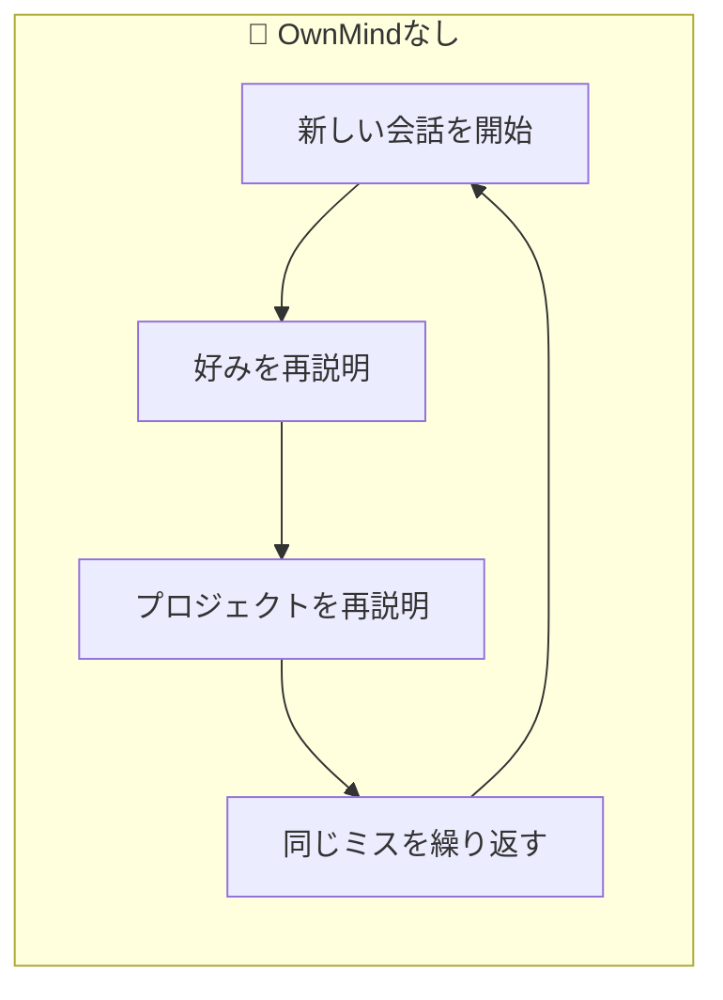
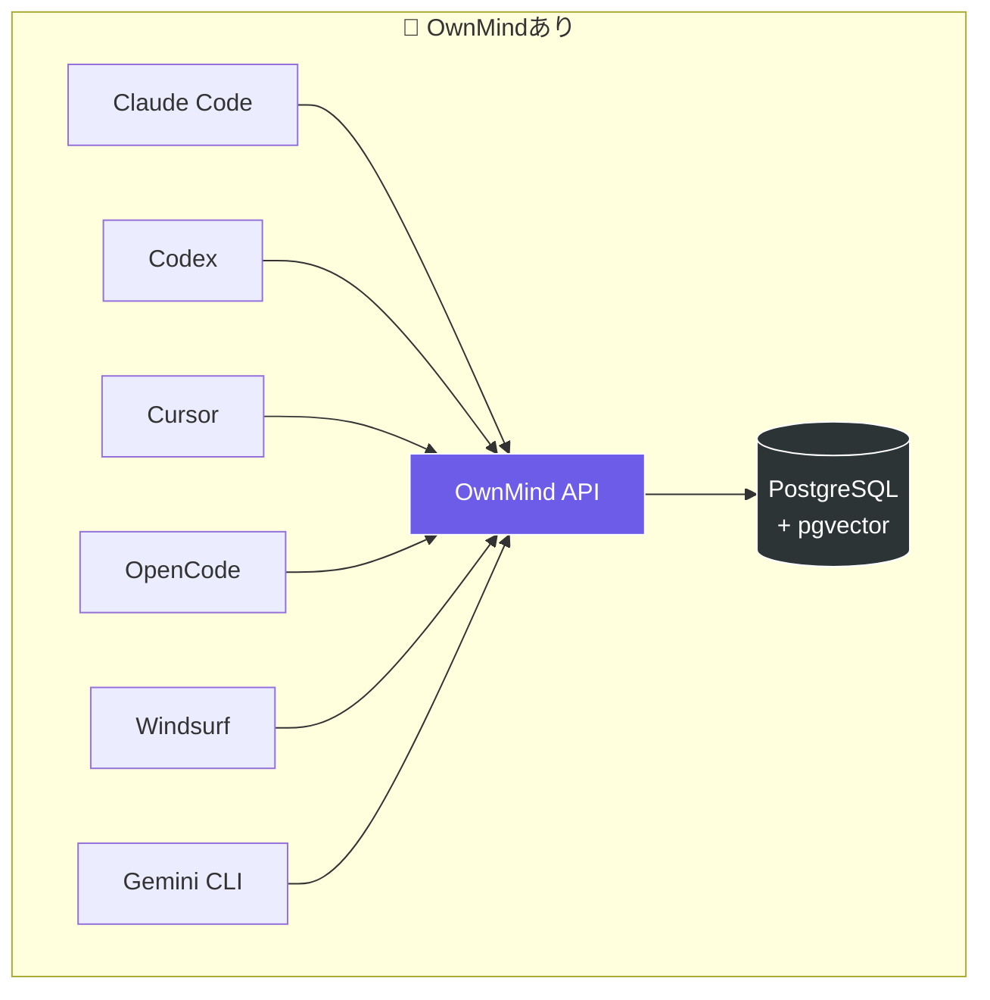
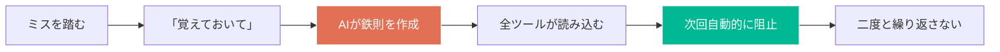
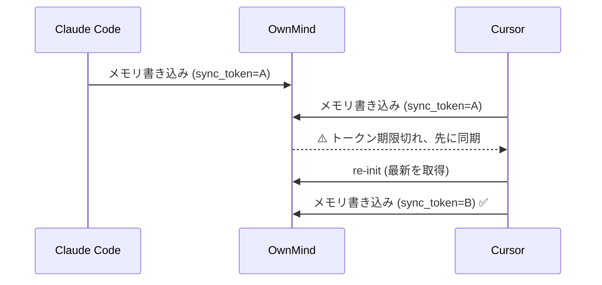

AIパーソナライズド永続メモリソリューション

[English](../README.md) | [繁體中文](README.zh-TW.md) | [日本語](README.ja.md)

# OwnMind — クロスプラットフォームAIメモリシステム

AIツール間でメモリを共有。Claude Code、Codex、Cursor、Copilot、OpenCode、その他のオンラインAI — OwnMindがすべてのツールであなたの好み、鉄則、プロジェクトコンテキストを読み書きできるようにします。

## なぜOwnMindが必要？

### 今のAIツールには3つの根本的な問題がある



**1. 毎回ゼロからスタート**
「varを使うな」「デプロイ前に環境変数を確認して」と100回言っても、次の会話では全部忘れる。同じことを何度も教え直す時間が無駄になる。

**2. ツールを切り替えると記憶喪失**
午前中にClaude Codeで作業して、午後にCursorに切り替えると、AIは午前中の作業を全く知らない。あなたの経験は一つのツールに閉じ込められる。

**3. 過去のミスを繰り返す**
先週のデプロイは環境変数の設定漏れでクラッシュした。あなたは覚えているが、AIは知らない。次回も同じミスを犯す。

### OwnMindの解決方法



**1つのAPI、全ツールで同じメモリを共有。** 一度教えれば、すべてのAIが知っている。

## OwnMindの対象ユーザー

- **毎日複数のAIツールを使う開発者** — ツールごとに好みを再説明する必要がなくなる
- **複数プロジェクト・複数デバイスで作業する人** — メモリがどこでもついてくる
- **チームAI規範が必要なテックリード** — ルールを一度設定すれば全員に適用
- **AIを進化させたいパワーユーザー** — AIに経験を蓄積させ、使うほど賢くなる

## よく使う3つのフレーズ

| あなたが言う | AIがやること |
|-------------|------------|
| **「覚えておいて」** | 鉄則として保存 — 全ツールで永続化、二度と忘れない |
| **「今日何を学んだ？」** | 会話を振り返り、保存すべき新知識をリストアップ |
| **「このプロジェクトの残りタスクは？」** | 全プロジェクトの進捗とTODOを取得して回答 |

## コア機能

### メモリと防護



- **クロスプラットフォームメモリ** — 1つのAPI、全AIツールで共有
- **鉄則管理** — 過去のミスを完全なコンテキスト付きで記録、二度と繰り返さない
- **リアルタイムルール適用** — セッション開始時に自動読み込み、AIが違反を能動的にブロック
- **トリガータグ** — 鉄則にトリガーをタグ付け（`trigger:commit`、`trigger:deploy`）、操作前に自動チェック
- **ルールバージョン履歴** — 変更時に旧バージョンを自動保存、進化の過程を追跡可能

### コラボレーションと同期



- **Sync Token** — 複数ツール同時使用時にコンフリクトを自動検知、メモリの一貫性を保証 `v1.8.0`
- **引き継ぎ機能** — 異なるツール間でシームレスに作業を引き継ぎ
- **チーム規範** — 管理者がルールを配信、メンバーが自動読み込み `v1.8.0`
- **ルール品質トラッキング** — 遵守/違反/トリガー回数を自動記録、低遵守率で警告 `v1.8.0`

### インフラ

- **シークレット管理** — APIキーとパスワードを安全に保存
- **セマンティック検索** — pgvectorで関連メモリを検索
- **階層圧縮** — 短期メモリは自動圧縮、長期メモリは永続保存
- **Windowsネイティブ対応** — `install.ps1` と `start.cmd` 同梱

## クイックスタート

### 1. APIキーを取得

管理者に連絡してAPIキーを取得してください。

### 2. インストール

**Windows**ユーザーはPowerShellでインストール：
```powershell
irm https://raw.githubusercontent.com/miou1107/ownmind/main/install.ps1 -OutFile install.ps1
.\install.ps1 YOUR_API_KEY
```

**Mac / Linux / Git Bash**ユーザー：
```bash
curl -sL https://raw.githubusercontent.com/miou1107/ownmind/main/install.sh | bash -s -- YOUR_API_KEY
```

または以下のプロンプトをAIツール（Claude Code、Codex、Cursorなど）にコピー＆ペーストし、`YOUR_API_KEY`を実際のキーに置き換えてください：

```
OwnMindパーソナルメモリシステムをインストールしてください。

APIキー：YOUR_API_KEY
API URL：YOUR_OWNMIND_URL

現在のツール環境に基づいて、以下を自動完了してください：

Step 1：OwnMindをダウンロード
https://github.com/miou1107/ownmind を ~/.ownmind/ にclone（既存の場合はgit pull）
~/.ownmind/mcp/ で npm install を実行

Step 2：MCP Serverを設定（ツールが対応している場合）
ツールのMCP設定ファイルにownmind MCPを追加（~をフルパスに展開）：
- Claude Code → ~/.claude/settings.json
- Cursor → ~/.cursor/mcp.json
- Windsurf → ~/.codeium/windsurf/mcp_config.json

Step 3：グローバルルールをインストール
インストール済みのAIツールをスキャンし、~/.ownmind/configs/ の設定を追記：
- Claude Code → ~/.claude/CLAUDE.md（configs/CLAUDE.mdを追記）
- Codex → ~/.codex/AGENTS.md（configs/AGENTS.mdを追記）
- Gemini CLI → ~/.gemini/GEMINI.md（configs/GEMINI.mdを追記）
- Windsurf → ~/.codeium/windsurf/memories/global_rules.md（configs/global_rules.mdを追記）
- OpenCode → ~/.config/opencode/opencode.json（configs/opencode.jsonのinstructionsをマージ）

Step 4：Skillをインストール
~/.ownmind/skills/ownmind-memory.md をツールのskillディレクトリにコピー

Step 5：検証
ownmind_init を呼び出して接続テスト、メモリが読み込まれ【OwnMind】サマリーが表示されることを確認
```

### 3. 使い始める

インストール完了後、新しい会話で「OwnMindを読み込んで」と言うだけ。AIが自動的にメモリを読み込みます。

## ユースケース

### 1. ミスをAIに永遠に覚えさせる
> あなた：「覚えておいて、デプロイ前に必ず環境変数を確認すること」

AIが鉄則を作成し、ミスの背景とルールを記録。次回、どのツール・どのAIを使っても同じミスを繰り返さない。

### 2. 残りのタスクを聞く
> あなた：「ringプロジェクトの残りタスクは？」

AIがOwnMindからプロジェクトのTODOリストと進捗を取得し、完了/未完了を報告。

### 3. ツール間でシームレスに引き継ぎ
> あなた（Claude Codeで）：「まとめてCodexに引き継いで」

AIが進捗、TODO、注意事項をOwnMindに保存。Codexで新しい会話を始めると、AIが自動的に引き継ぎ内容を読み込み、シームレスに作業を継続。

### 4. AIの自己振り返り
> あなた：「今日何を学んだ？」

AIが会話全体を振り返り、まだ記録されていない新知識をリストアップし、どれをOwnMindに保存するか確認。

### 5. AIが能動的にミスを阻止
> AIが複数のSSHセッションでデプロイしようとしている...
>
> 【OwnMindトリガー】あなたは「SSHの頻繁なログイン・ログアウトを避ける」と言いました。このルールを守ります。

AIが鉄則に違反しそうな瞬間に自ら停止。リマインドは不要。

### 6. 複数ツール同時使用でもコンフリクトなし
> Claude CodeとCursorで同時に作業し、両方がメモリに書き込み...
>
> 【OwnMind】状態変更を検知、最新メモリを取得するためre-init中...

Sync Tokenがコンフリクトを自動検知。書き込み前にトークンを検証し、期限切れなら先に同期。上書きされない。

### 7. チーム規範、一度の設定で全員に適用
> 管理者：「チーム規範を追加：すべてのAPIレスポンスにrequest_idを含めること」
>
> 【OwnMind】⚠️ チーム規範を追加しようとしています。全メンバーに適用されます。「確認します」と入力してください。

チーム規範は管理者が配信し、メンバーは新しい会話で自動読み込み。違反時は強制リマインド。個人のオプトアウト可能だが、リマインドは継続。

### 8. ルール遵守状況をデータで確認
> あなた：「鉄則の遵守状況は？」
>
> 【OwnMind】ルール自己評価：IR-001 SSHルール — 遵守12回、トリガー3回、違反0回（遵守率100%）

各鉄則のenforced/missed/triggered回数を自動トラッキング。低遵守率のルールは能動的に警告。

### 9. 新しいマシンでもメモリがついてくる
> あなた（新しいPCで）：「OwnMindをインストール、APIキーはxxx」

AIがセットアップを自動完了。すべての好み、鉄則、プロジェクトコンテキストがすぐに使える。再教育は不要。

## APIリファレンス

### 認証
すべてのAPIリクエストにヘッダーを追加：
```
Authorization: Bearer YOUR_API_KEY
```

### 主要エンドポイント

| エンドポイント | 説明 |
|--------------|------|
| `GET /api/memory/init` | メモリ読み込み（profile + principles + instructions） |
| `GET /api/memory/type/:type` | タイプ別メモリ取得 |
| `GET /api/memory/search?q=` | セマンティック検索 |
| `POST /api/memory` | メモリ作成 |
| `PUT /api/memory/:id` | メモリ更新 |
| `PUT /api/memory/:id/disable` | メモリ無効化 |
| `POST /api/handoff` | 引き継ぎ作成 |
| `GET /api/handoff/pending` | 保留中の引き継ぎ取得 |
| `POST /api/session` | セッション記録 |
| `GET /api/export` | 全メモリエクスポート |
| `GET /health` | ヘルスチェック |

### メモリタイプ

| タイプ | 説明 |
|--------|------|
| `profile` | プロフィール：アイデンティティ、コミュニケーション好み、作業スタイル |
| `principle` | コア原則とビジョン |
| `iron_rule` | 鉄則：過去のミスから作られた不可侵ルール |
| `coding_standard` | 技術的好みとコーディング規約 |
| `team_standard` | チーム規範：管理者が配信、全メンバーで共有 |
| `project` | プロジェクトコンテキスト：アーキテクチャ、環境、進捗 |
| `portfolio` | ポートフォリオ |
| `env` | 開発環境情報 |

## 技術スタック

- **ランタイム:** Node.js + Express
- **データベース:** PostgreSQL + pgvector
- **MCP:** @modelcontextprotocol/sdk
- **デプロイ:** Docker Compose

## コントリビューター

- Vin (miou1107)

## ライセンス

MIT
