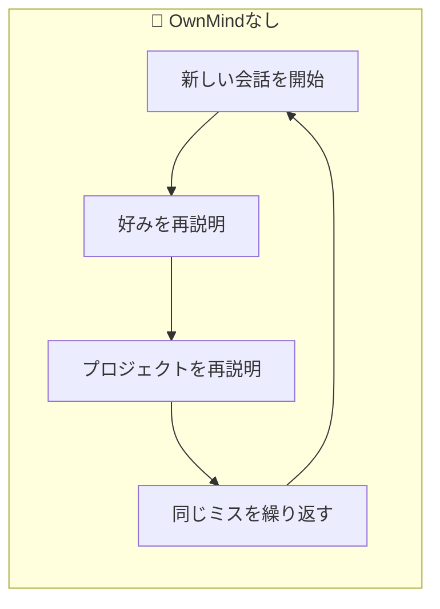
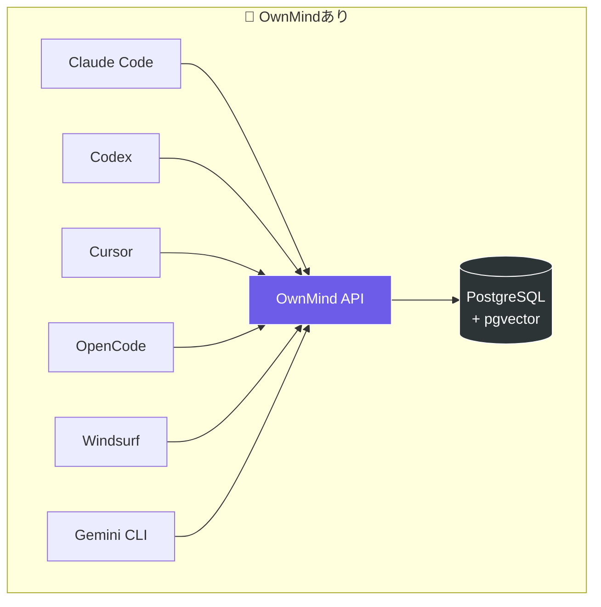
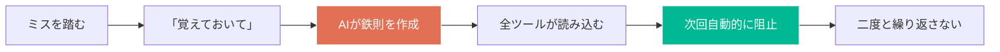
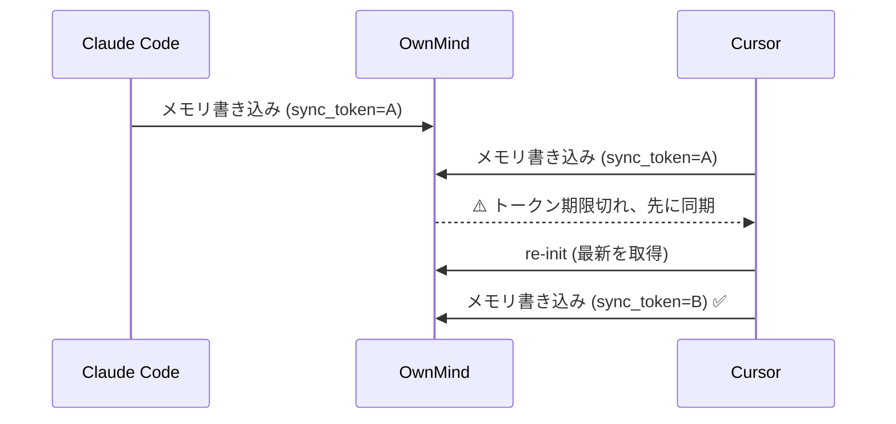

AIパーソナライズド永続メモリソリューション

[English](../README.md) | [繁體中文](README.zh-TW.md) | [日本語](README.ja.md)

**現在のバージョン：v1.17.14** · 詳細は [CHANGELOG](../CHANGELOG.md) を参照

# OwnMind — クロスプラットフォームAIメモリシステム

AIツール間でメモリを共有。Claude Code、Codex、Cursor、Copilot、OpenCode、その他のオンラインAI — OwnMindがすべてのツールであなたの好み、鉄則、プロジェクトコンテキストを読み書きできるようにします。

## ビジョン

OwnMindは、あらゆるLLM、エディタ、マシン、プロジェクト、AI会話を自由に行き来できるようにします。メモリは共有され、切り替えは無痛です。

- **インストールして忘れる** — セットアップ後、OwnMindは自動的に動作。学習コストゼロ、手動操作不要。存在すら感じない
- **使うほど賢くなる** — 使い続けるほどメモリが豊かになり、AIがあなたの作業習慣や好みを深く理解する
- **データ駆動の進化** — 利用データ、フリクションポイント、AI行動メトリクスを収集。この データがOwnMind自体の改善に活用される
- **シームレスなクロスプラットフォーム** — 1つのAPI、全ツール共通。ツールを切り替えても、マシンを変えても、メモリがついてくる
- **チーム規範の徹底** — 管理者が会社ルール（git flow、コーディング規約、レビュープロセス）を一度設定すれば、全メンバーのAIが自動的に読み込み遵守。新入社員も初日から適用
- **マルチ管理者管理** — 三段階のロール階層（super_admin > admin > user）、パスワード管理、完全な監査証跡 `v1.12.0`

## なぜOwnMindが必要？

### 今のAIツールには3つの根本的な問題がある



**1. 毎回ゼロからスタート**
「varを使うな」「デプロイ前に環境変数を確認して」と100回言っても、次の会話では全部忘れる。同じことを何度も教え直す時間が無駄になる。

**2. ツールを切り替えると記憶喪失**
午前中にClaude Codeで作業して、午後にCursorに切り替えると、AIは午前中の作業を全く知らない。あなたの経験は一つのツールに閉じ込められる。

**3. 過去のミスを繰り返す**
先週のデプロイは環境変数の設定漏れでクラッシュした。あなたは覚えているが、AIは知らない。次回も同じミスを犯す。

### OwnMindの解決方法



**1つのAPI、全ツールで同じメモリを共有。** 一度教えれば、すべてのAIが知っている。

## OwnMindの対象ユーザー

- **毎日複数のAIツールを使う開発者** — ツールごとに好みを再説明する必要がなくなる
- **複数プロジェクト・複数デバイスで作業する人** — メモリがどこでもついてくる
- **チームAI規範が必要なテックリード** — ルールを一度設定すれば全員に適用
- **AIを進化させたいパワーユーザー** — AIに経験を蓄積させ、使うほど賢くなる

## よく使う3つのフレーズ

| あなたが言う | AIがやること |
|-------------|------------|
| **「覚えておいて」** | 鉄則として保存 — 全ツールで永続化、二度と忘れない |
| **「今日何を学んだ？」** | 会話を振り返り、保存すべき新知識をリストアップ |
| **「このプロジェクトの残りタスクは？」** | 全プロジェクトの進捗とTODOを取得して回答 |

## コア機能

### メモリと防護



- **クロスプラットフォームメモリ** — 1つのAPI、全AIツールで共有
- **鉄則管理** — 過去のミスを完全なコンテキスト付きで記録、二度と繰り返さない
- **リアルタイムルール適用** — セッション開始時に自動読み込み、AIが違反を能動的にブロック
- **トリガータグ** — 鉄則にトリガーをタグ付け（`trigger:commit`、`trigger:deploy`）、操作前に自動チェック
- **ルールバージョン履歴** — 変更時に旧バージョンを自動保存、進化の過程を追跡可能

### コラボレーションと同期



- **Sync Token** — 複数ツール同時使用時にコンフリクトを自動検知、メモリの一貫性を保証 `v1.8.0`
- **引き継ぎ機能** — 異なるツール間でシームレスに作業を引き継ぎ
- **チーム規範** — 管理者がルールを配信、メンバーが自動読み込み `v1.8.0`
- **Team Standard RAG** — Markdownヘッダー階層分割（H1-H3）、複雑な規範の精密なセマンティック検索。`ownmind_upload_standard` でアップロード、`ownmind_confirm_upload` で確認 `v1.15.0`
- **ルール品質トラッキング** — 遵守/違反/トリガー回数を自動記録、低遵守率で警告 `v1.8.0`

### 可観測性と分析 `v1.9.0`

- **アクティビティログ** — 全OwnMindイベントをローカル+サーバーに記録
- **コンプライアンスレポート** — AIが鉄則の遵守/スキップ/違反を自動報告
- **管理ダッシュボード** — ユーザー統計、ツール/モデル分布、日別アクティビティ、遵守率
- **クロス分析** — ツール別、モデル別、ルール別、ユーザー別の遵守率
- **コンテキストレポート** — AIが毎セッション、ユーザーの痛みと改善提案を報告
- **自動セッションログ** — 会話終了時に構造化コンテキスト付き要約を自動保存
- **3ヶ月圧縮** — 古いセッションログを月別サマリーに自動圧縮

### インストール状況ダッシュボード + ブロードキャスト通知 `v1.17.0` *(開発中)*

- **カバレッジを一目で確認** — `設定 > インストール状況` で各ユーザーのツールごとの `scanner_version`、最後の heartbeat、5 種類の状態（🟢 Active / 🟠 Stale / 🔴 Offline / 🟡 要アップグレード / ⚪ 未インストール）を一覧
- **Semver 自動判定** — `scanner_version < SERVER_VERSION` で黄色マーク；null / `unknown` / pre-release バージョンは要アップグレード扱い（SemVer 2.0.0 準拠）
- **複数ツール集約** — 同じユーザーが Claude Code + Codex + Cursor を使用 → 1 行にまとめて 3 ツール表示
- **汎用ブロードキャストシステム**（P2）— super_admin が `設定 > ブロードキャスト管理` で任意のメッセージ（announcement / maintenance / rule_change）を配信；バージョン範囲（min / max）・対象ユーザー指定・任意 snooze に対応
- **自動アップグレードリマインダー** — 毎日 03:30 Asia/Taipei にジョブが `upgrade_reminder` ブロードキャストを冪等生成；`max_version=${SERVER_VERSION}-prev` + pre-release 順序で古いクライアントのみ表示
- **ブロードキャスト毎の Cooldown** — `cooldown_minutes` で MCP 注入時のフラッディングを防止；「本日初回」「4h 空き」はクールダウンを上書きして重要通知を確実に表示
- AI 対話式アップグレード + MCP レスポンス注入は P3–P7 で提供予定

### Token 使用量トラッキング `v1.16.0`

- **IDE 横断の使用量収集** — Tier 1 ツール（Claude Code、Codex、OpenCode）からメッセージ単位の tokens + コストを自動収集
- **Tier 2 アクティビティマーカー** — Cursor / Antigravity は API に token データが無いため、日次 `session_count` で活動を記録
- **コスト計算は完全サーバーサイド** — Pricing は `effective_date` による履歴管理、client の `native_cost_usd` は参考値のみで数値を歪められない
- **常時稼働コレクター** — macOS launchd / Linux systemd / Windows Task Scheduler が 30 分おきに自動実行、IDE を開いていなくても動作
- **Codex fingerprint 監査** — Codex JSONL はネイティブ message_id を持たないため、サーバーが token breakdown を canonicalize し SHA-256 `expectedId` を自算；client の id は「実装正確性の証人」扱いで、衝突 / 不一致 / 材料欠損はすべて audit log に記録
- **個人 + チーム dashboard** — 個人ページで日次 / 週次 / 月次 cost、tokens、勤務時間（wall vs active）を表示；チームページ（admin+）は coverage panel を必ず表示、80% 未満で「データ不完全」透かしを自動追加、ランキングも提供
- **Super_admin による定価管理** — 価格更新は append-only で新 `effective_date` row を追加、既存 row は絶対に上書きしない；毎日 03:00 Asia/Taipei の再計算で過去のコストにも新価格を反映
- **透明な opt-out** — Super_admin が dashboard で個別 user を豁免；該当 user は「追跡除外中」と表示され、静かに嘘をつかない；豁免中に届いたデータは `usage_audit_log` に理由付きで記録

### 鉄則実行エンジン `v1.11.0`

- **7層防御** — git pre-commit hook (L1)、PreToolUse hook (L2)、MCP自動検証 (L3)、Init通知 (L4)、post-commit監査 (L5)、Session監査 (L6)、エスカレーション警告 (L7)
- **自動テンプレートマッチング** — サーバーが鉄則作成時に検証テンプレートを自動マッチ、手動設定不要
- **自動ナンバリング** — 鉄則作成時に連番を自動付与（IR-001、IR-002、...） `v1.13.0`
- **検証可能な条件** — AND/OR/when-thenコンビネーターエンジン、ルールが機械検証可能に
- **Git hookによる強制** — pre-commit hookがローカルJSONLコンプライアンス記録を読み取り、違反時にcommitをブロック
- **共有検証エンジン** — `shared/verification.js`、`shared/helpers.js`、`shared/compliance.js` — 全レイヤーで同一コードベースを共有 `v1.15.0`
- **L1 fail-closed** — pre-commit hookがキャッシュ空時にAPI同期を試行（3秒タイムアウト） `v1.15.0`
- **L2 commitブロック** — PreToolUse hookが全トリガータイプ（commit含む）で検証エンジンを実行、失敗時にブロック `v1.15.0`
- **キャッシュ自動リフレッシュ** — save/update/disable後にiron_rules.jsonキャッシュを自動更新 `v1.15.0`
- **アクション可能な失敗メッセージ** — 検証失敗時に修正ヒントを付与（例：「git add Xしてください」） `v1.15.0`

### スマートラーニング＆データ駆動進化 `v1.10.0`

- **週次/月次レポート** — フリクション分析と改善提案を自動生成
- **パターン検出** — AIが繰り返し発生する問題を検出、ルール化を提案
- **自動ステージング** — 価値ある学びをペンディングレビューキューに自動保存
- **週次サマリー** — 毎週最初のinitで先週の振り返りを表示
- **フリクション自動起票** — 高頻度フリクション（3回以上）でプロジェクトメモリを自動作成

### インフラ

- **シークレット管理** — APIキーとパスワードを安全に保存
- **セマンティック検索** — pgvectorで関連メモリを検索
- **階層圧縮** — 短期メモリは自動圧縮、長期メモリは永続保存
- **Windowsネイティブ対応** — `install.ps1` と `start.cmd` 同梱
- **適応型鉄則強化** — コンプライアンス履歴に基づき、頻繁に違反されるルールのリマインダーを自動強化
- **オフラインレジリエンス** — ローカルキャッシュフォールバック＋書き込みキュー、オフライン操作は再接続時に自動リプレイ `v1.14.0`

## クイックスタート

### 1. APIキーを取得

管理者に連絡してAPIキーを取得してください。

### 2. インストール / アップグレード / 修復 — 統一エントリー（v1.17.6〜）

**一番簡単な方法 — AIに一言話すだけ**（Claude Code / Cursor / Codex / Antigravity / OpenCode など）：

```
OwnMindをインストールして（API keyはYOUR_API_KEY、URLはYOUR_API_URL）
```

またはすでにインストール済みでアップグレードしたい場合：
```
OwnMindをアップグレード
```

AIがOS + 現在の状態を自動検出し、適切なコマンドを実行します。新規インストール / アップグレード / 修復（壊れた `~/.ownmind`）の3状態をカバー。

**または手動で one-liner を実行** — `bootstrap` スクリプトが3つの状態（未インストール / 壊れた / 正常）を自動判定して適切に動作。

**Mac / Linux / Git Bash**:
```bash
# 新規インストール（API key + URLが必要）
curl -fsSL https://kkvin.com/ownmind/bootstrap.sh | bash -s -- YOUR_API_KEY YOUR_API_URL

# インストール済み、アップグレードのみ
curl -fsSL https://kkvin.com/ownmind/bootstrap.sh | bash
```

**Windows PowerShell**:
```powershell
# 新規インストール
$env:OWNMIND_API_KEY='YOUR_API_KEY'; $env:OWNMIND_API_URL='YOUR_API_URL'; iwr -useb https://kkvin.com/ownmind/bootstrap.ps1 | iex

# インストール済み、アップグレードのみ
iwr -useb https://kkvin.com/ownmind/bootstrap.ps1 | iex
```

### 3. 使い始める

インストール完了後、毎セッション自動的にメモリが読み込まれます。手動操作は不要です。

## ユースケース

### 1. ミスをAIに永遠に覚えさせる
> あなた：「覚えておいて、デプロイ前に必ず環境変数を確認すること」

AIが鉄則を作成し、ミスの背景とルールを記録。次回、どのツール・どのAIを使っても同じミスを繰り返さない。

### 2. 残りのタスクを聞く
> あなた：「ringプロジェクトの残りタスクは？」

AIがOwnMindからプロジェクトのTODOリストと進捗を取得し、完了/未完了を報告。

### 3. ツール間でシームレスに引き継ぎ
> あなた（Claude Codeで）：「まとめてCodexに引き継いで」

AIが進捗、TODO、注意事項をOwnMindに保存。Codexで新しい会話を始めると、AIが自動的に引き継ぎ内容を読み込み、シームレスに作業を継続。

### 4. AIの自己振り返り
> あなた：「今日何を学んだ？」

AIが会話全体を振り返り、まだ記録されていない新知識をリストアップし、どれをOwnMindに保存するか確認。

### 5. AIが能動的にミスを阻止
> AIが複数のSSHセッションでデプロイしようとしている...
>
> 【OwnMind vX.X.X】鐵律觸發：あなたは「SSHの頻繁なログイン・ログアウトを避ける」と言いました。このルールを守ります。

AIが鉄則に違反しそうな瞬間に自ら停止。リマインドは不要。

### 6. 複数ツール同時使用でもコンフリクトなし
> Claude CodeとCursorで同時に作業し、両方がメモリに書き込み...
>
> 【OwnMind vX.X.X】行為觸發：状態変更を検知、最新メモリを取得するためre-init中...

Sync Tokenがコンフリクトを自動検知。書き込み前にトークンを検証し、期限切れなら先に同期。上書きされない。

### 7. チーム規範、一度の設定で全員に適用
> 管理者：「チーム規範を追加：すべてのAPIレスポンスにrequest_idを含めること」
>
> 【OwnMind vX.X.X】行為觸発：⚠️ チーム規範を追加しようとしています。全メンバーに適用されます。「確認します」と入力してください。

チーム規範は管理者が配信し、メンバーは新しい会話で自動読み込み。違反時は強制リマインド。個人のオプトアウト可能だが、リマインドは継続。

### 8. ルール遵守状況をデータで確認
> あなた：「鉄則の遵守状況は？」
>
> 【OwnMind vX.X.X】規則自評：IR-001 SSHルール — 遵守12回、トリガー3回、違反0回（遵守率100%）

各鉄則のenforced/missed/triggered回数を自動トラッキング。低遵守率のルールは能動的に警告。

### 9. 新しいマシンでもメモリがついてくる
> あなた（新しいPCで）：「OwnMindをインストール、APIキーはxxx」

AIがセットアップを自動完了。すべての好み、鉄則、プロジェクトコンテキストがすぐに使える。再教育は不要。

## APIリファレンス

### 認証
すべてのAPIリクエストにヘッダーを追加：
```
Authorization: Bearer YOUR_API_KEY
```

### 主要エンドポイント

| エンドポイント | 説明 |
|--------------|------|
| `GET /api/memory/init` | メモリ読み込み（profile + principles + instructions） |
| `GET /api/memory/type/:type` | タイプ別メモリ取得 |
| `GET /api/memory/search?q=` | セマンティック検索 |
| `POST /api/memory` | メモリ作成 |
| `PUT /api/memory/:id` | メモリ更新 |
| `PUT /api/memory/:id/disable` | メモリ無効化 |
| `POST /api/handoff` | 引き継ぎ作成 |
| `GET /api/handoff/pending` | 保留中の引き継ぎ取得 |
| `POST /api/session` | セッション記録 |
| `GET /api/export` | 全メモリエクスポート |
| `POST /api/memory/batch-sync-standard` | チーム規範詳細のバッチ同期（RAG） |
| `GET /health` | ヘルスチェック |

### メモリタイプ

| タイプ | 説明 |
|--------|------|
| `profile` | プロフィール：アイデンティティ、コミュニケーション好み、作業スタイル |
| `principle` | コア原則とビジョン |
| `iron_rule` | 鉄則：過去のミスから作られた不可侵ルール |
| `coding_standard` | 技術的好みとコーディング規約 |
| `team_standard` | チーム規範：管理者が配信、全メンバーで共有 |
| `project` | プロジェクトコンテキスト：アーキテクチャ、環境、進捗 |
| `portfolio` | ポートフォリオ |
| `env` | 開発環境情報 |
| `standard_detail` | チーム規範詳細（RAG）：セマンティック検索用の階層セクション |

## 技術スタック

- **ランタイム:** Node.js + Express
- **データベース:** PostgreSQL + pgvector
- **MCP:** @modelcontextprotocol/sdk
- **デプロイ:** Docker Compose

## コントリビューター

- Vin (miou1107)

## ライセンス

MIT
