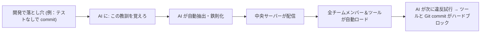

Personalized persistent memory for AI

[English](../README.md) | [繁體中文](README.zh-TW.md) | [日本語](README.ja.md)

**現在のバージョン：v1.26.130** · 詳細は [CHANGELOG](../CHANGELOG.md) を参照

# OwnMind — クロスプラットフォーム AI メモリ＆鉄則執行システム

AI に好みを忘れさせない、同じ低レベルなミスを繰り返させない。Claude Code（Claude のコマンドライン版）、Codex（OpenAI のコマンドラインツール）、Cursor（AI エディタ）、Gemini CLI（Google のコマンドラインツール）、その他のオンライン AI を使っていても、OwnMind はあなたの開発の好み、プロジェクトの文脈、絶対に違反できない「鉄則」（剛性規則：違反不可の硬性規定）をすべてのツール・マシン・AI モデル間でロックします。

---

## OwnMind は次の 4 タイプに最適

### 👤 個人開発者 — 好み設定は一度きり、どこでも適用

会社の PC で設定した「commit message（コミットメッセージ：各 git 履歴に書く説明）は繁体字中国語で統一」というルール。家のノート PC で新しい会話を開いても、出張先で借りた PC でも、AI が自動的に守ります。**あなたの開発人格は環境を変えてもリセットされません。**

### 🔁 マルチツール派 — Claude / Cursor / Codex / Copilot を同じルールで

朝は Claude Code でバックエンド、午後は Cursor でフロントエンド、夜は Codex CLI でスクリプト。各ツールが同じ個人の好みと鉄則を自動ロードし、**ツールごとに教え直す必要はありません**。来月新しいエディタ（OpenCode、Windsurf、何でも）を追加しても、OwnMind に接続すれば全て継承します。

### 👥 チームリード — ルール一括配信＋ダッシュボードで実コンプライアンス可視化

管理コンソールでチームルールを公開（例：「PR にはテスト必須」）すれば、全メンバーの AI が自動ロード。ローカルの pre-commit hook（pre-commit フック：git commit を実行する前に差分を検査する小プログラム）が非コンプライアンスコードを commit させません。管理ダッシュボード（データダッシュボード：データを図表化した Web ページ）はメンバー毎・ルール毎の実コンプライアンス率、チームで最も頻発する落とし穴、`OWNMIND_BYPASS`（ルールバイパス環境変数）の使用頻度トップを表示 — **勘ではなくデータでチーム管理できます。**

### 🛡️ セキュリティ意識者 — AI から機密データが漏れない

- パスワード / API キー（オンラインサービス呼び出し用の認証情報）を git commit しようとする → pre-commit hook がパターンマッチでブロック（v1.19.7 新規）
- AI がパスワードをメモリに書こうとする → メモリ API が HTTP 400 で拒否し暗号化金庫へ誘導
- AI 返答に user の身分証 / メール / 携帯番号が紛れる → reply-lint（返答品質リンター：AI 返答のルール違反を自動スキャン）が `privacy_check` イベントを発火、ブロックするかは各 user 自身の鉄則が決める（v1.19.7 で検出器追加、v1.19.10 で中立化）

金融、医療、法務などセンシティブな業界の開発者に特に有用。

---

## OwnMind 導入前後の開発体験比較

AI は強力ですが **本質的に長期記憶を持たず**、異なる AI モデル（例：Anthropic の Claude と Google の Gemini）はルール解釈の仕方が大きく異なります。複数マシンを跨ぐと摩擦はさらに増します。導入前後の典型的な体験比較：

### ペイン 1：新ウィンドウ開く度に「好みを再説明」

- **ブロックは正しく、そこに書かれた名前が誤っていたため、利用者は持っていないキーを探しに行かされた** — Anthropic と OpenAI はどちらも API キーの接頭辞に `sk-` を使い、`openai_api_key` という一つの正規表現がその一族全体を所有していた。v1.26.124 をコミットする最中に実地で観測された —— そのリリースが追加した既定スキャンが、そのリリース自身をブロックした：`value 符合 openai_api_key 格式 (detected_by=regex:openai_api_key) matched="sk-ant-a…AAAA"`。同じ一文の中で、マスクされた断片は `sk-ant-` と言い、ルール名は OpenAI と言っている。コミットを止めるのは仕事の半分であり、利用者が実際に行動の根拠にするのは名前のほうだ —— これは、隠れた一致によって bug id=6 が誤診されたのを受けて `matched_text` を追加した v1.26.28 と同じ失敗である。Anthropic のキーは自前のルールを持つようになり、ループが最初の一致で返るため OpenAI より前に配置した。さらに OpenAI 側のパターンも独立に `ant-` を拒否するので、並び替えも片方のパターンの編集も、それらを黙って誤った提供元に返すことはできない。除外するのは `ant-` という四文字であって `ant` の三文字ではない。ゆえに `sk-antelope…` は今も OpenAI である —— `(?!ant)` と書けば、誰も気づかない方向へ誤って分類される。Anthropic のキーを持たない利用者には、見つからないという経験すら起こらないからだ。既存の `regex:openai_api_key` に対する表明はすべて先に確認し、いずれも本当に OpenAI である `sk-proj-…` を使っていたので、この分割は誰の足場も動かしていない。新しい検体は実行時に組み立てられ、単一のリテラルへ「整理」しないよう注記が添えられている —— リテラルのキーは、そのテストファイル自身を、まさにそれが検証するスキャナによってコミット不能にする。前のリリースで `pre-commit-secret-baseline.test.js` に起きたことそのものである `v1.26.125`
- **四つの防御線のうち二つは一度も何も止めていなかった。しかも原因は同じだった** — インストール・設定・データ送信・鉄則の発火・更新を、テストを読むのではなく実際に走らせて Windows 実機で検証した。使い捨てリポジトリに整った形式の AWS キーと Anthropic キーを staged してコミットしたところ、**そのまま通った**。出力なし、exit 0。連鎖させたプローブフックにより wrapper もフックも動いていたことが確認できたので設定の不備ではない —— 秘密情報スキャンは鉄則ごとのループの内側、`isSecretGuardRule` の背後にあり、そのループの手前には「機械検証可能なコミット鉄則を持たない利用者」が必ず通る出口が二つあった。このアカウントの鉄則三つはすべてリマインダーのみで、それは**新規アカウントの既定状態**である。ゆえに両方の出口が発火し、宣伝されていたコミットの強制ブロックは、検証ブロックを手書きしたことのない全員にとって空だった。スキャンは今やすべての鉄則の出口より前で走る。漏れた資格情報は好みの問題ではないからだ。ルール駆動の経路は変えていない（secret-guard 鉄則があれば baseline は退き、同じ漏洩を二度印字しない）。`OWNMIND_BYPASS=all` は監査行を書いた上で通す —— 何をしても切れない検査は `--no-verify` を強い、それはすべてを一度に無効化し何も記録しない。同じ病巣が返信リントも無効化していた：`iron_rules.json` は検証エンジン用に作られ、v1.21.0 が `lint_validator` を探す二人目の消費者を同じファイルに向けたが、フィルタは広げられなかった。結果、バリデータだけを持つ鉄則は取得された後、ディスクへ書く途中で捨てられていた。実測：2 バイトのキャッシュ、解決されたバリデータ 0、エンジンが 79.3% の混在と判定する返信に対して「違反なし」—— きれいな返信と見分けがつかない。述語は `shared/cacheable-rules.js` に移し、このファイルの書き手二つが共有する。「設定しなければ検査しない」という全体既定は v1.26.13 が理由あって定めたものなので**意図的に変更していない**。同じ回でさらに三つ：Node フックが「今日」を UTC で計算する一方、二つのシェルフックと MCP は現地日付を使っていたため、UTC+8 のマシンでは登録済みの二つの SessionStart フックが毎日 0 時から 8 時まで互いの更新マーカーを覆し、その日のログを二つのファイルに割っていた —— 現地時刻が UTC と異なる場所でしか再現せず、それは CI では決して起きない。`install.sh` には `msys*` の分岐が存在せず、`bootstrap.sh` 経由の Windows インストールはすべて使用量スキャナを一切スケジュールせず、警告を一行だけ出していた。それは隣のコメント自身が記述している死に方そのものである。そして自己診断はその存在しないスケジュールを `[ OK ]` と認めていた。`Get-ScheduledTask` はマシン全体で共有され、別のインストールに属するタスクを見つけていたからだ —— つまり一度でも OwnMind を入れたマシンは、その検査に永遠に合格し続ける `v1.26.124`
- **中途半端にインストールされたマシンでは、鉄則チェックがまったく動いておらず、しかも何も言わなかった** — シェルのフックは `~/.claude/settings.json` から API キーを読むために、パスを `node -e` のソースへ差し込んでいた。これは `to_win_path` が `cygpath -m` のスラッシュ出力を返す限りにおいてのみ安全であり、**`path-helpers.sh` が無いときのフォールバックは `$HOME` の中身をそのまま返す**。Windows ではそれはバックスラッシュのパスなので、`C:\Users\...` はエスケープ列として JS パーサに届き、読み取りは例外を投げ、catch は空のキーを出力し、フックは一言もなく exit 0 した。v1.26.94 と v1.26.112 と同じ系統であり、その周りの `2>/dev/null` こそ利用者自身の鉄則が名指しする赤旗である。失敗を沈黙に変えるからだ。パスは現在 **argv** で渡される。バックスラッシュも空白もアポストロフィも通る形であり、`path-helpers.sh` のヘッダ自身が勧めながらここでは採用されていなかった。資格情報の読み取りも stderr を捨てなくなった。**最も効いた変更はテスト側にある**：フックの stderr を捨て、失敗メッセージは推測（「コマンドが抽出されなかった」）だった。真偽値の `reached: false` は、解析できない payload も、上流のガードによる先行終了も、クラッシュも同じ見た目になる —— そしてその三つはそれぞれ異なる stderr を書く。終了コード・stdout・stderr を添えたところ、真の原因は 2 分で分かった。物差しがもう二つ直った：`chmod 0o500` は NTFS で書き込み不可のディレクトリを作れないため、「劣化は告知される」テストは検証対象の劣化そのものを発生させていなかった（通常ファイルをディレクトリの位置に置けば、どの環境でも失敗する）。そして `finally` の裸の `rmSync` は Windows で EPERM を投げた —— その一時ディレクトリはフック自身が起動した更新の子プロセスがまだ掴んでいた —— **アサーションがすべて通過した後で**、無関係な名前のもとにテストを失敗させていた `v1.26.120`
- **Windows の赤いテストを追ったら本物の不具合が出た：記憶ファイルは一度も書けていなかった** — この課題は「Windows でだけ失敗するアサーション」の一覧で、すべて物差しの側が壊れていると見なされていた。1 つは違った。`projectSlugFromPath` はプロジェクトパスのスラッシュだけを置換していたが、Windows のプロジェクトパスは `C:\` で始まる —— **コロンはそこではディレクトリ名に入れられない**。NTFS が代替データストリームの区切りとして読むからだ。よって `mkdir` は失敗し（実測は ENOENT。Windows がまた別の形をその一つの errno に潰している）、書き込みは飲み込まれ、SessionStart フックは **Windows で記憶ファイルを一つも書けていなかった**。呼び出し側が v1.26.83 で加えたコメントは、まさにそれを防ぐためだと述べている（「これがないと AI は最後に書かれたスナップショットを読む。Windows ではそれが一度も起きていない」）。あのリリースは経路上のすべてを直し、ディレクトリ名を組み立てるその一行だけを見落とした。現在はスラグがコロンも落とし、`C--Users-Vin-X` を生成する。これは Claude Code 自身がプロジェクトディレクトリに使う綴りでもあるので、ファイルは AI が既に見ている場所に落ちる。残りは本当に物差しの問題だった：リポジトリ相対パスを POSIX のリテラルと比較していたもの（`src\app.js` 対 `src/app.js` —— 正しいファイルを見つけ、区切り文字で外した）、`/abs/path` と綴られた偽のホームを `path.join` がバックスラッシュに変える一方で、検証対象の性質（裸のファイル名ではなく絶対パス）は最初から満たされていたもの、そして通常ファイルをディレクトリに見立てると「Windows を含むあらゆるプラットフォームで」ENOTDIR になるというコメント —— 実測ではそこは ENOENT であり、不正文字も予約デバイス名も長すぎるパスも同様だった。つまり OS 自身の答えが「存在しない」であり、製品は正しかった。その最後の規則（ENOENT だけが未インストールを意味する）は、実際の OS エラーを捻出せず注入したエラーで検証できるようになり、その errno を作れる環境だけでなくすべてのプラットフォームで成立する `v1.26.119`
- **Windows では決して通り得ないアサーション、しかも告発された 2 つのファイルは健全だった** — `chmod` は NTFS では何もしない。修正したマシンでの実測では、755 に設定したファイルは 666 として読み戻される。したがって `statSync(f).mode & 0o100` は、`scripts/bootstrap.sh` と `scripts/run-migrations.sh` の実際の状態に関わらず、その環境で両者を壊れていると報告していた —— 壊れていたのは物差しであり、測られた側ではない。Windows でスキップするのはより悪い修正だ。そのプラットフォームに答えが一つも残らなくなる。このリストで何ヶ月も生き延びた不具合は、すべてその形をしている。現在は代わりに **git のインデックス**（`100755`）に問う。これはどのプラットフォームでも本来より適切な問いである。ローカルのビットは「このマシンが今たまたまどうなっているか」を語るが、インデックスのモードは**クローンする全員が何を受け取るか**を決める。`100644` でコミットされたスクリプトは、作者の作業コピーがどうであれ、その全員にとって実行不能である。POSIX のビットは意味のある場所で引き続き検証する。インデックスに問えない事例が一つある —— インストーラのフック複製関数が一時ディレクトリに作る新しいコピーだ。そこでは Windows で答えられる半分、すなわちその関数が実行ビットを要求しているかを検証し、本当の観測はそれが可能な環境に残す。新しいヘルパーは自前の逆対照を持つ：`100644` でコミットされたファイルは必ず失敗しなければならない。さもなければ「Windows で通る」と「何を渡しても通る」は同じテストになる `v1.26.118`
- **自己診断は MCP サーバーが「登録されている」ことは確認したが、「起動する」ことは一度も確認していなかった** — `mcp_registered`（v1.26.112）は `~/.claude.json` を読み、`mcpServers.ownmind` の存在を確認する。それはあのリリースに必要だったものそのものだ。きっかけとなったマシンでは、そのキー自体が存在しなかったのである。見えないのは、**エントリはあるのに起動しない**場合だ。そしてこのリポジトリは、その区間を四度壊している。いずれも設定ファイルは完璧に読める：`cygpath -w` のパスが `node -e` のソースへ埋め込まれ、JS パーサがバックスラッシュを食べた `v1.26.94`。PowerShell 5.1 が同じソースから二重引用符を剥ぎ取り、しかも PowerShell 自身のパーサはそれを完璧だと述べた `v1.26.112`。Git Bash が cmd.exe の `/c` を `C:/` に書き換え、その書き換えられた形が起動コマンドに入り込む `v1.26.112`。そして `start.cmd` の「node が PATH にない」フォールバックの階段 —— その失敗はエラースプール内のファイルであって、設定ファイルの誤りではない `v1.17.77/79`。新しい `mcp_launches` は、Claude Code がセッション開始時に行うことを行う。そのファイルにある `command`・`args`・`env` を**一字も変えずに**spawn し、JSON-RPC のハンドシェイクを完了させ、`ownmind_*` ツールを数える —— 実装したマシンでウォーム 693 ミリ秒である。インストーラの意図からコマンドを再構成すれば、試されるのは意図だ。四度間違っていたのはディスク上のその一行である。**意図的に fail-open する**：タイムアウトは*判定不能*を意味し、決して*故障*を意味しない。冷えたマシンや負荷の高いマシンは、健全なままどんな予算も超えうるし、自己診断が走るのはインストール直後、最も忙しい瞬間である。v1.26.106 は「遅い」を「壊れている」と読んだ検査から、すでに一度捏造された FAIL を送信している。これは v1.26.113 の `lock_age_seconds` と正反対であり、違いは答えが何のためのものかにある。あちらは**振る舞い**を左右し、誤読は何かを壊す。こちらは**診断**であり、誤読は問題のないマシンを告発する。二つに分けたことで安価な確実性も残る —— `mcp_registered` は常に答えを返す純粋なファイル読み取りのままだ。もう一つ塞ぐべき副作用があった。サーバーは起動時にハートビートを送り、`collector-silence` はそのハートビートでマシンが沈黙したかを判断する。したがって毎日無人でサーバーを起動する検査は、誰も使っていないマシンを保証し続けることになる —— 検査対象を密かに保証する検査は、検査がないより悪い。診断としての起動には印が付き、ハートビートは送られない。すべてのテストは一時ディレクトリの偽サーバーに対してどのプラットフォームでも走る。それが要点である：上記四つの不具合が生き延びたのは、到達しうるテストがすべて動作する Windows マシンを必要としていたからだ `v1.26.117`
- **ハングしたテスト実行は、どこで止まっているかを何も語らない** — CI 導入の翌日、`main` の macOS レグは開始 20 秒で最後の行を出したきり 20 分間沈黙し、ジョブ自身の制限時間に打ち切られた。GitHub はこれを `cancelled` として記録するため、誰かがボタンを押したように見える。同じコミットの再実行は 74 秒で通り、調べる材料は何も残らなかった。同じ日の早い時間にも別のコミットで同じことが起きていたが、新しい push に打ち切られたため「ハング」として認識すらされていない。`node --test` には既定の制限時間がなく、しかもファイルを**投入順に**報告するため、終わらないファイル 1 つがその後ろのファイルすべてを黙らせる。現在ランナーは `--test-timeout=300000` を伴う。スイート全体が ubuntu で 30 秒、macOS で 47 秒なので 5 分は十分に遠く、超えたものは報告に名前が出て、20 分の沈黙ではなく数分で赤になる。**これはハングを直したものではない** —— ローカルでの全体実行 5 回でも、停止位置が指すファイルの 120 回実行でも再現せず、完全なログが残った唯一の回も再実行では通った。次に起きたときに名前が残るようにしただけである。網には穴もあり、それは推測ではなく実測である：node 20 では「決して解決しないテスト」は自力で失敗し「ハンドルを閉じないファイル」は捕まるが、node 24 では逆で、後者は依然として無制限のままである `v1.26.114`
- **スタブの `stat` では「このマシンでヘルパーが動くか」を問えない** — v1.26.111 は `PATH` 上のスタブ `stat` で方言の扱いを全プラットフォームに固定した。これは最も重要な性質であり、それらのテストが存在する理由でもある。しかし四つの事柄がその射程外に残っていた。いずれもこの欠陥が隠れ得た、あるいは再発し得た経路である。スタブはテストが選んだ方言しか答えないため、**このマシン**に問うものが一つもなかった。それこそ Linux で九リリースにわたり「否」と答えられ続け、その間 macOS ではすべて緑だった問いである。スタブのテストはヘルパーを直接呼ぶため、利用者に実際に噛みついた帰結も覆われていなかった。すなわち `acquire_update_lock` が空の経過時間を「判断できない」と読み、staleness の分岐を丸ごと飛ばし、中断された実行が残したロックが決して引き継がれない、という帰結である。第三に、どちらの形式も答えられないときヘルパーは**黙って**非ゼロを返していた。沈黙こそがこれを九リリース生き延びさせたものであり、二つの `2>/dev/null` が苦情を覆い、どの層も一言も発しなかった。現在はファイル名と試した両形式を stderr に述べる。呼び出し側は従来どおり fail-closed であり、方言のロジックには一文字も触れていない。第四に、ファイルが存在しない場合は日常である（`acquire_update_lock` は毎セッション、通常は存在しない `.reclaim` の経過時間を問う）。この経路は静かでなければならず、さもなければ先の診断が全利用者の起動時の雑音になる。ヘルパーを戻すと四つのうち三つが赤くなる。四つ目は設計上どちらでも緑であり、過剰修正を防ぐ番人である `v1.26.113`
- **MCP サーバーは Claude Code が読むファイルに一度も登録されていなかった** — Claude Code は `~/.claude.json` から MCP サーバーを起動するが、どのインストーラも `~/.claude/settings.json` しか書いていなかった。したがって `ownmind_*` ツールは誰のセッションにも存在しなかった。壊れていたのでも機能低下でもなく、登録されていなかったのである。これが隠れ続けたのは**見える側が動いていたから**だ。SessionStart フックは `settings.json` に設定され、Claude Code はフックについてはそのファイルを読む。フックは自前で HTTP 呼び出しを行うため記憶は文脈に現れ、誰ももう半分の所在を問わなかった。2026-08-09 の実測では、`settings.json` に完全かつ正しい `mcpServers.ownmind` があり、`.claude.json` には `mcpServers` キーすら存在せず、セッションに `ownmind_*` ツールは一つもなかった。一方で `node ~/.ownmind/mcp/index.js` を手で叩くと `initialize` は正しく応答した。リポジトリは半分は知っていた。`resolve-credentials.cjs` は両方を探し、v1.26.93/94 の記述も `~/.claude.json` を「何も書かないファイル」と呼んでいる。ただ誰も文を締めくくらなかった。何も書かないなら、登録されていないということである。**難しかったのは更新スクリプトの側だ**。インストーラを再実行する人はいない。自動更新の経路は `git pull` → `npm install` → `update.sh` であり、インストーラだけを直せば、このリリースは修復を宣言しながら既存のすべてのマシンをそのまま壊れたまま残すことになる。v1.26.104 が git フックのラッパーで陥ったのと同じ罠である。実装中に同じ病が二度再現し、いずれも元の欠陥が決して問わなかった同じ問い、すなわち**どのファイルか**によって捕捉された。ヘルパーは `os.homedir()`（Windows では `USERPROFILE`）を既定にしていたが、インストーラは bash の `$HOME` を使っていた。更新スクリプトは一方のホームから資格情報を読み、別のホームへ書いていた。どちらも正しく書き、正しく読み戻し、成功を報告した。誰も見ていない場所で。現在ホームディレクトリは明示的な引数であり、絶対パスでないもの、Windows での POSIX 形式は拒否される。さらに `mcp_registered` という自己診断がそのファイル自体に問い合わせる。`mcp_files` も `mcp_node_modules` も、ツールが存在しないマシンで緑だったからである `v1.26.112`
- **`stat -f` は BSD では書式文字列、GNU では `--file-system` を意味する。そのため更新ロックは Linux で自分の経過時間を計算できなかった** — CI の初日に見つかった。セッションフックは `stat -f %m … || stat -c %Y …` でファイルの経過時間を求めており、前者が**静かに**失敗すると仮定していた。Linux では 5 行のファイルシステム情報を **stdout** に出力してから非ゼロで終了するため、`||` が正しい epoch をその下に追記し、次の行の算術がそこで落ちる。すぐ上のコメントは 2 つのプラットフォームの違いを明記していたのに、その下のコードは片方が黙って失敗すると仮定していた。`2>/dev/null` が覆っていたのは、最初から stderr だけである。現在は 2 つの形式を別々に試し、結果が数字だけかを検査する。テストは PATH に置いた スタブの `stat` で駆動するので macOS でも走る —— 要点はまさにそこで、これは macOS の開発者には見えない不具合である。alpine コンテナで確認し、Linux の node 20 / node 24 でも全テストが通る。**これは上の Windows 系リリースの鏡像**である：Mac で開発し、別の場所で壊れる。これを直したことで、期限切れロックの引き継ぎ経路が Linux で初めて到達可能になり、そこに元からあった競合が表に出た：強制終了した引き継ぎ役が残したマーカーを片付ける際、脇へ退避したものが本当に計測した期限切れのマーカーかを確認していなかった。その間に作られた新しいマーカーを代わりに奪ってしまい、2 つのプロセスが同時に更新に入りうる。両方の実装で塞ぎ、それぞれ逆向きの検証も付けた。**残る窓は 1 つあり、覆い隠さず書き残してある** —— フック 8 本が競合する状況で、1 CPU では 60 回に 1〜2 回まだ赤くなる。追跡すると 4 つのプロセスが順に、いずれも**規則どおりに**引き継ぎ役になっている。それは上記の窓ではなくプロトコルの形そのものであり、プロトコル自身が「削除と再作成はアトミックにできない」と述べている `v1.26.111`
- **このリポジトリに CI が入り、初日に「どこでも走っていなかったテスト」を 3 つ見つけた** — それまで `.github/` にあるのは `CODEOWNERS` だけで、テストは誰かが手で走らせたところでしか走らず、実際にはそれは 1 台の macOS だった。**Mac では、Windows でしか壊れないテストは「失敗したテスト」ではなく「見えないテスト」である。** 前リリース分の不具合はすべてそうやって生き延びていた。必須ゲートは ubuntu × node 20、ubuntu × node 24、macOS × node 20。Windows は実行して結果を出すがマージは止めない —— 利用者は `main` から直接更新を取得するのでマージは即出荷であり、既存の 109 件の赤で出荷を人質に取ることはできない。`continue-on-error` を付けた matrix leg ではなく独立した job にしてある：そうした leg は `needs.<job>.result` では依然 `failure` を返すため、その値を読むゲートは「Windows だけが赤」と「全部が赤」を区別できない。初日に判明したこと：`install-failed-beacon-ps1` は**書かれて以来どこでも通っていなかった**。ハーネスが `function Fail` だけを抜き出していたが、`Fail` はファイルのさらに下で定義された関数を文字列補間しており、PowerShell は引数の組み立て段階で例外を投げ、検証対象の呼び出しに到達する前に `Fail` 自身の `catch { }` に飲み込まれていた。しかも探していたのは `pwsh` だけで、macOS には存在せず Windows では `powershell` と呼ぶため、両方でスキップされていた —— **そしてスキップは、サマリー上でパスとまったく同じに見える。** `scanner-schedule-repair` の 2 件は macOS 専用の `plutil` を呼んでおり、「macOS：…」は実質「どこでもない」を意味していた。現在は生成された XML を直接検証し、プラットフォームのツールがある場合はクロスチェックとして併用する。`v1.26.107`
- **Windows でしか壊れず、Mac からは見えない 4 つの不具合** — このリポジトリに CI はない。`.github/` にあるのは `CODEOWNERS` だけで、テストは誰かが手で走らせたマシンでしか走らない。そして Windows 専用の経路は、Mac ではスキップされるか、そもそも到達しない。**macOS で緑になるテストは、macOS の開発者にとって「通ったテスト」ではなく「見えないテスト」である。** **(1)** サーバーへ送られる診断ログが文字化けし、NUL バイトを 148 個含んでいた。`install.ps1` は `Tee-Object -FilePath` で書いていたが、Windows PowerShell 5.1 の `Tee-Object` には `-Encoding` パラメータが**存在しない**（PS 6 で追加）ため必ず UTF-16LE で書き、読む側は UTF-8 として読んでいた。該当機の `register-task-*.log` はすべて `fffe` で始まり、最も古いものは 2026-05-09 だった。**これは v1.17.83 の障害の材料そのものである**：NUL が 1 つあるだけで Postgres は JSONB 文書全体を拒否し、INSERT が失敗し、クライアントの再送キューが同じ行を送り続ける。当時はサーバー側で INSERT 前に除去して直したが、今回はその残り半分にあたる。現在は**推測ではなく BOM に従って復号する**。なお最初の修正自体が間違っており、それをテストが捕まえた：`JSON.stringify` は NUL をエスケープ列に変えるため、直列化後の文字列から生の NUL を探しても見つからず成功と報告してしまう。Postgres が拒むのは、まさにそのエスケープ列である。**(2)** スケジューラ検査が偽の FAIL を送っていた。`Get-ScheduledTask` は CIM コマンドレットで、モジュールの自動読み込みと CIM セッションの確立が先に必要になる。アイドル状態の Windows 10 で実測約 1.5 秒、予算は 5 秒 —— 3 倍の余裕だが、self-check が走るのはインストールや更新の直後、マシンが最も忙しい瞬間である。タイムアウトを 600ms に下げると、当時の記録と 1 文字違わぬエラーが再現した。`launchctl list` は約 20ms なので、同じ定数は macOS では 250 倍の余裕になる。この予算は、この呼び出しのために決められたものではなかった。さらにその下で、`safeSpawn` が返す `killed`／`signal` を呼び出し側が捨てて `error` だけを見ていたため、タイムアウトが利用者には「Windows と PowerShell が必要です」と表示されていた —— 両方あることが明白なマシンに対して。**(3)** 4 つのテストファイルが Windows では何も検査していなかった。`new URL(...).pathname` は Windows で `/C:/Users/...` を返し、node がそれを現在のドライブのルートに連結するため、`install-artifacts.test.js` は `MODULE_NOT_FOUND: C:\C:\Users\...` で**最初のアサーションの前にプロセスごと落ちて**おり、他の 3 つは ENOENT だった。macOS ではその pathname がたまたま妥当な絶対パスになるので、4 つとも緑だった。**(4)** Git Bash 検出器を実際に実行する唯一のテストは、どのプラットフォームでも通り得なかった。PowerShell を `-ExecutionPolicy Bypass` なしで起動していたためである。ポリシーを設定したことのない Windows クライアントの既定は Restricted で、`.ps1` のドットソースはそこで拒否される。macOS には PowerShell がないので、ブロックごとスキップされていた。出荷される呼び出し側はすべてこのフラグを渡しており、渡していなかったのはテストだけだった。直して初めて第二の層が見えた：`.cmd` スタブが cmd.exe のメタ文字をエスケープしておらず、実際の `bash --version` は 3 行目の末尾が `<http://gnu.org/licenses/gpl.html>` で終わる。cmd はこの `<` を入力リダイレクトとして読むため、Git Bash の 2 例とも否と判定され、テストは正常な検出器を告発していた。**新しいテスト 2 本はどこでも走る**。それが要点で、これらの不具合が生き延びたのは、到達しうるテストがすべて動作する Windows マシンを必要としていたからである。その後のレビューで、この検査自体が、まさに取り除こうとしていた死角を抱えていたことが分かった —— 走査対象が `tests/` だけで、同じ裸の `.pathname` が出荷コードにも生きていた。1 つ前のリリースで追加されたコミットメッセージ用フックである。Windows ではそれ自身の import が解決できず、しかもこのフックは設計上どんな異常でも exit 0 する —— つまり**コミットメッセージの規則は、そこで静かに一切効いていなかった**。現在は `hooks/`・`mcp/`・`scripts/`・`shared/`・`src/` も走査し、PowerShell を使うファイルの選別も大文字小文字を区別しない。以前の条件は小文字で引用符付きの `powershell` を要求していたため、この規則そのものに違反していたファイルを見落としていた。もう 1 点、NUL のエスケープ除去は、先頭のバックスラッシュ自体がエスケープされている場合でも、その 6 文字を見つけ次第削っていた。その 6 文字を本文として含む payload は、もはや解析できない文書になる —— サーバーが拒否し、キューが再送する。まさにそれが防ぐはずだったループである `v1.26.106`
- **同じ設定ファイルの中で、片方のアイアンルールフックは動き、もう片方は何か月も死んでいた** — v1.26.102 に更新した Windows の `~/.claude/settings.json` に、同じフックを指す PreToolUse が 2 件。`Edit|Write|MultiEdit|NotebookEdit` の方は exit 0、`Bash` の方は Bash コマンドを打つたびに `ERR_MODULE_NOT_FOUND` で exit 1。**2 つのファイルはバイト単位で同一**で、違うのは置き場所だけ：`~/.claude/hooks` に置かれた方は `../shared/helpers.js` を import するが、`~/.claude/shared/` はどのインストーラも作らないディレクトリなので、node は payload の 1 バイト目を読む前に終了する。フックはもともと静かなものなので、コマンドのたびにアイアンルール検査が見えない場所で死んでいても誰も気づかない。v1.26.92 はこの経路が壊れていることを既に把握し、新規インストールはチェックアウト側を指すようにしていた。しかしその判定は「この matcher の下に `ownmind-iron-rule-check` に言及する command があるか」であり、壊れている方も**言及していた**。壊れたコマンドが自分自身の修復条件を満たしてしまうため、書き換えられることは決してない。v1.26.92 が届いたのは新規インストールだけで、アップグレード組こそが全人口である。同じロジックの写しが install.ps1 / install.sh / update.ps1 / update.sh の 4 か所にあり、CI から届くのは bash の 1 つだけ —— 腐ったのは、まさにテストが触れない側だった。今は 4 つとも共有ヘルパーを呼び、**コマンドが違えば書き換える**。「存在すること」を「正しいこと」として扱わない。インストール自己診断も、どこかに写しがあるかを尋ねるのではなく settings.json に実際に登録されたコマンドを読む。ただしこのマシンでは、コマンドを読むだけでも足りない —— 同じ教訓のより鋭い形である。2 つの写しはバイト単位で同一なので、登録されたファイルは**存在する**。欠けていたのは、そのファイルが 1 行目で import するモジュールのほうだ。解決できない import は payload が動き出す前に node を終了させる。**存在することは、起動することではない。**そこで両方を検査するようにした。6/6 を報告しながらフックが死んでいる状態は、これで成立しなくなる。もう 1 点、レビューで見つかったもの：`install.sh` はヘルパーを裸の `VAR=$(...)` で呼んでいた。`set -eE` の下ではヘルパーの終了コードがそのまま伝播するため、読めない設定ファイルが 1 つあるだけで インストーラはその行で、しかも静かに中断し、自己診断を含む以降のすべてが走らなくなる。さらに、更新スクリプトの自己診断は修復の**後**に移した。先に走ると、同じ実行がこれから直す状態を報告してしまう —— マシン 1 台につき 1 件の警報が上がり、誰かが読む頃にはそのマシンはもう健全になっている。あわせて `.gitignore` に、インストーラがチェックアウトへ書き込む実行時ファイル 6 件を追加した。元の一覧は `.update-lock*` で止まっていたため、実機では毎回のアップグレードがツリーを dirty と判定して `git reset --hard` の分岐へ進み、その警告が毎回の雑音になっていた —— 利用者が実際に手を入れた変更は、そこで一緒に流れていく `v1.26.105`
- **コミットメッセージの検査は、前回のコミットのメッセージを読んでいた** — git が `.git/COMMIT_EDITMSG` に書き込むのは pre-commit が走った**後**である。したがって pre-commit がそのファイルを読むと、前回のコミット、あるいは前回中断した試行が残した内容を見ることになる。各段階の内容を出力するフックで実測すると、pre-commit は `FIRST MESSAGE` を、commit-msg は `SECOND MESSAGE` を見ていた。発見は手痛い形で訪れた。禁止されたトレーラーを理由にコミットが拒否され、それを削除して再送したところ、メッセージにもはや存在しない文字列を引用して再び拒否されたのである。**静かな方向のほうが深刻だ**。一度目の試行がきれいなら、きれいなテキストが残るので、二度目に持ち込まれた違反は素通りし、誰も気づかない。これが生き延びたのは、`GIT_COMMIT_MSG` 環境変数へのフォールバックがファイル読み取りの例外時にのみ発火するからである。まっさらなテストリポジトリでは必ずそうなるため、テストは本番が決して通らない経路だけを検証していた。メッセージ規則は commit-msg フックへ移った。git が本物のメッセージを渡すのはそこだけである。pre-commit はそれらを「合格」と評価させるのではなく**除外**する。検査していない規則を `all N rules passed ✓` に数えることは、何も言わないより強い主張だからだ。規則の選別は条件の型で行い、規則コードでは決して行わない。誰がどう採番していても機能する。ハードコードされた `Co-Authored-By:` の防護は**意図的に残した** — 最初の版ではこれを削除し、穴が空いた。規則エンジンの部分一致は大文字小文字を区別するため、git 自身の綴りである `Co-authored-by:` を取り逃がす。それを捕まえたのは、一文字も変えていない既存のテストだった。続くレビューは、このリリースを保護の**純減**に変えかねなかった点を突き止めた。`~/.ownmind` は git のチェックアウトそのものなので、pull が届いた瞬間にフックのロジックは入れ替わる。しかしインストール済みのラッパーはコピーであり、自動更新の経路はそれを一度も更新していなかった。つまり利用者は、メッセージを検査しなくなった新しい pre-commit と、新スクリプトを決して呼ばない古い commit-msg を同時に抱えることになり、唯一まだ動いている規則がその沈黙を覆い隠す。現在はどちらの更新スクリプトも、すでにインストールされているラッパーを再コピーし、存在しないものは作らない。併せて三つの誤ブロックも解消した。`git commit --verbose` はステージ済みの差分をはさみ線の下に**コメントなしで**置くため、その差分に禁止トレーラーを追加する行があるとメッセージが清潔でもコミットがブロックされていた。`set -e` と `git rev-parse` のコマンド置換の組み合わせは、リポジトリ外で終了コード 128、出力なしでフックを終わらせていた。そしてコメント文字は常に `#` とは限らず設定可能である `v1.26.104`
- **ファイルを移動することは、ファイルを書くことではなくなった** — アーカイブ済みの 22 個のフォルダを `git mv` で移動しただけ、一バイトも編集していないのに、pre-commit の機密スキャンが「認証情報が含まれている疑い」として commit をブロックした。名指しされた二つのファイルはコミット済みの版とバイト単位で同一であり、git 自身も `R100` と報告している。同じ内容は何バージョンにもわたってコミットされ続け、一度も検出されたことはなかった。スキャナーが誤読したのではない — スキャナーは git に**単一パス**の差分を求めており、パスを一つに限定すると、追加と対にすべき削除側が存在しないためリネーム検出が働かず、git はファイル全体を新規追加として返す。報告が提案した blob ハッシュの比較は、完全一致のケースを隠すだけで、より厄介なもう一方には効かない。**ファイルを移動しつつ一行だけ編集する**と、手つかずの残り 400 行はやはり新規として提示され、しかもハッシュは実際に変わっている。そこで両方のパスを git に渡すようにし、二つの呼び出しのいずれにも `-M` を明示した — 設定で `diff.renames=false` にしていると移動は無関係な削除と追加として届き、バグがそのまま戻るからであり、その設定の好みが commit をブロックするかどうかを決めてはならない。続くレビューが、この変更で唯一「以前よりスキャン量が減りうる」経路を突き止めた。git は返してきたパスを、こんどは **pathspec（パターン）**として読み直し、`--` ではそれを無効化できない。`:!victim.txt` は正当なファイル名であると同時に除外パターンでもあり、自分の移動先を自分の差分から打ち消してしまう — 実測で、スキャナーは新規追加された `sk-proj-…` の行を通過させた。`--literal-pathspecs` で修正しテストで固定した。同じフラグは逆方向の誤ブロックも併せて解消する。**新しい適用除外は追加していない**：blob SHA によるスキップは一度書いてから削除した。ペアリングを直した後では、その分岐があるかないかをテストで区別できず、ブロックを伴うセキュリティ検査においてテストされていない「スキャンを飛ばす」分岐は、安全の上積みではなく穴の追加だからである。影響は一度の commit にとどまらない — 誤検出を回避する手段として文書化されているのは bypass であり、bypass は同時に他のすべての規則も無効にする `v1.26.103`
- **コレクターが止まったことを、本人にも管理者にも通知するようになった** — 利用状況の収集はスケジュール実行のスキャナーに依存しており、そのスケジュールが死ぬと本人の MCP は毎日ハートビートを送り続ける一方で何もアップロードされず、ダッシュボード上は「この人は働いていない」とまったく同じに見える。原因となる機構はすでに二度修正済みだが（v1.26.65、v1.26.79）、2026-08-07 に計測した端末はなお十一日間沈黙しており、クライアントが古すぎてどちらの修正も届いていなかった。「N 日間報告がない」という規則ではこれをまったく検知できない。手がかりは**一台の端末が自分自身と食い違うこと**である。その端末の `claude-code` 行は 0.2 日前、他の三つは 11.2 日前だった。同じスナップショットで、健全な十台はすべてのツール行が同一秒に書かれていた。よってこの規則を採用し、二つのしきい値の間には意図的に隙間を設けた。判断がつかない端末には「かもしれない」ではなく何も出さないためである。本人には何が止まったか、いつからか、その間の利用状況が送られていないこと、そして修復方法を伝える。管理者には修復手順を含まない別の一覧を送る。他人の端末では実行できないからである。修復すれば通知は期限切れを待たずに早期終了する。初めて異常を検知した時点では通知しない。二週間ぶりに電源を入れた端末は、スキャナーが次に走るまでまさにこの形になる（Windows では二時間、バッテリー駆動ではさらに長い）。そのため六時間後もなお壊れている場合にのみ通知し、二週間経っても直っていない端末は再度知らせる。通知そのものは 48 時間で消えるからである。**完全に沈黙した端末は意図的に報告しない** — このデータでは、電源が切られた端末、休暇中の人、買い替えられたノート PC と区別がつかない `v1.26.102`
- **インデックス予算の半分が、セッションが既に持っているものの再掲に使われていた** — v1.26.100 は予算を件数で等分したが、等分は中立であり、ここでは中立が誤りだった。載せないことの代償が両者で違うからである。鉄則は SessionStart フックがセッションへ一式注入するので、インデックスの一行が足すのはローカルファイルへのリンクだけ。一方、載らなかったプロジェクトはセッションに存在しない。件数で等分した結果、予算の半分が再掲に費やされた（鉄則 63 件 対 プロジェクト 63 件、プロジェクト 67 件が未掲載）。現在、鉄則は 20 行の固定枠のみを取り、残りは他に経路を持たない種別へ回る。同じデータで**プロジェクトは 106 件を掲載、この一連の作業の前は 47 件だった**。上限を課された種別も、載せなかった実数をそのまま報告する `v1.26.101`
- **記憶インデックスの半分がセッションに届かなくなっており、それを誰も告げていなかった** — インデックスは記憶が一件増えるごとに一行増えるが、読み手は 200 行で打ち切り、140 行未満を求める。実際のインストールで計測すると 284 行、鉄則 143 件とプロジェクト 130 件だった。鉄則が先に並び 151 行目で終わるため、**セッションに届いていなかったのはすべてプロジェクト**である。130 件のうち届いていたのは 47 件で、残る 83 件はしばらく読み込まれていなかった。ファイルには何の印も残らず、どちらの側も警告しないため、完全なインデックスとして読まれ続けていた。上限を超えさせたのは鉄則を全件列挙していたことだが、SessionStart フックはすでに鉄則一式をセッションへ注入しているので、その行は何も足していなかった。現在インデックスには越えられない行数予算がある：各種別で更新が新しいものから採用し、取り分を使い切らない種別は残りを他へ譲り、各行は 200 文字で `…` を付けて切り詰め、改行を含む題名は一行に畳み（さもないと一件が三行になる）、そして**各節が「何件を載せなかったか」と「どこで探せるか」を明示する**。同じデータで 139 行、273 件中 126 件を掲載し、残る 147 件は明示的に告げられる。プロジェクトは 47 件から 63 件へ増え、鉄則は 143 件から 63 件へ減るが、失われるのはローカルファイルへのリンクだけで、規則自体はフックが注入する。記憶ファイルは一つも削除されず、到達不能になるものもない `v1.26.100`
- **「最も多いプロジェクト」列が空だったのは、誰もプロジェクト名を送っていなかったから** — チームページが読むフィールドは `ownmind_log_session` だけが書き込む。AI がそれを呼ばなかった場合、サーバーはアクティビティログからセッションを再構築するが、どのイベントもプロジェクト名を運んでいなかった。一週間の計測では、四名は全セッションがこの再構築で、五人目も 95 件中 76 件がそうだった。つまりこの列は四名について完全に空、五人目についても五分の四が空だった。当初これは「復旧不可能」と判断されたが、それは誤りだった。この値は v1.17.37 以来 `CLAUDE_PROJECT_DIR` から導出されており、単にセッションログ以外の何にも同行していなかっただけである。修正は復旧ではなく送信すること：導出を `resolveProjectName()` の一箇所にまとめ、MCP と二つの SessionStart フックが送るすべてのイベントがこれを運び、再構築側は最初の一件ではなく最頻値を採る。**ディレクトリ名のみで、パスは決して送らない** — 名前は作業の文脈だが、パスはその人がファイルをどこに置いているかを示す `v1.26.98`
- **シークレット検出が、コードの三分の一を鍵と誤判定していた** — 最後の砦となるヒューリスティックは「鍵の文字集合から成る 20 文字以上」で発火する。これでは鍵と識別子を区別できない。同じ日に 2 回コミットがブロックされた。ファイル名と変数名であり、いずれもユーザーには「API キーのように見える」と伝えられた。本リポジトリ自身の追跡対象ファイルに含まれる 20 文字以上のトークンすべてで計測したところ、**10486 件中 3438 件が誤検出**だった。例外はすでに 3 つ追加されており、いずれも誤ブロックのたびに足されたものである。4 つ目を足しても同じことの繰り返しになる。規則が測っていたのは長さであり、区別すべき性質は語の構造だからだ。現在は鍵らしい文字の最長連続部分（`- _ .` は連続を切るが base64 記号は切らない）を取り、そのうち語らしい区間が占める割合を測る。同一の標本で誤検出は 333 件に減り（うち 279 件は本来ランダムな npm の整合性ハッシュ）、コードと文書のみでは 9082 件中 51 件、0.6% となった。実在する 13 種類の鍵形式はすべて検出され、途中で本物の穴も塞がった。スラッシュ区切りの塊が 3 つ以上ある値はファイルパスとして無条件に通されていたが、base64 のシークレットはまさにその形を取りうる。古い例外のうち 2 つは冗長として削除し、保証は許可リストではなく計測された比率として表現するようにした `v1.26.98`
- **アップグレード失敗の記録が、理由ではなく推測だった** — アップグレードスクリプトの各エラー報告は、手書きの一文を `detail` として送っていた。そして `detail` こそサーバー、管理コンソール、ヘルス通知に届く内容である。`git pull --ff-only failed (network or non-ff merge)` は、リモートに到達できなかったのか、ブランチが分岐したのか、ファイルがロックされていたのかにかかわらず同じ文面になる。ある端末で pull が失敗し、バックアップを復元し、7 秒後に自己診断が全項目通過したが、なぜ失敗したのかは誰にも答えられなかった。ログ末尾を運ぶはずの `context` フィールドは空で届いた。どこで失われるかは未確定であり、**実証できない原因は原因として記録しない**。そこで失敗したコマンドのログ末尾を `detail` にも入れるようにした。1 行に畳み、制御文字を除去し、両プラットフォームで同一の上限を課す。呼び出し箇所の一覧はテスト時に導出する方式に変え、手作業で漏れていた箇所が即座に見つかった `v1.26.98`
- **更新ロックはロックしていなかった** — 三つのプログラムが `~/.ownmind/.update-lock` を共有し、`~/.ownmind` での日次 `git pull` が同時に走らないようにしている。しかし実際に取得していたのは MCP だけだった。シェルフックはファイルの不在を確認した十行あとで `touch` しており、その間に隙間があるうえ、`touch` は既存ファイルに対しても成功する。結果として同時に走った四つのフックがすべて「取得」した。Node フックはロックを確認したあと、何も作成していなかった。あるアカウントのアクティビティログを読んでいて判明した：毎朝四つのフックが同じ秒に起動し、三つが `update_failed`、一つが成功を記録していた。アップグレードは毎回成功しており、六日間で十八件の「失敗」はすべて競合に負けた側だった。現在は三者とも排他作成で取得し、停止した実行が残したロックの回収は専用ファイルで直列化したうえで再確認するため、順番待ちの間に他者が取得したロックを削除することはない。競合に負けた場合は失敗ではなく `update_skipped`（理由 `lock_held`）として記録される `v1.26.98`
- **送信確認のゲートは、はじめからゲートではなかった** — `ownmind_report_bug` の説明は「バックエンドが自動入力の送信を HTTP 400 で拒否する」ため AI が `confirm_string` を自分で埋めてはならない、と述べていた。実際には拒否しない：これは文字列フィールドであり、サーバーは期待どおりの値の文字列が届いたことしか分からない。報告者はその方法で二件のバグ報告を提出して実証した。サーバー発行のワンタイム語句でも塞がらない — その語句を取得する呼び出し元こそ AI だからだ。コンソールでの承認も同様で、`POST /me/login` は AI がすでに持っているのと同じ api_key を返す。両者が同一の主体として認証される限り、サーバー側のどんな検査も両者を区別できない。よってその主張は削除し、代わりに区別を記録する：`confirmation_declared` は `user_typed` / `ai_filled` / `unknown`。名前はそれが「申告」であることを示し、欠落や未知の値は強い方ではなく `unknown` になる `v1.26.97`
- **手書きのリストは、自分が取りこぼしたファイルを報告しない** — `.gitattributes` は git フックを 1 ファイル 1 行で LF に固定していたが、`hooks/ownmind-git-commit-msg` はそのリストが書かれた後に追加された。Windows のクローンでは、三つのフックのうちそれだけが CRLF で届く。リポジトリ全体を走査すると、シバンを持ちながら `eol=lf` 規則のない追跡ファイルが 32 件あった。現時点の影響はゼロ（Git for Windows は CRLF のシバンをどちらの形式でも実行する。`GIT_TRACE=1` で確認済み）だが、シェル提供元が変わった瞬間に実害となる。規則をグロブに変え、`git ls-files` からリストを生成して未カバーがあれば失敗するテストを追加し、`install.sh` はフックをコピーする際に CR を除去する — `.gitattributes` はチェックアウトのみを制御するため、すでに CRLF を持つマシンは git に書き換えられることがなく、正規化比較によって `status` にも `pull` にも見えないからだ `v1.26.96`
- **導入前**：新しい会話を開いてコード依頼するも、古い構文を返したり独自のコーディングスタイルを忘れたり。「うちのプロジェクトはこう書く」と毎回再入力。
- **導入後**：会話オープンの瞬間、OwnMind が既に好み・スタイル・剛性制約を AI に注入済み。要件だけ伝えれば、一発で準拠コードが出てきます。

### ペイン 2：マシンとモデルの切り替えで「知能ゼロ・規格分断」

- **導入前**：朝は会社デスクトップで Claude Code、午後は家のノート PC で Cursor + Gemini。**異なるマシン** + **異なる AI モデル**を跨ぐとメモリ文脈が完全リセット、コード再コピー＆モデル毎の癖を再調整。激痛。
- **導入後**：どの PC・どの AI モデルでも、OwnMind がバックグラウンドでメモリコアを統一。**どこで会話を開いても、連続性のある一貫体験。**

### ペイン 3：同じ失敗を繰り返す AI

- **導入前**：先週デプロイで env var を漏らして本番 DB がクラッシュ、徹夜修復。今日 AI に新機能デプロイを頼んだら同じ env var を漏らした指示を生成、再災害寸前。
- **導入後**：失敗時に「この教訓を覚えろ」と AI に伝えるだけ。鉄則として OwnMind にアップロード。次回 AI がデプロイしようとすると、カーネルレベルで阻止され、AI に自己点検を強制、再災害を未然防止。

### ペイン 4：チーム開発がバラバラ、統一基準なし

- **導入前**：チームが拡大するにつれ、各人の AI 使用習慣と規範が異なる。テストなしの粗悪コード、誤って機密 commit。標準ドキュメントを書いても誰も読まない。コード品質が制御不能に。
- **導入後**：リードが管理コンソールでチームルールを一度公開、全メンバーの AI が自動強制ロード・実施。非準拠コードは、ローカル pre-commit hook がハードリジェクト、開発者 + AI に修正を強制してから commit 許可。完全自動のチーム標準化と品質ゲート。

### ペイン 5：中央管理なし、チームの AI 使用状況が不明

- **導入前**：リードはチームの AI 使用状況を全く把握できない。誰がどのツールを使い、どの技術的摩擦が頻発し、ルール遵守率は実際どれくらいか — 群盲象を撫でる。データがなく真の生産性とリスクを評価できない。
- **導入後**：専属の**中央管理コンソール + データダッシュボード**。チーム全体の AI 使用状況、メンバー毎ルール毎の実コンプライアンス率、最頻出の落とし穴 — 主要メトリクスを一目で把握。コンプライアンス分析と監査ログ（audit log：改ざん防止された全アクション記録）が自動集計。

---

## 落とし穴進化論：ミスから鉄則への学習チェーン

OwnMind のコア価値は、日々の開発で「踏んだ落とし穴」を瞬時に AI の「遺伝子ルール」に沈殿させ、同じミスがチーム内で二度と起きないことを保証する点です：


```mermaid
graph LR
    A["開発で落とし穴 (例：テストなしで commit)"] --> B["AI に: この教訓を覚えろ"]
    B --> C["AI が自動抽出・鉄則化"]
    C --> D["中央サーバーが配信"]
    D --> E["全チームメンバー＆ツールが自動ロード"]
    E --> F["AI が次に違反試行 → ツールと Git commit がハードブロック"]
```

1. **捕獲**：デプロイや開発で問題発生時、AI に「この教訓を覚えろ：デプロイ前は主 DB 接続を必ず確認」と一言
2. **抽出**：AI が現在の文脈を統合し、機械検証可能な剛性鉄則（例：`IR-038`）に蒸留、OwnMind にアップロード
3. **継続的ゲート**：ルールが即座に全開発ツールに同期。次回どこで開発しても、AI が「接続未確認のままデプロイ」を試みた瞬間、システムがカーネルレベルで阻止

---

## チーム執行防衛線：開発規範をどう強制実施するか

プロジェクトが拡大すると、チーム管理は災害の始まり — 開発標準ドキュメントは誰も読まず、新人のコードはバグだらけ。OwnMind はチーム向けに強制実施システムを設計：

### 1. 三階層ロール権限管理

ビルトインの**スーパー管理者**>**管理者**>**一般ユーザー**の三層構造。上位二つはチーム鉄則の絶対制御権を持ち、一般ユーザーや AI が会話中に勝手にコア安全ルールを変更・無効化することを防止。

### 2. チーム標準の一括配信

リードは管理コンソールで一度ルール公開（例：「全返答にリクエスト ID を含む」）すれば OK。システムは RAG（Retrieval-Augmented Generation：外部ナレッジを検索してから AI に回答させる技術）で意味的にスライシング。メンバーが新しい会話を開いた瞬間、AI が要約を強制ロードして厳密実施し、詳細は必要に応じて取得。人手による告知や標準同期コストゼロ。

### 3. ローカル Git pre-commit ハードゲート

チーム管理の最強物理防衛線。OwnMind は全メンバーの PC に pre-commit hook をインストール。メンバーの AI がチーム鉄則違反コード（例：機密パスワード、文書同期漏れ）を書くと、`git commit` はハードリジェクト、開発者 + AI に修正後の再 commit を強制。

### 4. コンプライアンスダッシュボード + 監査ログ

管理コンソールが各メンバー・各 AI モデル・各鉄則の実行データ（遵守回数、トリガー回数、違反回数）を自動追跡しコンプライアンス率トレンドグラフ化。全 AI アクション、違反、バイパス例外申請が改ざん防止監査ログに記録、データ駆動型品質管理の確固たる基盤に。

---

## 剛性安全ゲート：三道の防衛線

プロンプトで AI にお願いするだけでは効きません。OwnMind はローカル環境と OS レベルで、AI が痕跡を残さず突破できない三道の物理防衛線を構築：

1. **第一線：仕様統一** — 会話オープン時、システムが API 経由で底層プロンプトを注入。意味的防衛線。
2. **第二線：実行側コントロール** — AI が実際にコード変更やコマンド実行する前に **PreToolUse 介入**（PreToolUse：AI がツール呼出する前の安全ゲート機構）。コードを読まずに変更しようとすれば即拒否＆ロールバック、**ブラインド編集**（Blind Edit：コード未読のまま直接ファイル変更）を阻止。
3. **第三線：出力側レビュー** — AI が出力完了時、Stop hook（Stop hook：AI が応答完了時に自動起動されるレビュープログラム）が reply-lint を起動。中英混在・専門用語の説明不足・身分証/メール/携帯番号の偶発漏洩（v1.19.7 で privacy_check 検出器追加）を検出したら、システムが背景で AI に**書き直し**を命じ、準拠するまで通しません。**連続 3 回ブロック後は自動的に警告にダウングレード**、AI の無限書き直しループによる対話デッドロックを防止。

---

## プロジェクト直下の静的ルールファイルとの違い

「プロジェクト直下の静的ルールファイル（例：`.cursorrules`、`CLAUDE.md`）で十分では？なぜ OwnMind？」

静的ルールファイルは脆弱（AI ハルシネーションで密かに迂回される）です。OwnMind はステートフルな剛性安全ゲートシステム：

| 比較項目 | プロジェクト直下の静的ルール | OwnMind ステートフル強制実施 |
|:---|:---|:---|
| **メンテナンス** | プロジェクト毎にファイル散在、同期困難 | 中央サーバー一箇所修正で全マシン・全ツール即同期 |
| **強制力** | AI の自律頼み、ハルシネーションで迂回 | critical 級ルールはプログラムによる強制中断。ローカル pre-commit hook で git commit 自体をブロック |
| **エラー学習** | 毎会話がまっさら、同じ落とし穴を繰り返す | 違反を自動記録、適応的強化機構（システムが AI の違反履歴に基づきプロンプトを動的強化）を発動 |
| **情報セキュリティ** | 機密キーやパスワードを誤って commit しやすい | 機密文字列を自動フィルタ・ハードブロック、安全な金庫へ誘導 |
| **チーム展開** | メンバーが手動コピー、漏れたら未管理 | リードが一括配信、新人初日から自動整列 |

> **正直な開示**：`OWNMIND_BYPASS` 環境変数（ルールバイパススイッチ）は緊急時に単一鉄則をスキップ可能 — ただし全バイパスは監査ログに記録。AI は痕跡を残さずに迂回できません。

---

## コア機能

### メモリと保護

- **メモリ / シークレットルーティング** — 三種のデータ分離：profile / memory（通常メモリ）/ secret（暗号化金庫）。AI が通常メモリにパスワード書込み → HTTP 400 でブロックし金庫へ誘導 `v1.19.1`
- **個人情報検出器（オプション）** — AI 返答ごとに台湾身分証（公式チェックサム検証付き）、メール、台湾携帯番号をスキャン可能。user 自身がプロンプトで提示した文字列は能動的共有とみなし例外扱い。検出時 `privacy_check` イベントを発火、ブロック可否は各 user の鉄則で決定 `v1.19.7`
- **Pre-commit シークレット内容スキャン** — 既存のファイル名ブロックに加え、staged diff の追加行を OpenAI / GitHub PAT（Personal Access Token）/ JWT（JSON Web Token）/ AWS key パターンで IR-002 違反として検出 `v1.19.7`

### コラボレーションと同期

- **クロスツール引き継ぎ** — 終業時に AI へ「wrap up して引き継ぎ準備」と一言で、未完タスク＆設計文脈を自動パッケージング＆アップロード。明日別エディタ＋別 AI でシームレス継続 `v1.13.0`
- **マルチクライアント衝突ロック** — 複数エディタが同時にメモリ書込み時、同期トークン（誰が先か判定するタグ）が古いバージョンをブロックし AI に最新再取得を強制。苦労して蓄積した開発ルールが上書きされません
- **クロスマシン自動同期** — ノート PC 切替、出張、新人初日 — ログインで即メモリ＆ルール取得、待ち時間ゼロ

### 観測性と分析

- **三段階ルール分類** — 全ルールに `critical`（赤、強制ブロック）/ `default`（黄、設定次第）/ `advisory`（灰、ログのみ）のラベル。SessionStart ダイジェストでティア別にグループ表示 `v1.19.0`
- **コンプライアンスダッシュボード** — メンバー毎・AI モデル毎の遵守 / トリガー / 違反回数を追跡、トレンドグラフ化
- **返答品質リント** — Stop hook が中英混在（IR-037）、専門用語の説明不足（IR-036）、個人情報パターン（`privacy_check` イベント、各 user の鉄則がブロック可否を決定）をスキャン。session 内 4 回目の違反で `process.exit(2)` + stderr に指令型書き直しプロンプト出力。連続 3 回ハードブロック後は警告に自動降格しデッドロック回避 `v1.19.7`
- **バージョン強制即時チェック** — 新規会話毎に API でクライアント / サーバーバージョン確認。修正済みバグに古いバージョンで踏むのを防止 `v1.19.4`
- **インストールチェック失敗レンダリング** — 純粋関数がまとめたインストールチェック失敗を読みやすいメッセージに変換。同じ問題を抱える複数マシンは 1 行に集約。読み手に実際に表示される範囲（配信側は先頭 5 行・400 文字のみ）に合わせて生成するため、1 件の失敗は 1 行、省略件数は最終行、切り詰められた項目には必ず可視マーカーが付く `v1.26.87`
- **インストールチェック警報ジョブ** — `runInstallCheckAlerts` が各マシンの最新セルフチェック結果（クライアント送信のタイムスタンプではなくサーバー採番の id 順）を読み、新規／解決済みの失敗を記録し、最も在籍歴の長い super admin 宛てに有効期限 48 時間のブロードキャスト草稿を作成。新規失敗は先に「確保」してからブロードキャストを書き込み、確保もブロードキャストもすべて 1 つのトランザクション内で実行する。途中のどこかが失敗すれば全体がロールバックされ、例外が再送出される。そのため同時実行された 2 つの走査でも通知は 1 回だけ、書き込み途中の中断が「通知済みなのにブロードキャストが存在しない」失敗を残すこともない（確保がサーバー側で確定した後に応答だけが失われた場合も含む）。レポート保存ごとに 1 回実行（`POST /api/debug/install-check`、失敗はログのみで例外は投げない）、サーバー起動時にも既存レポートを対象に 1 回補完実行 `v1.26.87`

### 鉄則執行エンジン

- **最も多くタグ付けされた鉄則が、一度も発火していなかった** — フックは `Bash` にしか登録されておらず、規則はシェルコマンドの実行中にしか発火できなかった。ファイルの編集はシェルコマンドではないので、`trigger:edit` が付いた規則は AI がコードを変更している最中に一度も提示されたことがなかった。実際のアカウントでは 56 件（そのアカウントで最も使われているタグ）、別名と全トリガーに一致する未タグ付けの規則を数えると 68 件に対し、提示は 0 件。今後はファイル編集ツールでも実行され、1 時間単位で抑制される：その時間の最初の 1 回は全件を列挙し、それ以降の編集は 1 行だけ — `AI 改檔案要遵守的鐵律 68 條 · 本小時第 4 次`。主語を AI にしているのは、「68 件の鉄則が有効」では画面を見ている人への指示に読めるからであり、規則が適用されることは述べても、守られたことは述べない — フックは前者を観測できるが後者はできない。リマインダーのみ：edit トリガーは検証エンジンに到達せず（ここで唯一ブロックしうる経路）、抑制された 1 行はネットワークにアクセスしない `v1.26.92`
- **シェルフックが記録したフィールドは、到着時にすべて捨てられていた** — `log_event` はキー/値のペアを `ts` や `event` と並ぶトップレベルに書き、その同じオブジェクトをバッチエンドポイントへ送っていた。しかし受け側は `e.details` だけを読む。`details` は一度も存在せず、すべての行が `{}` として保存されていた。アップグレードフックは lock / cd / fetch / pull / npm / update_sh の六つの失敗ステップを区別するが、そのどれもユーザー自身のマシンから出たことがなかった：2026-08-07 の計測で、あるユーザーは 18 回、別のユーザーは 9 回アップグレードに失敗しており、理由の記録は一件もなかった。同じ沈黙が「どのトリガーが発火したか」と、一つ前のリリースで追加された `edit_reminder_failed` も覆っていた — つまりその通知経路は生まれた時点で壊れていた。ペアは `details` の中に入るようになった。サーバー側の変更は不要で、最初から正しいキーを読んでいた `v1.26.95`
- **Windows の MCP パスが settings.json に書き込まれる途中で壊れなくなった** — `cygpath -w` はバックスラッシュ区切りのパスを返すが、install.sh はそれを `node -e` のソーステキストへ直接埋め込んでいた。パーサが受け取っていたのは `const p = 'C:\Users\Vin\.ownmind\mcp\start.cmd'.replace(/\\/g, '\\\\')` であり、`\U`・`\V`・`\.`・`\m`・`\s` はいずれもエスケープシーケンスではない。JavaScript はバックスラッシュを捨てて文字だけを残すため、バックスラッシュを二重化するために置かれていた `.replace` が走る前から `p` は既に `C:UsersVin.ownmindmcpstart.cmd` になっていた。`bootstrap.sh` でアップグレードするたび、この実行不可能なコマンドが `~/.claude/settings.json` に書き込まれていた。気づかれなかったのは、Claude Code が MCP サーバーを `~/.claude.json` から起動し、そのファイルをどのインストーラも書かないためで、壊れた値は誰も読まないファイルに残り、次の install.ps1 実行が静かに直していた。これはエスケープでは解決できない — 文字列を壊しているのはシェルではなく JS パーサだからだ。現在はどちらの分岐もパスを argv 要素として Node に渡す `v1.26.94`
- **新しいキーでインストーラを再実行すると、実際にキーが変わるようになった** — どちらのインストーラも、設定ファイルに `"ownmind"` という文字列が含まれていれば Claude Code の MCP ブロックをまるごとスキップしていた。しかしそのブロックこそ API キーの置き場所であり、キーを変えるための再実行 — アカウント切り替え、認証情報のローテーション、打ち間違いの修正 — はすべて何もせず、そのままインストール完了サマリーを表示していた。判定すべきは「このキーで設定されているか」だったが、実際には「設定されたことがあるか」を問うていた。Cursor の MCP ブロックも同じガードと同じキーを持っていたので一緒に修正。どちらも常に書き込み、上書きではなくマージするので既存エントリのうちインストーラが管理しない項目は保持される。実行後は「書き込み／更新／変更なし」のどれだったかを明示する。以降の「設定済みのためスキップ」はルール文言の追記で認証情報を含まないため、そのまま `v1.26.93`
- **2 つの設定ファイルが別々のキーを持つ状態が見えるようになった** — インストーラは `~/.claude/settings.json` しか書かないが、Claude Code は MCP 設定を `~/.claude.json` に持つ。`resolveCredentials` は最初に見つけたキーを返すため、アカウント切り替え後に両ファイルが食い違ったままでもすべてのチェックが通り、もう一方のファイルから起動されたプロセスは別アカウントとして動作しうる — 値を比較するコードはどこにもなかった。`resolveCredentials` は `conflicts` を返すようになり、新しい `credential_agreement` セルフチェックが警告して食い違うファイル名を示す。比較対象はファイルのみ：環境変数は検索順の最後で負ける側になりえず、数に入れるとインストール時のキーをシェルに保持している全員に警告が出てしまう。値ではなく場所のみ — これはレポートと共にアップロードされる `v1.26.93`
- **鉄則は「意味」で一致させる。三つの単語との完全一致ではない** — `detectCommandTrigger` が返すのは `commit` / `deploy` / `delete` の三語だけで、フックはタグがちょうど `trigger:<その語>` の規則しか残さなかった。しかしその三語が語彙のすべてだとはどこにも書かれておらず、`ownmind_save` はどんなタグでも受け取る。だから規則は作者が考えるままの言葉 — `trigger:回滾`、`trigger:cleanup`、`trigger:升級` — で保存され、フィルタで捨てられ、理由を告げないまま静かに終了する。実際のアカウントで、三つの鉄則がどの操作からも到達できない状態が見つかった。現在は各トリガーが同義タグの集合を受け付ける（`delete` は 刪除／cleanup／清理／rollback／回滾／還原／restore なども受け付ける、以下同様）。比較は大文字小文字を区別しない。これは「どの規則が一致するか」を広げるだけで、「フックがいつ走るか」は変えていない — 発火条件は従来どおり `detectCommandTrigger` のままなので、うるさくなることも、新たに止められることもない。`trigger:install` のような高リスク操作の範囲外のタグは依然として発火しない。`npm install` はそもそもフックが走る操作ではないからだ `v1.26.91`
- **実行前の鉄則リマインダーがようやく発火する** — フックはトップレベルの `.command` を読んでいたが、Claude Code が送るのは `{ tool_name, tool_input: { command } }`。抽出結果は常に空で、フックは空値ガードで正常終了していた — プラットフォームを問わず誰もリマインダーを見ていなかった。Windows ではさらに手前で失敗していた：`readFileSync('/dev/stdin')` は `C:\dev\stdin` に解決され `try` の外で例外を投げ、`2>/dev/null` がそれを捨てていた。両方のフックを fd 0 読み取りと `tool_input.command` 優先に修正し、旧形式は手動実行用に残した `v1.26.90`
- **一致した検証テンプレートは提案であって適用ではない** — 鉄則の保存時にサーバーが `metadata.verification` を黙って付与していた。セット内の全テンプレートが `block_on_fail: true` を持つため、リマインダーとして書いたルールが作業を止めるルールとして返り、通知はレスポンス内に埋もれた ID ひとつだけだった。長い本文中のキーワード 1 個で一致する: ロールバック時にログを消さないという趣旨のルールが、デプロイのタグと本文中に一度だけ現れる「測試」により「デプロイ前にテストを実行」を付与され、ブロック時の文言は作者が書いていない内容を表示していた。一致判定自体は残し、`template_suggestion`（名称・`applied: false`・作業を止めるか・そのまま伝えられる一文）として返す。誰かが求めるまで何も書き込まない `v1.26.89`

- **共通ジャッジコア** — 純粋関数 `enforceRule(ruleCode, context, options)` が `allow` / `block` / `warn` / `log_only` / `bypass` をティアに基づき返す。**ステータス：**v1.19.7 では `bypass-handler.js` のみを git pre-commit と reply-lint に接続（`OWNMIND_BYPASS` 環境変数が機能する）；`evaluateConditions` ループを `enforceRule` 呼び出しに置き換える完全統合は v1.19.8 に延期 `v1.19.6`
- **適応的強化** — システムが AI の違反履歴に基づきプロンプトを動的強化（同一ルールを 1 session 内で 3 回以上違反 → 次回そのルールのプロンプトが自動で強警告にアップグレード）

### インフラストラクチャ

- **シークレット管理** — API キー・パスワードを二重暗号化（master key + per-row salt）でセキュアに保管
- **キーワード検索** — タイトル・内容・タグ・コード欄を対象とした複数キーワード AND 検索（データベースには pgvector 列を予約済みですが、意味的類似度検索は将来のアップグレード項目で現時点では未稼働）
- **段階圧縮** — 短期メモリ自動圧縮、長期メモリ永久保存
- **Windows ネイティブサポート** — `install.ps1` と `start.cmd` 同梱、WSL（Windows Subsystem for Linux）不要
- **ソースファイル検索可能性ガード** — `src/`、`scripts/install-helpers/`、`hooks/` 配下のファイルに生の制御バイト（NUL など）や実体の不可視文字が含まれていると `grep`／`file` がバイナリと誤判定して黙って読み飛ばす。テストスイートがこれを検知して失敗させる `v1.26.87`
- **インライン Node に渡すパスを Windows 形式へ統一** — Git Bash 上では POSIX パス（`/c/Users/...`）を `node -e` のソース文字列に埋め込むと node.exe が変換せず受け取り、先頭のスラッシュをドライブルート基準で解決するため、インストーラーが途中で何も出力せず停止していた。現在はすべて共用の `to_win_path`（`cygpath -m`、Windows 以外では恒等）を経由し、ガードテストが対象一覧をスクリプト自身から生成する。解析できないブロックはスキップではなく失敗として扱う `v1.26.88`
- **インストーラーは Node のエラー出力を捨てない** — `set -e` のスクリプトで `2>/dev/null` を使うと、致命的なエラーが「ただ停止するスクリプト」になる。Node の stderr はログへ送り、ERR trap が中断行を示し、アップグレードログはロールバックが置き換えるディレクトリの外に置く。「ログを見てください」がロールバック直後に削除済みのファイルを指すことはなくなった `v1.26.88`
- **インストール完了はバージョン番号ではなく成果物で判定** — バージョン番号はインストール完了の証拠にならない。インストーラーが途中で中断しても、別の仕組みが作業ツリーを進めていれば最新バージョンを報告してしまう。共用の成果物一覧（SessionStart フック、鉄則フック、`hooks/lib`、git hooks、スキルファイル、MCP エントリポイント）を各インストールの最後に検証し、同じ一覧をセルフチェックの `install_complete` 項目として報告するため、途中で切れたインストールは自ら申告する `v1.26.88`

---

## システム要件

- **クライアント**：Node.js 20+、Git 2.30+
- **サーバー**：セルフホスト（Docker Compose ワンクリックデプロイ提供）、または認可ホスト型サービス利用
- **対応プラットフォーム**：macOS / Linux / Windows（Windows ユーザーは Git for Windows フルインストーラ必要、Git hook が sh.exe を使用）
- **対応 AI ツール**：Claude Code、Codex CLI、Cursor、Copilot、OpenCode、Windsurf、Gemini CLI など MCP（Model Context Protocol：AI と外部ツールの統合標準）またはフックを読めるクライアント

---

## クイックスタート

### 1. API キーと URL を取得

OwnMind インストール後、管理者として管理コンソールにログインしアクセスキー（API key）とサーバーパス（API URL）を取得。

### 2. インストール方法を選択（二択）

#### 方法 A：AI 自動インストール（最も簡単）

AI エディタ（例：Cursor または Claude Code）のチャットに入力：

- **新規インストール**：`OwnMind をインストールして（key は YOUR_API_KEY、URL は YOUR_API_URL）`
- **自動アップグレード**：`OwnMind をアップグレード`

AI が OS を自動検出してインストーラを実行。

#### 方法 B：ターミナルのワンラインコマンド

macOS または Linux：

```bash
# 新規インストール
curl -fsSL https://raw.githubusercontent.com/miou1107/ownmind/main/scripts/bootstrap.sh | bash -s -- YOUR_API_KEY YOUR_API_URL

# アップグレード
curl -fsSL https://raw.githubusercontent.com/miou1107/ownmind/main/scripts/bootstrap.sh | bash
```

Windows PowerShell：

```powershell
# 新規インストール
$env:OWNMIND_API_KEY='YOUR_API_KEY'; $env:OWNMIND_API_URL='YOUR_API_URL'; iwr -useb https://raw.githubusercontent.com/miou1107/ownmind/main/scripts/bootstrap.ps1 | iex

# アップグレード
iwr -useb https://raw.githubusercontent.com/miou1107/ownmind/main/scripts/bootstrap.ps1 | iex
```

> **Windows 注意**：OwnMind は Git for Windows 同梱の Bash シェル（sh.exe）に依存して Git hook を実行します。フル版の Git for Windows をインストール（Lite や Portable は不可）、さもないと commit 時にエラー発生。

### 3. インストール検証

インストール後、新しい会話を開いて AI に：

> 「現在ロードされている OwnMind 鉄則を最初の 5 件見せて」

AI がリストできれば（IR-002、IR-008 などのコード付き）、hook が正しくメモリ注入できています。

リストできない場合は確認：

```bash
cat ~/.ownmind/credentials   # key 存在確認
cat ~/.ownmind/cache/iron_rules.json | head -3   # ルールキャッシュ確認
```

---

## 緊急バイパス：詰まった時の対処

OwnMind は env-var 経由の脱出口を提供。**全てのバイパスは監査ログに記録**、後でリード（または将来の自分）が確認可能。

### pre-commit がブロック、とにかく commit したい

```bash
# 単一ルールをバイパス
OWNMIND_BYPASS=IR-002 git commit -m "hotfix: 緊急"

# 全ルールをバイパス（極端な場合）
OWNMIND_BYPASS=all git commit -m "hotfix: 緊急"
```

### reply-lint が煩い、警告のみに退避

```bash
# 違反は警告のみ、AI 返答ブロックなし
export OWNMIND_REPLY_LINT_MODE=warn

# または完全スキップ
export OWNMIND_REPLY_LINT_DISABLE=1
```

### OwnMind 全体を一時停止

```bash
export OWNMIND_DISABLED=1
```

> **重要**：これらは脱出口であって長期設定ではありません。特定ルールを常時バイパスしているなら、そのルール自体が設計ミス — 管理コンソールで修正する方が OwnMind を停止するより良いです。

---

## よく使うチャットコマンド

AI に普通の言葉で命令：

- **「この教訓を覚えろ：[内容]」** — 自動で鉄則を生成、全ツールに同期
- **「このプロジェクトで残ってる作業は？」** — AI が OwnMind から横断的 TODO リストを引き出す
- **「今日の作業をまとめて引き継ぎ準備」** — 進捗を自動パッケージング、明日別マシンや別ツールでフル回復
- **「私のバージョンは最新ですか？」** — オンラインの最新バージョンを強制チェック
- **「鉄則を最初の 10 件見せて」** — ローカルルールキャッシュの状態確認

---

## よくある質問 FAQ

### インストール関連

#### Q: 新規サーバーデプロイ後、初回の管理コンソールへの入り方は？

**v1.19.8+ 推奨フロー（摩擦ゼロ）**：
1. `docker compose up -d` でサーバー起動
2. ブラウザで `https://あなたのサーバー/admin` を開く — システムが `users` テーブルが空であることを検出し `/setup` に自動 redirect
3. email + パスワードを入力して最初の super_admin を作成
4. ページに api_key（ワンクリックコピー）+ client インストールテンプレート（現在のサーバー URL 自動入力済）が表示
5. 「ログインへ」をクリックして管理コンソールへ入り、他のメンバー作成や鉄則管理を開始

所要時間：約 2 分。Setup wizard は最初の admin 作成後、永続的に自動クローズ。

**進階／レスキューパス（v1.19.7 以前の旧フロー）**：

下記シナリオは wizard で対応不可：

| シナリオ | 経路 |
|:---|:---|
| バックアップから復元、`users` テーブルに super_admin はいるが `password_hash IS NULL` | 環境変数 `SETUP_TOKEN` を設定し、管理画面のログインページへ。パスワード設定フォームが表示されます（`POST /api/admin/setup`） |
| 管理者がパスワードを忘れて再設定したい | DB に SSH、`UPDATE users SET password_hash = NULL WHERE id = ...`、その後 setup token パス利用 |
| サーバー移行、旧 DB をインポート | pg_dump / pg_restore + 上記いずれかのレスキューパス |

通常の初回インストールは `SETUP_TOKEN` **不要** — wizard が完全カバー。

#### Q: Admin がパスワードを忘れたら？（v1.19.9+ 三層レスキュー）

「他の admin がいるか」で経路が決まる：

**シナリオ A：チームに他の admin がいる（最も一般的）**
- 他の super_admin が管理コンソールにログイン、「使用者管理」でロックされた admin を見つけ「パスワードリセット」をクリック
- システムが 12 文字のランダム一時パスワードを生成（混同しやすい 0/O/I/l/1 を除外）、本人にコピーして渡す
- 本人は一時パスワードでログイン、強制的に新パスワードを設定

**シナリオ B：唯一の admin がパスワードを忘れた**
- サーバーホストに SSH してレスキュースクリプトを実行：
  ```bash
  node scripts/reset-admin-password.js
  ```
- スクリプトはインタラクティブ：全 super_admin を列挙、リセット対象を選択、`yes` 入力で確認
- ランダム `SETUP_TOKEN` を生成・ターミナルに表示
- 続いて `export SETUP_TOKEN=<token>`、サーバーを再起動し、管理画面のログインページで該当アカウントのメールと任意のパスワードを入力します。パスワード未設定と判定され、設定フォームが表示されます。（v1.26.59 より前は `/admin/setup` と記載していましたが、旧管理画面は同バージョンで廃止されました。）

**シナリオ C：SSH 権限なし（クラウド SaaS モード）**
- 現状ビルトイン経路なし — サービス提供者に連絡
- v1.20+ で email リセットフロー追加予定（SMTP 統合に依存）

**予防は治療に勝る**：v1.19.9+ から、admin が 1 人だけの時は管理コンソールにオレンジ警告バナーを表示、第二の admin 作成を強く推奨。

#### Q: `.cursorrules` や `CLAUDE.md` と共存可能？

可能。OwnMind は中央集中、`.cursorrules` はプロジェクトローカル補完。推奨：プロジェクト横断の個人好み・剛性鉄則は OwnMind、単一プロジェクト特殊ルールは `.cursorrules`。衝突なし。

#### Q: なぜ AI が時々同じ内容を 2 回言うように見える？

バグではなく、返答品質チェック機構の可視的な副作用です。フロー：

1. AI の最初の返答が出力済み、リント hook が違反を検出（中英混在、専門用語の説明不足、個人情報の混入）
2. session 内 4 回目の違反で hook がブロック、AI に「書き直して」と指示
3. AI が準拠版を再出力 — ユーザーは似た 2 段落が見える

v1.19.11 で 3 層の改善を追加：

- **AI 自己アノテーション**（85% の信頼性）：書き直しの冒頭に引用ブロック「⚠️ 前版が IR-XXX に違反、再調整」+ セパレータ
- **段階表示**：第 1 回ブロックは完全メッセージ、第 2-3 回は短い「↻ 前版が IR-XXX に違反、書き直し済み」
- **永続ログ**：全ブロックイベントを `~/.ownmind/logs/reply-lint-events.jsonl` に追記、いつでも「今週何回ブロックされた、どのルールが最頻」を照会可

AI がアノテーションをスキップした場合（15% のケース）、ログでわかります：

```bash
tail -5 ~/.ownmind/logs/reply-lint-events.jsonl
```

### プライバシーとセキュリティ

#### Q: 会話データはどこへ？OwnMind 自体は個人情報を収集する？

OwnMind の設計原則は「業務直接関連でない限り user の個人情報を収集しない」。明細：

**サーバーへアップロード**：
- あなたが能動的に作成した鉄則、メモリ項目、profile の好み
- コンプライアンスイベント（どのルールがいつトリガーされ、結果は comply / violate / bypass か）— コンプライアンス分析用

**絶対にアップロードしない**：
- AI 完全会話内容（あなたの prompt + AI 返答原文）
- ソースコード / ファイル内容
- システムパス、ファイル名（あなたが能動的にメモリ化したもの以外）
- キーストローク、マウス軌跡などの telemetry（行動テレメトリ：ユーザー操作を監視するデータ）

**セルフホスト = 100% あなた自身のサーバー上**、「アップロード」されるデータもあなたのデータベース内のみ。

#### Q: API キーやパスワードはどう保管？通信は安全？

- **保管層**：API キーと `/api/secret` の機密は二重暗号化（master key + per-row salt：マスター鍵 + 行毎の固有ソルト）、DB 全体が盗まれても直接復号不可
- **通信層**：HTTPS 強制（HTTP 自動 redirect、nginx/caddy をフロントに置いて SSL 終端可）
- **ローカル層**：クライアント `~/.ownmind/credentials` は mode 0600（現在の user のみ読取可）
- **監査**：全 API アクションを audit log に記録、タイムスタンプ + 操作者 user ID 付、改ざん耐性

#### Q: OwnMind は私のソースコードを見る？

見ません。OwnMind の hook は**ルール違反イベント**のみを捕捉（例：staged ファイルに認証情報パターン、AI 返答の中英混在が閾値超）し、違反メタデータ（イベント自体を記述するデータ、コード内容は含まず）をサーバーに返送。**ソースコードと AI 会話内容は本機を離れません。**

例外：あなたが明示的に AI に「このコードスニペットをメモリに保存」と命じた場合、そのスニペットはアップロードされます。

### コストと性能

#### Q: OwnMind 使用で AI token 課金は増える？

増えますが少額です。OwnMind 自体は **LLM 呼出をしません**（GPT/Claude API コールなし）、追加 LLM API コストは発生しません。ただし新会話毎に鉄則リスト（30-50 件、約 2-5 KB のテキスト）を AI の system prompt に注入するため、新会話毎の AI input token が 1500-3000 token 増加（鉄則数次第）。

Claude Sonnet 料金（input $3 / 1M tokens）で計算：新会話毎に約 $0.005-0.01 の追加。1 日 20 新会話なら追加コスト約 $0.10-0.20/day。「好み再説明」で節約される時間を考慮すれば、ROI（投資対効果：投入と回収の比）は明確にプラス。

> 最適化のヒント：管理コンソールで現業務に影響しない鉄則を `disabled` に、または `advisory` ティア（広告級：ログ記録のみ、自動注入なし）に設定すれば token オーバーヘッド削減可能。

#### Q: hook で開発フローが遅くなる？

実測レイテンシ（M1 MacBook、ローカルキャッシュ温まり済）：

| Hook | レイテンシ | トリガー |
|---|---|---|
| pre-commit | < 50 ms | `git commit` ごと |
| reply-lint | < 30 ms | AI 返答ターン終了ごと |
| session-start | 200-500 ms | 新 AI 会話オープン（ルール読込込み） |
| version-check | < 100 ms | 新会話オープン（並行 API コール、非ブロック） |

知覚しうるのは session-start の 200-500 ms のみ、他は知覚閾値以下（< 100 ms は人間が感じない）。ネットワーク同期はバックグラウンドの非同期実行、commit を阻害しません。

#### Q: サーバーがダウンしたら作業が固まる？

固まりません。設計原則 fail-open（失敗時はブロックではなく許可）— サーバー無応答時 hook はチェックをスキップ、commit も AI 返答もブロックしません。ローカルルールキャッシュで 24 時間オフライン動作可能。24 時間経過後 hook が再同期試行、失敗時も fail-open。

### その他

#### Q: オフラインで使える？

可能。全鉄則は `~/.ownmind/cache/iron_rules.json` にキャッシュ、24 時間以内のオフライン動作は通常通り。

#### Q: 鉄則のインポート / エクスポート、チーム間共有は可能？

可能。各ルールには固有 UUID、管理コンソールが JSON エクスポートをサポート。異なる OwnMind インスタンス間で移行、または GitHub にオープンソース化して他チームに提供。

#### Q: なぜ「OwnMind」？

「Own your mind」— あなたのメモリはあなたのもの、AI ベンダーのものではない。新ツール毎にスタイル再教育するのは実質的にあなたの思考習慣（mental model：物事の考え方の癖）をベンダーに貸している。OwnMind が所有権をあなたに戻します。

---

## API リファレンス

### 認証

全 API リクエストには `Authorization: Bearer YOUR_API_KEY` ヘッダが必要。

### 主要エンドポイント

```
GET    /api/memory               # メモリ一覧
POST   /api/memory               # メモリ作成
PUT    /api/memory/:id           # メモリ更新
DELETE /api/memory/:id           # メモリ削除
GET    /api/memory/type/:type    # タイプ別取得（例：iron_rule）

POST   /api/secret               # 暗号化シークレット作成
GET    /api/secret/:key          # 復号化シークレット取得
DELETE /api/secret/:key          # シークレット削除

POST   /api/activity/batch       # コンプライアンスイベント一括報告
GET    /api/compliance/stats     # コンプライアンス統計取得
```

完全な API ドキュメントは [OpenAPI spec](../openapi.yaml)（あれば）参照。

### メモリタイプ

- `profile` — 個人の好み（ニックネーム、慣用ツール、文体）
- `iron_rule` — 鉄則（検証条件、ティア、block_on_fail フラグ付）
- `project` — プロジェクト文脈（アーキテクチャ、技術スタック、TODO）
- `principle` — 作業原則（機械検証不可、AI 参考用）
- `learning` — 落とし穴記録（鉄則化前のドラフト）

---

## 技術スタック

- バックエンド：Node.js 20+ / Express
- データベース：PostgreSQL 16 + pgvector
- デプロイ：Docker Compose
- クライアント hook：Node.js（macOS / Linux / Windows）
- 同期プロトコル：HTTPS REST + MCP（Model Context Protocol）

---

## 貢献者

- Vin（miou1107）

Issues、PR、利用フィードバック歓迎。
リポジトリ：[github.com/miou1107/OwnMind](https://github.com/miou1107/OwnMind)（公開済なら）

---

## ライセンス

MIT
