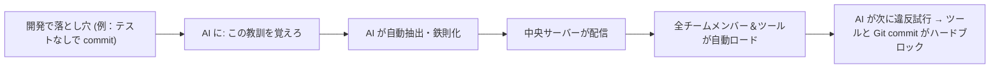

Personalized persistent memory for AI

[English](../README.md) | [繁體中文](README.zh-TW.md) | [日本語](README.ja.md)

**現在のバージョン：v1.26.3** · 詳細は [CHANGELOG](../CHANGELOG.md) を参照

# OwnMind — クロスプラットフォーム AI メモリ＆鉄則執行システム

AI に好みを忘れさせない、同じ低レベルなミスを繰り返させない。Claude Code（Claude のコマンドライン版）、Codex（OpenAI のコマンドラインツール）、Cursor（AI エディタ）、Gemini CLI（Google のコマンドラインツール）、その他のオンライン AI を使っていても、OwnMind はあなたの開発の好み、プロジェクトの文脈、絶対に違反できない「鉄則」（剛性規則：違反不可の硬性規定）をすべてのツール・マシン・AI モデル間でロックします。

---

## OwnMind は次の 4 タイプに最適

### 👤 個人開発者 — 好み設定は一度きり、どこでも適用

会社の PC で設定した「commit message（コミットメッセージ：各 git 履歴に書く説明）は繁体字中国語で統一」というルール。家のノート PC で新しい会話を開いても、出張先で借りた PC でも、AI が自動的に守ります。**あなたの開発人格は環境を変えてもリセットされません。**

### 🔁 マルチツール派 — Claude / Cursor / Codex / Copilot を同じルールで

朝は Claude Code でバックエンド、午後は Cursor でフロントエンド、夜は Codex CLI でスクリプト。各ツールが同じ個人の好みと鉄則を自動ロードし、**ツールごとに教え直す必要はありません**。来月新しいエディタ（OpenCode、Windsurf、何でも）を追加しても、OwnMind に接続すれば全て継承します。

### 👥 チームリード — ルール一括配信＋ダッシュボードで実コンプライアンス可視化

管理コンソールでチームルールを公開（例：「PR にはテスト必須」）すれば、全メンバーの AI が自動ロード。ローカルの pre-commit hook（pre-commit フック：git commit を実行する前に差分を検査する小プログラム）が非コンプライアンスコードを commit させません。管理ダッシュボード（データダッシュボード：データを図表化した Web ページ）はメンバー毎・ルール毎の実コンプライアンス率、チームで最も頻発する落とし穴、`OWNMIND_BYPASS`（ルールバイパス環境変数）の使用頻度トップを表示 — **勘ではなくデータでチーム管理できます。**

### 🛡️ セキュリティ意識者 — AI から機密データが漏れない

- パスワード / API キー（オンラインサービス呼び出し用の認証情報）を git commit しようとする → pre-commit hook がパターンマッチでブロック（v1.19.7 新規）
- AI がパスワードをメモリに書こうとする → メモリ API が HTTP 400 で拒否し暗号化金庫へ誘導
- AI 返答に user の身分証 / メール / 携帯番号が紛れる → reply-lint（返答品質リンター：AI 返答のルール違反を自動スキャン）が `privacy_check` イベントを発火、ブロックするかは各 user 自身の鉄則が決める（v1.19.7 で検出器追加、v1.19.10 で中立化）

金融、医療、法務などセンシティブな業界の開発者に特に有用。

---

## OwnMind 導入前後の開発体験比較

AI は強力ですが **本質的に長期記憶を持たず**、異なる AI モデル（例：Anthropic の Claude と Google の Gemini）はルール解釈の仕方が大きく異なります。複数マシンを跨ぐと摩擦はさらに増します。導入前後の典型的な体験比較：

### ペイン 1：新ウィンドウ開く度に「好みを再説明」

- **導入前**：新しい会話を開いてコード依頼するも、古い構文を返したり独自のコーディングスタイルを忘れたり。「うちのプロジェクトはこう書く」と毎回再入力。
- **導入後**：会話オープンの瞬間、OwnMind が既に好み・スタイル・剛性制約を AI に注入済み。要件だけ伝えれば、一発で準拠コードが出てきます。

### ペイン 2：マシンとモデルの切り替えで「知能ゼロ・規格分断」

- **導入前**：朝は会社デスクトップで Claude Code、午後は家のノート PC で Cursor + Gemini。**異なるマシン** + **異なる AI モデル**を跨ぐとメモリ文脈が完全リセット、コード再コピー＆モデル毎の癖を再調整。激痛。
- **導入後**：どの PC・どの AI モデルでも、OwnMind がバックグラウンドでメモリコアを統一。**どこで会話を開いても、連続性のある一貫体験。**

### ペイン 3：同じ失敗を繰り返す AI

- **導入前**：先週デプロイで env var を漏らして本番 DB がクラッシュ、徹夜修復。今日 AI に新機能デプロイを頼んだら同じ env var を漏らした指示を生成、再災害寸前。
- **導入後**：失敗時に「この教訓を覚えろ」と AI に伝えるだけ。鉄則として OwnMind にアップロード。次回 AI がデプロイしようとすると、カーネルレベルで阻止され、AI に自己点検を強制、再災害を未然防止。

### ペイン 4：チーム開発がバラバラ、統一基準なし

- **導入前**：チームが拡大するにつれ、各人の AI 使用習慣と規範が異なる。テストなしの粗悪コード、誤って機密 commit。標準ドキュメントを書いても誰も読まない。コード品質が制御不能に。
- **導入後**：リードが管理コンソールでチームルールを一度公開、全メンバーの AI が自動強制ロード・実施。非準拠コードは、ローカル pre-commit hook がハードリジェクト、開発者 + AI に修正を強制してから commit 許可。完全自動のチーム標準化と品質ゲート。

### ペイン 5：中央管理なし、チームの AI 使用状況が不明

- **導入前**：リードはチームの AI 使用状況を全く把握できない。誰がどのツールを使い、どの技術的摩擦が頻発し、ルール遵守率は実際どれくらいか — 群盲象を撫でる。データがなく真の生産性とリスクを評価できない。
- **導入後**：専属の**中央管理コンソール + データダッシュボード**。チーム全体の AI 使用状況、メンバー毎ルール毎の実コンプライアンス率、最頻出の落とし穴 — 主要メトリクスを一目で把握。コンプライアンス分析と監査ログ（audit log：改ざん防止された全アクション記録）が自動集計。

---

## 落とし穴進化論：ミスから鉄則への学習チェーン

OwnMind のコア価値は、日々の開発で「踏んだ落とし穴」を瞬時に AI の「遺伝子ルール」に沈殿させ、同じミスがチーム内で二度と起きないことを保証する点です：


```mermaid
graph LR
    A["開発で落とし穴 (例：テストなしで commit)"] --> B["AI に: この教訓を覚えろ"]
    B --> C["AI が自動抽出・鉄則化"]
    C --> D["中央サーバーが配信"]
    D --> E["全チームメンバー＆ツールが自動ロード"]
    E --> F["AI が次に違反試行 → ツールと Git commit がハードブロック"]
```

1. **捕獲**：デプロイや開発で問題発生時、AI に「この教訓を覚えろ：デプロイ前は主 DB 接続を必ず確認」と一言
2. **抽出**：AI が現在の文脈を統合し、機械検証可能な剛性鉄則（例：`IR-038`）に蒸留、OwnMind にアップロード
3. **継続的ゲート**：ルールが即座に全開発ツールに同期。次回どこで開発しても、AI が「接続未確認のままデプロイ」を試みた瞬間、システムがカーネルレベルで阻止

---

## チーム執行防衛線：開発規範をどう強制実施するか

プロジェクトが拡大すると、チーム管理は災害の始まり — 開発標準ドキュメントは誰も読まず、新人のコードはバグだらけ。OwnMind はチーム向けに強制実施システムを設計：

### 1. 三階層ロール権限管理

ビルトインの**スーパー管理者**>**管理者**>**一般ユーザー**の三層構造。上位二つはチーム鉄則の絶対制御権を持ち、一般ユーザーや AI が会話中に勝手にコア安全ルールを変更・無効化することを防止。

### 2. チーム標準の一括配信

リードは管理コンソールで一度ルール公開（例：「全返答にリクエスト ID を含む」）すれば OK。システムは RAG（Retrieval-Augmented Generation：外部ナレッジを検索してから AI に回答させる技術）で意味的にスライシング。メンバーが新しい会話を開いた瞬間、AI が強制ロード・厳密実施。人手による告知や標準同期コストゼロ。

### 3. ローカル Git pre-commit ハードゲート

チーム管理の最強物理防衛線。OwnMind は全メンバーの PC に pre-commit hook をインストール。メンバーの AI がチーム鉄則違反コード（例：機密パスワード、文書同期漏れ）を書くと、`git commit` はハードリジェクト、開発者 + AI に修正後の再 commit を強制。

### 4. コンプライアンスダッシュボード + 監査ログ

管理コンソールが各メンバー・各 AI モデル・各鉄則の実行データ（遵守回数、トリガー回数、違反回数）を自動追跡しコンプライアンス率トレンドグラフ化。全 AI アクション、違反、バイパス例外申請が改ざん防止監査ログに記録、データ駆動型品質管理の確固たる基盤に。

---

## 剛性安全ゲート：三道の防衛線

プロンプトで AI にお願いするだけでは効きません。OwnMind はローカル環境と OS レベルで、AI が痕跡を残さず突破できない三道の物理防衛線を構築：

1. **第一線：仕様統一** — 会話オープン時、システムが API 経由で底層プロンプトを注入。意味的防衛線。
2. **第二線：実行側コントロール** — AI が実際にコード変更やコマンド実行する前に **PreToolUse 介入**（PreToolUse：AI がツール呼出する前の安全ゲート機構）。コードを読まずに変更しようとすれば即拒否＆ロールバック、**ブラインド編集**（Blind Edit：コード未読のまま直接ファイル変更）を阻止。
3. **第三線：出力側レビュー** — AI が出力完了時、Stop hook（Stop hook：AI が応答完了時に自動起動されるレビュープログラム）が reply-lint を起動。中英混在・専門用語の説明不足・身分証/メール/携帯番号の偶発漏洩（v1.19.7 で privacy_check 検出器追加）を検出したら、システムが背景で AI に**書き直し**を命じ、準拠するまで通しません。**連続 3 回ブロック後は自動的に警告にダウングレード**、AI の無限書き直しループによる対話デッドロックを防止。

---

## プロジェクト直下の静的ルールファイルとの違い

「プロジェクト直下の静的ルールファイル（例：`.cursorrules`、`CLAUDE.md`）で十分では？なぜ OwnMind？」

静的ルールファイルは脆弱（AI ハルシネーションで密かに迂回される）です。OwnMind はステートフルな剛性安全ゲートシステム：

| 比較項目 | プロジェクト直下の静的ルール | OwnMind ステートフル強制実施 |
|:---|:---|:---|
| **メンテナンス** | プロジェクト毎にファイル散在、同期困難 | 中央サーバー一箇所修正で全マシン・全ツール即同期 |
| **強制力** | AI の自律頼み、ハルシネーションで迂回 | critical 級ルールはプログラムによる強制中断。ローカル pre-commit hook で git commit 自体をブロック |
| **エラー学習** | 毎会話がまっさら、同じ落とし穴を繰り返す | 違反を自動記録、適応的強化機構（システムが AI の違反履歴に基づきプロンプトを動的強化）を発動 |
| **情報セキュリティ** | 機密キーやパスワードを誤って commit しやすい | 機密文字列を自動フィルタ・ハードブロック、安全な金庫へ誘導 |
| **チーム展開** | メンバーが手動コピー、漏れたら未管理 | リードが一括配信、新人初日から自動整列 |

> **正直な開示**：`OWNMIND_BYPASS` 環境変数（ルールバイパススイッチ）は緊急時に単一鉄則をスキップ可能 — ただし全バイパスは監査ログに記録。AI は痕跡を残さずに迂回できません。

---

## コア機能

### メモリと保護

- **メモリ / シークレットルーティング** — 三種のデータ分離：profile / memory（通常メモリ）/ secret（暗号化金庫）。AI が通常メモリにパスワード書込み → HTTP 400 でブロックし金庫へ誘導 `v1.19.1`
- **個人情報検出器（オプション）** — AI 返答ごとに台湾身分証（公式チェックサム検証付き）、メール、台湾携帯番号をスキャン可能。user 自身がプロンプトで提示した文字列は能動的共有とみなし例外扱い。検出時 `privacy_check` イベントを発火、ブロック可否は各 user の鉄則で決定 `v1.19.7`
- **Pre-commit シークレット内容スキャン** — 既存のファイル名ブロックに加え、staged diff の追加行を OpenAI / GitHub PAT（Personal Access Token）/ JWT（JSON Web Token）/ AWS key パターンで IR-002 違反として検出 `v1.19.7`

### コラボレーションと同期

- **クロスツール引き継ぎ** — 終業時に AI へ「wrap up して引き継ぎ準備」と一言で、未完タスク＆設計文脈を自動パッケージング＆アップロード。明日別エディタ＋別 AI でシームレス継続 `v1.13.0`
- **マルチクライアント衝突ロック** — 複数エディタが同時にメモリ書込み時、同期トークン（誰が先か判定するタグ）が古いバージョンをブロックし AI に最新再取得を強制。苦労して蓄積した開発ルールが上書きされません
- **クロスマシン自動同期** — ノート PC 切替、出張、新人初日 — ログインで即メモリ＆ルール取得、待ち時間ゼロ

### 観測性と分析

- **三段階ルール分類** — 全ルールに `critical`（赤、強制ブロック）/ `default`（黄、設定次第）/ `advisory`（灰、ログのみ）のラベル。SessionStart ダイジェストでティア別にグループ表示 `v1.19.0`
- **コンプライアンスダッシュボード** — メンバー毎・AI モデル毎の遵守 / トリガー / 違反回数を追跡、トレンドグラフ化
- **返答品質リント** — Stop hook が中英混在（IR-037）、専門用語の説明不足（IR-036）、個人情報パターン（`privacy_check` イベント、各 user の鉄則がブロック可否を決定）をスキャン。session 内 4 回目の違反で `process.exit(2)` + stderr に指令型書き直しプロンプト出力。連続 3 回ハードブロック後は警告に自動降格しデッドロック回避 `v1.19.7`
- **バージョン強制即時チェック** — 新規会話毎に API でクライアント / サーバーバージョン確認。修正済みバグに古いバージョンで踏むのを防止 `v1.19.4`

### 鉄則執行エンジン

- **共通ジャッジコア** — 純粋関数 `enforceRule(ruleCode, context, options)` が `allow` / `block` / `warn` / `log_only` / `bypass` をティアに基づき返す。**ステータス：**v1.19.7 では `bypass-handler.js` のみを git pre-commit と reply-lint に接続（`OWNMIND_BYPASS` 環境変数が機能する）；`evaluateConditions` ループを `enforceRule` 呼び出しに置き換える完全統合は v1.19.8 に延期 `v1.19.6`
- **適応的強化** — システムが AI の違反履歴に基づきプロンプトを動的強化（同一ルールを 1 session 内で 3 回以上違反 → 次回そのルールのプロンプトが自動で強警告にアップグレード）

### インフラストラクチャ

- **シークレット管理** — API キー・パスワードを二重暗号化（master key + per-row salt）でセキュアに保管
- **意味検索** — pgvector（PostgreSQL のベクトル検索拡張：意味的類似度でメモリ検索）で実装
- **段階圧縮** — 短期メモリ自動圧縮、長期メモリ永久保存
- **Windows ネイティブサポート** — `install.ps1` と `start.cmd` 同梱、WSL（Windows Subsystem for Linux）不要

---

## システム要件

- **クライアント**：Node.js 20+、Git 2.30+
- **サーバー**：セルフホスト（Docker Compose ワンクリックデプロイ提供）、または認可ホスト型サービス利用
- **対応プラットフォーム**：macOS / Linux / Windows（Windows ユーザーは Git for Windows フルインストーラ必要、Git hook が sh.exe を使用）
- **対応 AI ツール**：Claude Code、Codex CLI、Cursor、Copilot、OpenCode、Windsurf、Gemini CLI など MCP（Model Context Protocol：AI と外部ツールの統合標準）またはフックを読めるクライアント

---

## クイックスタート

### 1. API キーと URL を取得

OwnMind インストール後、管理者として管理コンソールにログインしアクセスキー（API key）とサーバーパス（API URL）を取得。

### 2. インストール方法を選択（二択）

#### 方法 A：AI 自動インストール（最も簡単）

AI エディタ（例：Cursor または Claude Code）のチャットに入力：

- **新規インストール**：`OwnMind をインストールして（key は YOUR_API_KEY、URL は YOUR_API_URL）`
- **自動アップグレード**：`OwnMind をアップグレード`

AI が OS を自動検出してインストーラを実行。

#### 方法 B：ターミナルのワンラインコマンド

macOS または Linux：

```bash
# 新規インストール
curl -fsSL https://kkvin.com/ownmind/bootstrap.sh | bash -s -- YOUR_API_KEY YOUR_API_URL

# アップグレード
curl -fsSL https://kkvin.com/ownmind/bootstrap.sh | bash
```

Windows PowerShell：

```powershell
# 新規インストール
$env:OWNMIND_API_KEY='YOUR_API_KEY'; $env:OWNMIND_API_URL='YOUR_API_URL'; iwr -useb https://kkvin.com/ownmind/bootstrap.ps1 | iex

# アップグレード
iwr -useb https://kkvin.com/ownmind/bootstrap.ps1 | iex
```

> **Windows 注意**：OwnMind は Git for Windows 同梱の Bash シェル（sh.exe）に依存して Git hook を実行します。フル版の Git for Windows をインストール（Lite や Portable は不可）、さもないと commit 時にエラー発生。

### 3. インストール検証

インストール後、新しい会話を開いて AI に：

> 「現在ロードされている OwnMind 鉄則を最初の 5 件見せて」

AI がリストできれば（IR-002、IR-008 などのコード付き）、hook が正しくメモリ注入できています。

リストできない場合は確認：

```bash
cat ~/.ownmind/credentials   # key 存在確認
cat ~/.ownmind/cache/iron_rules.json | head -3   # ルールキャッシュ確認
```

---

## 緊急バイパス：詰まった時の対処

OwnMind は env-var 経由の脱出口を提供。**全てのバイパスは監査ログに記録**、後でリード（または将来の自分）が確認可能。

### pre-commit がブロック、とにかく commit したい

```bash
# 単一ルールをバイパス
OWNMIND_BYPASS=IR-002 git commit -m "hotfix: 緊急"

# 全ルールをバイパス（極端な場合）
OWNMIND_BYPASS=all git commit -m "hotfix: 緊急"
```

### reply-lint が煩い、警告のみに退避

```bash
# 違反は警告のみ、AI 返答ブロックなし
export OWNMIND_REPLY_LINT_MODE=warn

# または完全スキップ
export OWNMIND_REPLY_LINT_DISABLE=1
```

### OwnMind 全体を一時停止

```bash
export OWNMIND_DISABLED=1
```

> **重要**：これらは脱出口であって長期設定ではありません。特定ルールを常時バイパスしているなら、そのルール自体が設計ミス — 管理コンソールで修正する方が OwnMind を停止するより良いです。

---

## よく使うチャットコマンド

AI に普通の言葉で命令：

- **「この教訓を覚えろ：[内容]」** — 自動で鉄則を生成、全ツールに同期
- **「このプロジェクトで残ってる作業は？」** — AI が OwnMind から横断的 TODO リストを引き出す
- **「今日の作業をまとめて引き継ぎ準備」** — 進捗を自動パッケージング、明日別マシンや別ツールでフル回復
- **「私のバージョンは最新ですか？」** — オンラインの最新バージョンを強制チェック
- **「鉄則を最初の 10 件見せて」** — ローカルルールキャッシュの状態確認

---

## よくある質問 FAQ

### インストール関連

#### Q: 新規サーバーデプロイ後、初回の管理コンソールへの入り方は？

**v1.19.8+ 推奨フロー（摩擦ゼロ）**：
1. `docker compose up -d` でサーバー起動
2. ブラウザで `https://あなたのサーバー/admin` を開く — システムが `users` テーブルが空であることを検出し `/setup` に自動 redirect
3. email + パスワードを入力して最初の super_admin を作成
4. ページに api_key（ワンクリックコピー）+ client インストールテンプレート（現在のサーバー URL 自動入力済）が表示
5. 「ログインへ」をクリックして管理コンソールへ入り、他のメンバー作成や鉄則管理を開始

所要時間：約 2 分。Setup wizard は最初の admin 作成後、永続的に自動クローズ。

**進階／レスキューパス（v1.19.7 以前の旧フロー）**：

下記シナリオは wizard で対応不可：

| シナリオ | 経路 |
|:---|:---|
| バックアップから復元、`users` テーブルに super_admin はいるが `password_hash IS NULL` | 環境変数 `SETUP_TOKEN` 設定、`POST /admin/setup` 使用 |
| 管理者がパスワードを忘れて再設定したい | DB に SSH、`UPDATE users SET password_hash = NULL WHERE id = ...`、その後 setup token パス利用 |
| サーバー移行、旧 DB をインポート | pg_dump / pg_restore + 上記いずれかのレスキューパス |

通常の初回インストールは `SETUP_TOKEN` **不要** — wizard が完全カバー。

#### Q: Admin がパスワードを忘れたら？（v1.19.9+ 三層レスキュー）

「他の admin がいるか」で経路が決まる：

**シナリオ A：チームに他の admin がいる（最も一般的）**
- 他の super_admin が管理コンソールにログイン、「使用者管理」でロックされた admin を見つけ「パスワードリセット」をクリック
- システムが 12 文字のランダム一時パスワードを生成（混同しやすい 0/O/I/l/1 を除外）、本人にコピーして渡す
- 本人は一時パスワードでログイン、強制的に新パスワードを設定

**シナリオ B：唯一の admin がパスワードを忘れた**
- サーバーホストに SSH してレスキュースクリプトを実行：
  ```bash
  node scripts/reset-admin-password.js
  ```
- スクリプトはインタラクティブ：全 super_admin を列挙、リセット対象を選択、`yes` 入力で確認
- ランダム `SETUP_TOKEN` を生成・ターミナルに表示
- 続いて `export SETUP_TOKEN=<token>`、サーバー再起動、ブラウザで `/admin/setup` を開いて新パスワード設定

**シナリオ C：SSH 権限なし（クラウド SaaS モード）**
- 現状ビルトイン経路なし — サービス提供者に連絡
- v1.20+ で email リセットフロー追加予定（SMTP 統合に依存）

**予防は治療に勝る**：v1.19.9+ から、admin が 1 人だけの時は管理コンソールにオレンジ警告バナーを表示、第二の admin 作成を強く推奨。

#### Q: `.cursorrules` や `CLAUDE.md` と共存可能？

可能。OwnMind は中央集中、`.cursorrules` はプロジェクトローカル補完。推奨：プロジェクト横断の個人好み・剛性鉄則は OwnMind、単一プロジェクト特殊ルールは `.cursorrules`。衝突なし。

#### Q: なぜ AI が時々同じ内容を 2 回言うように見える？

バグではなく、返答品質チェック機構の可視的な副作用です。フロー：

1. AI の最初の返答が出力済み、リント hook が違反を検出（中英混在、専門用語の説明不足、個人情報の混入）
2. session 内 4 回目の違反で hook がブロック、AI に「書き直して」と指示
3. AI が準拠版を再出力 — ユーザーは似た 2 段落が見える

v1.19.11 で 3 層の改善を追加：

- **AI 自己アノテーション**（85% の信頼性）：書き直しの冒頭に引用ブロック「⚠️ 前版が IR-XXX に違反、再調整」+ セパレータ
- **段階表示**：第 1 回ブロックは完全メッセージ、第 2-3 回は短い「↻ 前版が IR-XXX に違反、書き直し済み」
- **永続ログ**：全ブロックイベントを `~/.ownmind/logs/reply-lint-events.jsonl` に追記、いつでも「今週何回ブロックされた、どのルールが最頻」を照会可

AI がアノテーションをスキップした場合（15% のケース）、ログでわかります：

```bash
tail -5 ~/.ownmind/logs/reply-lint-events.jsonl
```

### プライバシーとセキュリティ

#### Q: 会話データはどこへ？OwnMind 自体は個人情報を収集する？

OwnMind の設計原則は「業務直接関連でない限り user の個人情報を収集しない」。明細：

**サーバーへアップロード**：
- あなたが能動的に作成した鉄則、メモリ項目、profile の好み
- コンプライアンスイベント（どのルールがいつトリガーされ、結果は comply / violate / bypass か）— コンプライアンス分析用

**絶対にアップロードしない**：
- AI 完全会話内容（あなたの prompt + AI 返答原文）
- ソースコード / ファイル内容
- システムパス、ファイル名（あなたが能動的にメモリ化したもの以外）
- キーストローク、マウス軌跡などの telemetry（行動テレメトリ：ユーザー操作を監視するデータ）

**セルフホスト = 100% あなた自身のサーバー上**、「アップロード」されるデータもあなたのデータベース内のみ。

#### Q: API キーやパスワードはどう保管？通信は安全？

- **保管層**：API キーと `/api/secret` の機密は二重暗号化（master key + per-row salt：マスター鍵 + 行毎の固有ソルト）、DB 全体が盗まれても直接復号不可
- **通信層**：HTTPS 強制（HTTP 自動 redirect、nginx/caddy をフロントに置いて SSL 終端可）
- **ローカル層**：クライアント `~/.ownmind/credentials` は mode 0600（現在の user のみ読取可）
- **監査**：全 API アクションを audit log に記録、タイムスタンプ + 操作者 user ID 付、改ざん耐性

#### Q: OwnMind は私のソースコードを見る？

見ません。OwnMind の hook は**ルール違反イベント**のみを捕捉（例：staged ファイルに認証情報パターン、AI 返答の中英混在が閾値超）し、違反メタデータ（イベント自体を記述するデータ、コード内容は含まず）をサーバーに返送。**ソースコードと AI 会話内容は本機を離れません。**

例外：あなたが明示的に AI に「このコードスニペットをメモリに保存」と命じた場合、そのスニペットはアップロードされます。

### コストと性能

#### Q: OwnMind 使用で AI token 課金は増える？

増えますが少額です。OwnMind 自体は **LLM 呼出をしません**（GPT/Claude API コールなし）、追加 LLM API コストは発生しません。ただし新会話毎に鉄則リスト（30-50 件、約 2-5 KB のテキスト）を AI の system prompt に注入するため、新会話毎の AI input token が 1500-3000 token 増加（鉄則数次第）。

Claude Sonnet 料金（input $3 / 1M tokens）で計算：新会話毎に約 $0.005-0.01 の追加。1 日 20 新会話なら追加コスト約 $0.10-0.20/day。「好み再説明」で節約される時間を考慮すれば、ROI（投資対効果：投入と回収の比）は明確にプラス。

> 最適化のヒント：管理コンソールで現業務に影響しない鉄則を `disabled` に、または `advisory` ティア（広告級：ログ記録のみ、自動注入なし）に設定すれば token オーバーヘッド削減可能。

#### Q: hook で開発フローが遅くなる？

実測レイテンシ（M1 MacBook、ローカルキャッシュ温まり済）：

| Hook | レイテンシ | トリガー |
|---|---|---|
| pre-commit | < 50 ms | `git commit` ごと |
| reply-lint | < 30 ms | AI 返答ターン終了ごと |
| session-start | 200-500 ms | 新 AI 会話オープン（ルール読込込み） |
| version-check | < 100 ms | 新会話オープン（並行 API コール、非ブロック） |

知覚しうるのは session-start の 200-500 ms のみ、他は知覚閾値以下（< 100 ms は人間が感じない）。ネットワーク同期はバックグラウンドの非同期実行、commit を阻害しません。

#### Q: サーバーがダウンしたら作業が固まる？

固まりません。設計原則 fail-open（失敗時はブロックではなく許可）— サーバー無応答時 hook はチェックをスキップ、commit も AI 返答もブロックしません。ローカルルールキャッシュで 24 時間オフライン動作可能。24 時間経過後 hook が再同期試行、失敗時も fail-open。

### その他

#### Q: オフラインで使える？

可能。全鉄則は `~/.ownmind/cache/iron_rules.json` にキャッシュ、24 時間以内のオフライン動作は通常通り。

#### Q: 鉄則のインポート / エクスポート、チーム間共有は可能？

可能。各ルールには固有 UUID、管理コンソールが JSON エクスポートをサポート。異なる OwnMind インスタンス間で移行、または GitHub にオープンソース化して他チームに提供。

#### Q: なぜ「OwnMind」？

「Own your mind」— あなたのメモリはあなたのもの、AI ベンダーのものではない。新ツール毎にスタイル再教育するのは実質的にあなたの思考習慣（mental model：物事の考え方の癖）をベンダーに貸している。OwnMind が所有権をあなたに戻します。

---

## API リファレンス

### 認証

全 API リクエストには `Authorization: Bearer YOUR_API_KEY` ヘッダが必要。

### 主要エンドポイント

```
GET    /api/memory               # メモリ一覧
POST   /api/memory               # メモリ作成
PUT    /api/memory/:id           # メモリ更新
DELETE /api/memory/:id           # メモリ削除
GET    /api/memory/type/:type    # タイプ別取得（例：iron_rule）

POST   /api/secret               # 暗号化シークレット作成
GET    /api/secret/:key          # 復号化シークレット取得
DELETE /api/secret/:key          # シークレット削除

POST   /api/activity/batch       # コンプライアンスイベント一括報告
GET    /api/compliance/stats     # コンプライアンス統計取得
```

完全な API ドキュメントは [OpenAPI spec](../openapi.yaml)（あれば）参照。

### メモリタイプ

- `profile` — 個人の好み（ニックネーム、慣用ツール、文体）
- `iron_rule` — 鉄則（検証条件、ティア、block_on_fail フラグ付）
- `project` — プロジェクト文脈（アーキテクチャ、技術スタック、TODO）
- `principle` — 作業原則（機械検証不可、AI 参考用）
- `learning` — 落とし穴記録（鉄則化前のドラフト）

---

## 技術スタック

- バックエンド：Node.js 20+ / Express
- データベース：PostgreSQL 16 + pgvector
- デプロイ：Docker Compose
- クライアント hook：Node.js（macOS / Linux / Windows）
- 同期プロトコル：HTTPS REST + MCP（Model Context Protocol）

---

## 貢献者

- Vin（miou1107）

Issues、PR、利用フィードバック歓迎。
リポジトリ：[github.com/miou1107/OwnMind](https://github.com/miou1107/OwnMind)（公開済なら）

---

## ライセンス

MIT
