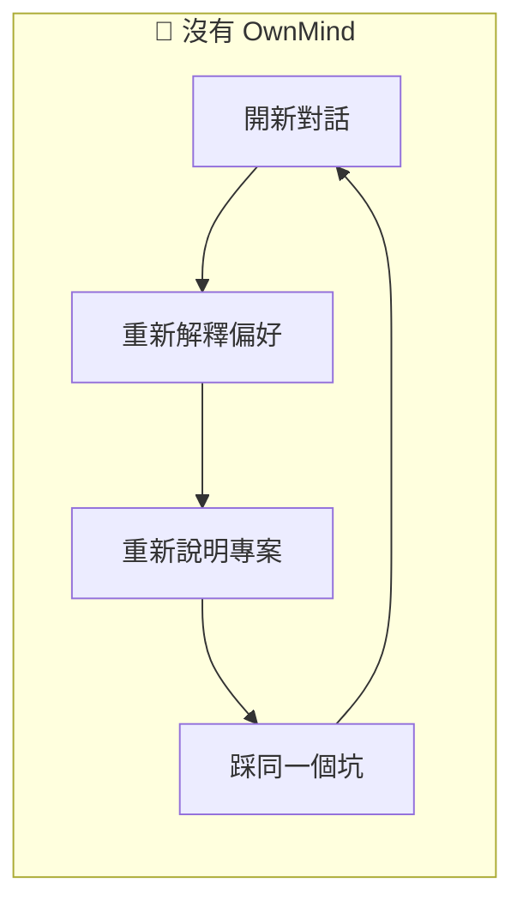
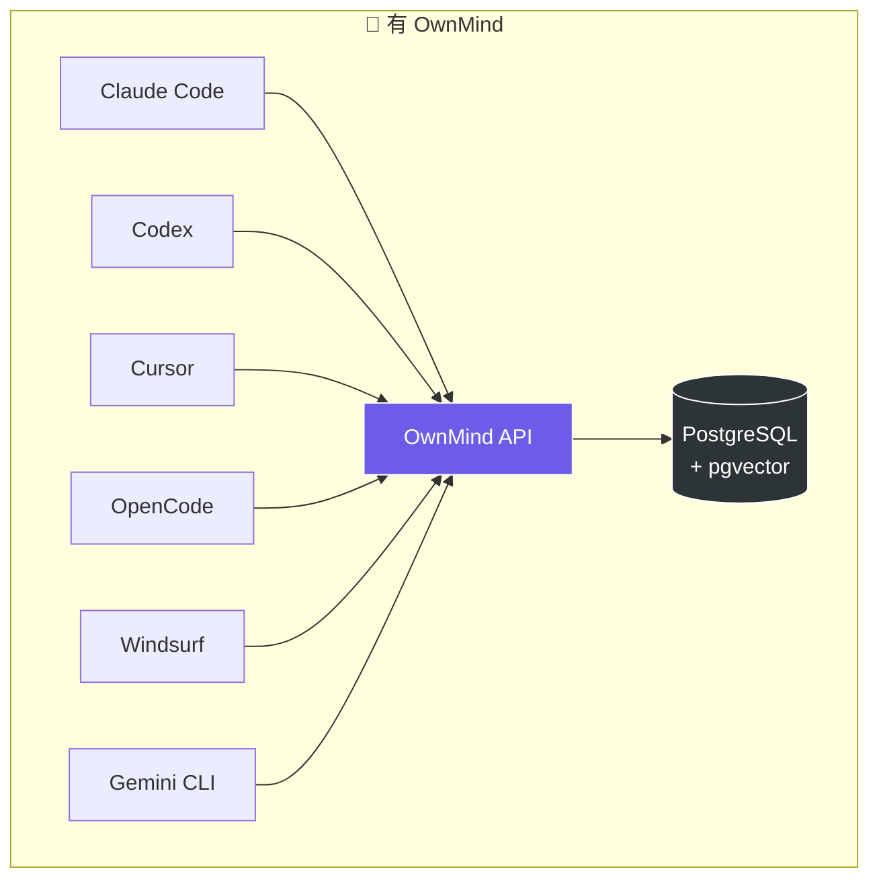
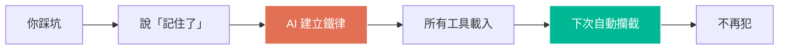
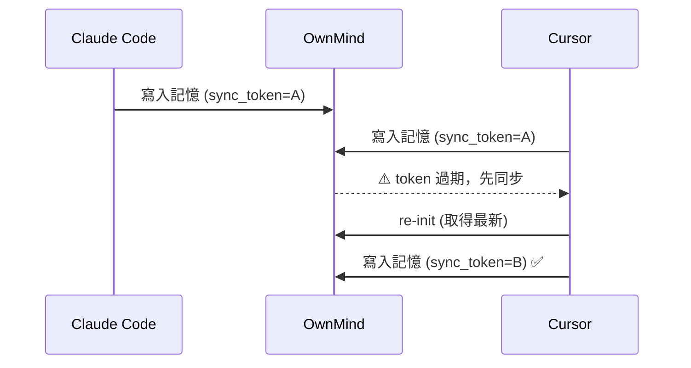

AI個人化永久記憶解決方案

[English](../README.md) | [繁體中文](README.zh-TW.md) | [日本語](README.ja.md)

# OwnMind — 跨平台 AI 個人記憶系統

讓你的 AI 工具共享記憶。不管用 Claude Code、Codex、Cursor、Copilot、OpenCode 還是線上 AI，OwnMind 讓所有工具都能讀寫你的偏好、鐵律、專案 context。

## 願景

OwnMind 讓你在各種 LLM、編輯器、電腦、專案、AI 會話中自由橫移，記憶共享且無痛切換。

- **裝後即忘** — 安裝後不需學習，OwnMind 自動運作，你完全感受不到它的存在
- **越用越聰明** — 用越久記憶越豐富，AI 越來越了解你的工作偏好和習慣，變得越來越聰明
- **數據驅動進化** — 搜集使用中的資訊和數據，用來訓練和改善 OwnMind，持續做出更好的功能
- **跨平台無縫** — 一個 API，所有工具共用。換工具、換電腦、換專案，記憶跟著走，不用重新教
- **團隊規範落地** — 管理員設定一次公司規範（git flow、coding standard、review 流程），全員的 AI 自動載入並遵守。新人入職，規範自動生效
- **多管理者管理** — 三級角色階層（super_admin > admin > user），密碼管理，完整操作稽核 `v1.12.0`

## 為什麼需要 OwnMind？

### 現在的 AI 工具有三個根本問題



**1. 每次對話都從零開始**
你跟 AI 說過一百次「不要用 var」「部署前檢查環境變數」，但下一次對話它全忘了。你花大量時間在重複教 AI 相同的事。

**2. 換工具就失憶**
早上用 Claude Code 寫了半天，下午切到 Cursor 繼續，AI 完全不知道你早上做了什麼。你的經驗被鎖在單一工具裡。

**3. 踩過的坑會再踩**
上週部署炸了是因為忘記改環境變數，你自己記住了，但 AI 不知道。下次它還是會犯同樣的錯。

### OwnMind 怎麼解決



**一個 API，所有工具共用同一份記憶。** 你只要教一次，所有 AI 都知道。

## 誰適合用？

- **每天使用多個 AI 工具的開發者** — 不用再對每個工具重新解釋你的偏好
- **跨專案、跨裝置工作的人** — 你的記憶跟著你走，不受裝置限制
- **有團隊 AI 規範需求的技術主管** — 規則設定一次，全員自動遵守
- **想讓 AI 持續進化的重度使用者** — 讓 AI 累積經驗，越用越懂你

## 最常用的三句話

| 你說 | AI 做什麼 |
|------|----------|
| **「記住了」** | 把經驗寫進鐵律，跨平台永久保存，永不再犯 |
| **「你學到什麼」** | 回顧這次對話，列出值得記下的新知識 |
| **「我最近做了什麼？哪些還沒做？」** | 從所有專案的進度和待辦中回答 |

## 核心功能

### 記憶與防護



- **跨平台記憶** — 一個 API，所有 AI 工具共用
- **鐵律管理** — 踩過的坑不會再犯，含完整背景脈絡
- **鐵律即時防護** — session 開始時自動載入，AI 主動攔截違規
- **Trigger Tags** — 鐵律標記觸發時機（`trigger:commit`、`trigger:deploy`），AI 在操作前自動 re-check
- **規則時間序列** — 規則改變時自動保留舊版本，可追溯演變過程

### 協作與同步



- **Sync Token** — 多工具同時使用時自動偵測衝突，確保記憶一致性 `v1.8.0`
- **交接機制** — 在不同工具間無縫交接工作
- **團隊規範** — 管理員統一下發規則，成員自動載入 `v1.8.0`
- **Team Standard RAG** — Markdown 標題階層切分（H1-H3），精準語意檢索複雜規範。透過 `ownmind_upload_standard` 上傳，`ownmind_confirm_upload` 確認 `v1.15.0`
- **規則品質追蹤** — 自動記錄遵守/違反/觸發次數，落地率低時主動預警 `v1.8.0`

### 觀測與分析 `v1.9.0`

- **活動日誌** — 所有 OwnMind 事件自動記錄，本地 + 上傳 server
- **合規回報** — AI 自動回報鐵律是否遵守、跳過或違反
- **管理後台** — 使用者統計、工具/模型分佈、每日活躍度、落地率
- **交叉分析** — 按工具、按模型、按規則、按使用者的落地率
- **情境報告** — AI 每次 session 回報使用者痛點和改善建議
- **自動 Session 記錄** — 對話結束時自動存摘要 + 結構化情境
- **3 個月壓縮** — 舊 session 自動合併成月摘要

### 鐵律執行引擎 `v1.11.0`

- **七層防護** — git pre-commit hook (L1)、PreToolUse hook (L2)、MCP 自動驗證 (L3)、Init 提醒 (L4)、post-commit 稽核 (L5)、Session 稽核 (L6)、升級警告 (L7)
- **自動模板匹配** — Server 建立鐵律時自動匹配驗證模板，不需手動設定
- **自動編號** — 鐵律建立時自動分配序號（IR-001、IR-002、...） `v1.13.0`
- **可驗證條件** — AND/OR/when-then 條件組合引擎，規則可被機器檢查
- **Git hook 強制執行** — pre-commit hook 讀取本地 JSONL 合規記錄，違反時阻止 commit
- **共用驗證引擎** — `shared/verification.js`、`shared/helpers.js`、`shared/compliance.js` — 所有層共用同一套程式碼 `v1.15.0`
- **L1 fail-closed** — pre-commit hook 快取為空時嘗試 API 同步（3 秒 timeout） `v1.15.0`
- **L2 commit 攔截** — PreToolUse hook 對所有觸發類型（含 commit）跑驗證引擎，失敗時攔截 `v1.15.0`
- **快取自動刷新** — save/update/disable 鐵律後自動刷新 iron_rules.json 快取 `v1.15.0`
- **可操作的失敗訊息** — 驗證失敗時附帶修復指引（例如「請 git add X」） `v1.15.0`

### 智慧學習與數據驅動進化 `v1.10.0`

- **週/月報** — 自動產生摩擦分析和改善建議
- **模式偵測** — AI 偵測重複問題，主動建議存為規則
- **自動暫存** — 有價值的學習自動存到待審佇列
- **週摘要** — 每週第一次 init 顯示上週回顧
- **摩擦自動立案** — 高頻摩擦（3 次以上）自動建立專案記憶

### 基礎設施

- **密鑰管理** — 安全儲存 API keys 和密碼
- **語意搜尋** — pgvector 驅動，找到相關記憶
- **分層壓縮** — 短期記憶自動壓縮，長期記憶永久保留
- **Windows 原生支援** — 提供 `install.ps1` 和 `start.cmd`
- **鐵律智慧強化** — 根據合規歷史自動加強經常違反的規則提醒
- **離線韌性** — 本地快取回退 + 寫入佇列，斷線操作上線後自動重播 `v1.14.0`

## 快速開始

### 1. 取得 API Key

聯繫管理員取得你的 API key。

### 2. 安裝

**Windows 用戶**可以用 PowerShell 直接安裝：
```powershell
$env:OWNMIND_API_KEY='YOUR_API_KEY'; $env:OWNMIND_API_URL='YOUR_API_URL'; irm https://raw.githubusercontent.com/miou1107/ownmind/main/install.ps1 | iex
```

**Mac / Linux / Git Bash** 用戶：
```bash
curl -sL https://raw.githubusercontent.com/miou1107/ownmind/main/install.sh | bash -s -- YOUR_API_KEY YOUR_API_URL
```

或者複製以下 prompt 貼到你的 AI 工具（Claude Code、Codex、Cursor 等）：

```
幫我安裝 OwnMind：curl -sL https://raw.githubusercontent.com/miou1107/ownmind/main/install.sh | bash -s -- YOUR_API_KEY YOUR_API_URL
```

如果工具不能執行 shell：

```
把 https://github.com/miou1107/ownmind clone 到 ~/.ownmind/，執行 npm install，然後跑 bash ~/.ownmind/install.sh YOUR_API_KEY YOUR_API_URL
```

### 3. 開始使用

安裝完成後，每次開新 session 記憶會自動載入，不需要手動操作。

## 應用情境

### 1. 踩坑後讓 AI 永遠記住
> 你：「記住了，部署前一定要檢查環境變數」

AI 會自動建立一條鐵律，記錄你踩坑的背景和規則。下次不管用哪個工具、哪個 AI，都不會再犯同樣的錯。

### 2. 問 AI 還有什麼事沒做
> 你：「ring 這個專案還有什麼沒做？」

AI 從 OwnMind 調出專案的待辦清單和進度，告訴你哪些做了、哪些還沒。

### 3. 在不同工具間無縫交接
> 你（在 Claude Code）：「整理一下，交接給 Codex」

AI 把目前進度、待辦、注意事項整理好存到 OwnMind。你切到 Codex 開新對話，AI 自動讀取交接內容，無縫接手。

### 4. 讓 AI 自我回顧學到什麼
> 你：「你今天學到什麼？」

AI 回顧整個對話，列出所有還沒記下來的新知識和發現，問你哪些要存進 OwnMind。

### 5. AI 主動攔截你踩過的坑
> AI 正準備用多次 SSH 連線部署...
>
> 【OwnMind vX.X.X】鐵律觸發：你提醒過「SSH 不要頻繁登入登出」，我要遵守，不能再犯

AI 在即將違反鐵律的那一刻主動停下來，不用你提醒。

### 6. 多工具同時用，記憶不打架
> 你同時在 Claude Code 和 Cursor 工作，兩邊都在寫記憶...
>
> 【OwnMind vX.X.X】行為觸發：偵測到狀態已變更，正在 re-init 取得最新記憶...

Sync Token 機制自動偵測衝突。寫入前驗證 token，過期就先同步再寫，不會互相覆蓋。

### 7. 團隊共用規範，一人設定全員生效
> 管理員：「新增團隊規範：所有 API 回傳必須包含 request_id」
>
> 【OwnMind vX.X.X】行為觸發：⚠️ 你即將新增團隊規範，此規範將套用到所有成員。請輸入「我確認」。

團隊規範由管理員統一下發，成員開新對話自動載入，違反時強制提醒。個人可 opt-out 但會持續提醒。

### 8. 規則有沒有在遵守？數據說話
> 你：「我的鐵律遵守狀況如何？」
>
> 【OwnMind vX.X.X】規則自評：IR-001 SSH 規則 — 遵守 12 次，觸發 3 次，遺漏 0 次（落地率 100%）

每條鐵律自動追蹤 enforced/missed/triggered 計數，落地率低的規則會主動預警。

### 9. 換一台電腦，記憶跟著走
> 你（在新電腦）：「幫我安裝 OwnMind，API Key 是 xxx」

AI 自動完成安裝設定，你的所有偏好、鐵律、專案 context 立刻可用，不用重新教。

## API 文件

### 認證
所有 API 請求需要在 header 加入：
```
Authorization: Bearer YOUR_API_KEY
```

### 主要 Endpoints

| Endpoint | 說明 |
|----------|------|
| `GET /api/memory/init` | 載入記憶（profile + principles + instructions） |
| `GET /api/memory/type/:type` | 取得特定類型記憶 |
| `GET /api/memory/search?q=` | 語意搜尋 |
| `POST /api/memory` | 新增記憶 |
| `PUT /api/memory/:id` | 更新記憶 |
| `PUT /api/memory/:id/disable` | 停用記憶 |
| `POST /api/handoff` | 建立交接 |
| `GET /api/handoff/pending` | 取得待接手的交接 |
| `POST /api/session` | 記錄 session |
| `GET /api/export` | 匯出所有記憶 |
| `POST /api/memory/batch-sync-standard` | 批次同步團隊規範細項（RAG） |
| `GET /health` | 健康檢查 |

### 記憶類型

| 類型 | 說明 |
|------|------|
| `profile` | 個人檔案：身份、溝通偏好、工作風格 |
| `principle` | 核心原則與願景 |
| `iron_rule` | 鐵律：踩坑後訂下的不可違反規則 |
| `coding_standard` | 技術偏好與編碼標準 |
| `team_standard` | 團隊規範：管理員下發，全員共享 |
| `project` | 專案 context：架構、環境、進度 |
| `portfolio` | 作品集 |
| `env` | 開發環境資訊 |
| `standard_detail` | 團隊規範細項（RAG）：階層式片段供語意檢索 |

## 技術棧

- **Runtime:** Node.js + Express
- **Database:** PostgreSQL + pgvector
- **MCP:** @modelcontextprotocol/sdk
- **部署:** Docker Compose

## Contributors

- Vin (miou1107)

## License

MIT
