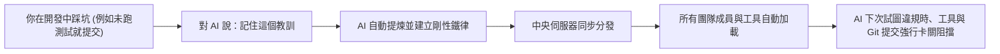

Personalized persistent memory for AI

[English](../README.md) | [繁體中文](README.zh-TW.md) | [日本語](README.ja.md)

**目前版本：v1.26.101** · 詳見 [更新紀錄 CHANGELOG](../CHANGELOG.md)

# OwnMind — 最佳 Harness Engine AI 管控系統

別再讓 AI 丟三落四、也別讓它一再犯下相同的低級錯誤。無論你用的是 Claude Code（命令列版 Claude）、Codex（OpenAI 命令列工具）、Cursor（AI 編輯器）、Gemini CLI（Google 命令列工具），還是任何線上 AI，OwnMind 都能幫你把開發偏好、專案脈絡、跟不可違反的「剛性鐵律」（剛性規則：不能違反的硬性規定）牢牢鎖定。

---

## 這四種人最適合用 OwnMind

### 👤 個人開發者 — 偏好設定一次、跨機器跨工具都記得

你在公司電腦設好的「commit message（提交訊息：每次 git 紀錄要寫的說明）一律用繁中」、回家換筆電開新對話、AI 還是會自動遵守。出差用別人的機器登入也一樣。**你的開發人格不會因為換環境就歸零。**

### 🔁 工具混搭族 — Claude / Cursor / Codex / Copilot 全部同一份規則

你早上用 Claude Code 寫後端、下午切到 Cursor 改前端、晚上用 Codex CLI 寫腳本。每個工具都會自動載入同一份個人偏好跟鐵律、**不用為每個工具重新教一遍**。底層的記憶儲存統一、不管你哪天又裝了 OpenCode、Windsurf 或新冒出來的 AI 編輯器、接上 OwnMind 就直接繼承。

### 👥 團隊主管 — 規範一次發布、全團隊強制落實 + 合規數據儀表板

你在後台發布一條團隊規範（例如「PR 必須附測試」）、所有成員的 AI 自動載入。本機 pre-commit hook（提交前攔截：把 git commit 動作擋下檢查的小程式）會把不合規的代碼擋下、不讓提交。後台儀表板（資料看板：把數據畫成圖表的網頁）顯示每位成員、每條鐵律的真實遵守率、團隊最常踩的坑、誰最常用 OWNMIND_BYPASS（跳規則環境變數）跳規則 — **全部有數據佐證、不是憑感覺管團隊**。

### 🛡️ 安全意識者 — 敏感資料絕對不會被 AI 不小心外洩

- 密碼／API 金鑰（呼叫線上服務的通行碼）想 commit 進 git → pre-commit hook 用樣式比對直接擋下（v1.19.7 新功能）
- AI 想把密碼寫進記憶 → 記憶接口用狀態碼 400 拒絕、引導去加密金鑰庫
- AI 回應夾了使用者身分證／信箱／手機 → reply-lint（回應品質檢查工具：自動掃 AI 回應有沒有違反規則）發出 privacy_check 事件、由使用者自設的鐵律決定要不要擋下（v1.19.7 新增、v1.19.10 中性化）

對金融、醫療、法務等敏感產業的開發者特別有用。

---

## 安裝 OwnMind 前後的開發體驗對比

AI 雖然強大、但因為它**天生沒有長期記憶**、且不同 AI 模型（例如 Anthropic 的 Claude 跟 Google 的 Gemini）解讀規則的方式大相徑庭、更不用說在多台機器切換時的割裂感。以下是你安裝 OwnMind 前後的典型體驗對比：

### 痛點一：每次開新視窗都要「重新交代偏好」

- **索引一半的位置花在「講第二次」** — v1.26.100 給了索引行數預算，然後照筆數平分。平分是中立的，而中立在這裡是錯的：兩邊沒被列出來的代價差很多。鐵律每次開對話都被 SessionStart 掛勾整組注入 session，索引那一行多給的只是「連到本地檔案」的連結；專案沒被列進索引，就是完全不在 session 裡。照筆數平分的結果是把一半預算花在 session 已經有的東西上：鐵律 63 筆對專案 63 筆，另外 67 個專案沒列。現在鐵律固定只拿 20 行，其餘全給沒有別條路可走的類型。同一份資料：**專案列出 106 筆，這整件事開始前是 47 筆**。被壓下來的類型報的仍然是真正的剩餘筆數，不是「超過上限的部分」 `v1.26.101`
- **記憶索引有一半沒進到 session，而且沒有人講** — 索引每多一筆記憶就多一行，但讀它的那一端 200 行就停，還要求壓在 140 行以內。真實安裝量到的是 284 行，143 條鐵律加 130 個專案。鐵律排在前面、第 151 行就列完了，所以**沒進到 session 的那一段全部是專案**：130 個裡只有 47 個進得來，另外 83 個已經有一段時間沒被載入過。檔案上沒有記號、兩邊都不出聲，所以它一直讀起來像一份完整的索引。把它推過上限的，是「把每一條鐵律都列一次」，而 SessionStart 掛勾本來就已經把整組鐵律注入 session 了，那些行沒有多給任何東西。現在索引有一個跨不過去的行數預算：每一類挑最近更新的排前面，用不完的額度讓給別類，每行最多 200 字、截斷處補 `…`，標題會被壓成一行（含換行的標題會讓一筆變成三行），而且**每一類都會講出自己少列了幾筆、去哪裡找**。同一份資料：139 行，273 筆裡列出 126 筆，另外 147 筆被明確標示。專案從 47 筆變 63 筆；鐵律從 143 筆變 63 筆，少的只是連到本地檔案的連結，規則本身照樣由掛勾注入。沒有刪掉任何記憶檔，也沒有任何一筆變得找不到 `v1.26.100`
- **「最常做的專案」是空的，因為沒有人把它送出去** — 團隊頁讀的欄位只有「AI 主動寫工作記錄」時才會寫；AI 沒寫的時候伺服器會拿活動記錄事後重建，而那些事件裡沒有任何一個帶著專案名稱。一週實測：四個人的工作記錄全部是重建的，第五個人 95 場裡有 76 場也是，所以這一欄對四個人全空、對第五個人空掉五分之四。**原本被我判成「救不回來」，那是錯的** —— 這個值從 v1.17.37 起就會從 `CLAUDE_PROJECT_DIR` 算出來，只是它只跟著那份 AI 主動寫的記錄走。所以要修的是讓它一起送，不是從沒有的東西裡變出來：推導邏輯收成一份 `resolveProjectName()`，MCP 與兩支 SessionStart 掛勾送出的每個事件都帶上，伺服器重建時挑出現最多次的那個而不是第一個。**只送資料夾名稱、不送路徑** —— 名稱是工作脈絡，路徑會透露一個人把檔案放在哪 `v1.26.98`
- **密碼偵測把三分之一的程式碼當成金鑰** — 最後一道防線的判斷法是「20 字以上、字元都在金鑰字元集內」，這條分不出金鑰跟識別字。同一天擋了兩次 commit，一次是檔名、一次是變數名稱，兩次都跟使用者說「這看起來像 API 金鑰」。拿這個倉庫自己所有追蹤檔案裡每一個 20 字以上的字串來量：**10486 個裡面 3438 個被誤判**。之前已經為此補了三個例外、每一個都是某次誤擋之後才加的，再加第四個只會重演 —— 因為它量的是長度，而真正的差別是**有沒有單字結構**。現在改成取最長的一段金鑰形狀字元（`- _ .` 會切斷、base64 符號不會），再算裡面「像單字」的部分佔多少。同一組樣本誤判降到 333（其中 279 個是 npm 套件雜湊，本來就是亂數），只看程式碼與文件則是 9082 個裡 51 個、0.6%。13 種真金鑰照抓，還順手補上一個真漏洞：舊規則只要看到三段以上用斜線分隔就當檔案路徑放行，而 base64 金鑰正好長那樣。三個舊例外刪掉兩個（量過之後多餘），而且保證改成寫「比率」而不是列「允許清單」 `v1.26.98`
- **升級失敗時，記錄裡只有一句猜測** — 升級腳本每一個錯誤回報都把一句寫死的話當成 `detail` 送出，而 `detail` 就是伺服器、後台、健康報告會看到的內容。`git pull --ff-only failed (network or non-ff merge)` 這句，不管是連不上遠端、分支分岔、還是檔案被鎖住，送上來的都一樣。有一台機器升級時 pull 失敗、自動還原備份、7 秒後自我檢查全過，但沒人答得出它為什麼失敗。本來要放日誌尾巴的 `context` 欄位是空的；空在哪一段沒有查出來，**證不出來的原因就不寫成結論**。所以現在把失敗指令的日誌尾巴一併寫進 `detail`：摺成一行、去掉控制字元、兩個平台同一個字數上限。呼叫點清單改成測試時掃出來、不再手寫，一掃就找到一個手改時漏掉的 `v1.26.98`
- **那把「一次只准一個人更新」的鎖，其實鎖不住** — 有三支程式共用 `~/.ownmind/.update-lock`，確保同一時間只有一個在 `~/.ownmind` 裡跑每日 `git pull`；但真正拿鎖的只有 MCP 一支。shell 掛勾是先檢查檔案不存在，隔十行才 `touch`：中間有空隙，而且 `touch` 對已存在的檔案本來就不會失敗，所以四個同時進來的掛勾全都「拿到鎖」；Node 掛勾則是檢查完鎖之後，根本沒有建立任何東西。這是在查一個帳號的活動記錄時發現的：每天早上四個掛勾在同一秒啟動，三個記成 `update_failed`、一個記成成功 — 升級其實每次都成功，六天累積的十八筆「失敗」全是搶輸的那幾個。現在三邊都改成獨佔式建檔；接手死掉那次留下的鎖要先排隊、拿到後再確認一次，才不會刪掉排隊期間別人剛拿到的鎖；搶輸則記成 `update_skipped`（原因 `lock_held`），不再記成失敗 `v1.26.98`
- **那道「請使用者確認」的關卡，從來沒有在擋** — `ownmind_report_bug` 的說明寫著 AI 不可以自己填 `confirm_string`，因為「伺服器會用 HTTP 400 擋掉自動填入的送出」。它不會：那只是一個字串欄位，伺服器看到的是「有一個內容正確的字串送到了」。回報者用這種方式送了兩份回報來證明。由伺服器出一次性片語也擋不住，因為去要片語的就是 AI；改成到後台核可一樣不行，`POST /me/login` 回傳的就是 AI 手上那把金鑰。只要兩者是同一個身分，伺服器就分不出他們。所以那句話拿掉了，改成把差別記下來：`confirmation_declared` 是 `user_typed` / `ai_filled` / `unknown`，名字就叫「宣告」，沒送或不認得的值一律變成 `unknown`、不會變成比較強的那個 `v1.26.97`
- **手寫的清單，不會告訴你它漏了哪一個** — `.gitattributes` 一行一個檔案把 git 掛勾釘成 LF，而 `hooks/ownmind-git-commit-msg` 是後來才加的、沒人記得補。在 Windows 上 clone 下來，三支掛勾裡只有它是 CRLF。往整個程式碼庫掃，有 32 個帶 shebang 的被追蹤檔案沒有 `eol=lf` 規則。目前影響是零（Git for Windows 對 CRLF 的 shebang 兩種寫法都執行得起來，用 `GIT_TRACE=1` 驗過），但換 shell 提供者的那天就會變成活的故障。現在規則改用萬用字元，並加一條測試從 `git ls-files` 長出清單、沒被涵蓋就紅；`install.sh` 複製掛勾時會去掉 CR —— 因為 `.gitattributes` 只管簽出，已經是 CRLF 的機器 git 永遠不會重寫它，正規化比對讓它對 `status` 跟 `pull` 都是隱形的 `v1.26.96`
- **安裝前**：你開啟新對話、想寫一段代碼、AI 又寫出過時的舊語法、或忘了你特定的程式碼風格。你只好重複打字解釋：「別忘了、我們專案的寫法是這樣這樣...」
- **安裝後**：對話開啟的瞬間、OwnMind 已經自動把你的偏好、風格、剛性限制注入給 AI。你直接寫需求、AI 一次就寫出合規的代碼。

### 痛點二：跨機器與跨模型切換時「智商歸零、規格割裂」

- **安裝前**：早上在公司電腦用 Claude Code、下午回家換筆電用 Cursor + Gemini。跨越了**不同機器**+**不同 AI 模型**、你的記憶脈絡徹底歸零、要重新複製代碼跟調教不同模型的理解偏差。
- **安裝後**：不論你換哪台電腦、用哪種 AI 模型、OwnMind 在背景自動統一你的記憶核心。**在任何地方開啟對話都能獲得連續一致的體驗。**

### 痛點三：重蹈覆轍 — AI 重複犯下相同的愚蠢錯誤

- **安裝前**：上週因為部署時漏掉一個環境變數、導致正式資料庫崩潰、修一整晚。今天讓 AI 幫你部署新功能、它居然又寫出漏掉變數的指令、差點再次釀災。
- **安裝後**：上次出錯時你只需對 AI 說「記住這個教訓」、這條鐵律就上傳到 OwnMind。今天當它又試圖部署、系統在底層一鍵攔截、強制 AI 自我檢視、主動防範悲劇再發生。

### 痛點四：團隊開發各自為政、完全沒有統一標準

- **安裝前**：團隊擴大時、每個人用 AI 的習慣與規範都不一樣。有人讓 AI 寫沒有測試的粗糙代碼、有人不小心把密碼提交上去。主管寫的開發規範根本沒人看、團隊品質全面失控。
- **安裝後**：主管只需在後台發布一次團隊規範、所有成員的 AI 自動強制加載並落實。寫出不合規代碼的人、本地 Git 預提交鉤子會硬性卡關拒絕提交、實現全自動的團隊標準同步與品質把關。

### 痛點五：缺乏中央管理中心、完全無法掌握團隊的 AI 開發狀況

- **安裝前**：主管對團隊成員怎麼用 AI 一無所知。誰用了哪些工具、頻繁遇到哪些技術摩擦、代碼規範的實際合規率是多少、主管像盲人摸象、沒有數據支撐、無法評估真實開發效率與潛在風險。
- **安裝後**：主管擁有專屬的「中央管理中心與數據儀表板」。團隊整體 AI 使用狀況、每個人對代碼鐵律的實際合規率、團隊最常踩坑的技術摩擦點、關鍵數據一目瞭然。所有合規分析與稽核日誌（audit log：完整紀錄每個動作的不可竄改檔案）自動彙整。

---

## 踩坑進化論：從犯錯到鐵律的持續學習鏈

OwnMind 最核心的價值、在於將你或團隊在日常開發中「踩坑的經驗」、瞬間沉澱為 AI 的「基因規則」、確保同一個錯誤絕對不會在團隊中發生第二次：


```mermaid
graph LR
    A["你在開發中踩坑 (例如未跑測試就提交)"] --> B["對 AI 說：記住這個教訓"]
    B --> C["AI 自動提煉並建立剛性鐵律"]
    C --> D["中央伺服器同步分發"]
    D --> E["所有團隊成員與工具自動加載"]
    E --> F["AI 下次試圖違規時、工具與 Git 提交強行卡關阻擋"]
```

1. **踩坑捕獲**：你在部署或開發時遇到問題、對 AI 說一句「記住這個教訓：部署前必須確認主庫連線」
2. **規則提煉**：AI 自動整合當前上下文、提煉成機器可驗證的剛性鐵律（例如 `IR-038`）、上傳至 OwnMind
3. **持續品質把關**：規則立刻同步至你所有的開發工具。下一次不論在哪裡開發、一旦 AI 試圖「不檢查連線就直接部署」、系統在底層立刻啟動攔截、硬性終止操作

---

## 團隊管理防線：如何強制落實所有開發規範？

當專案規模擴大時、團隊管理往往是災難的開始 — 開發規範寫在文件裡沒人看、新進人員寫出的代碼漏洞百出。OwnMind 為團隊設計了一套強制規範落實的硬核管理系統：

### 1. 三層權限角色管理

系統內建「超級管理員（Super Admin）」「管理員（Admin）」「一般使用者（User）」三層權限。前兩者擁有對團隊鐵律的絕對控制權、防止一般使用者或 AI 在對話中私自修改或停用核心安全規範。

### 2. 團隊標準一鍵推播

開發主管只需在後台發布一次團隊規範（例如「所有回應必須包含要求識別碼」）。系統透過 RAG（檢索增強生成：先去外部知識庫搜資料再交給 AI 回答的技術）做語意切片。團隊任何成員開啟新對話時、AI 強制加載規範摘要並嚴格執行、需要細節時再即時調閱切片內容、省去人工宣導與標準同步成本。

### 3. 本機 Git 提交剛性卡關

這是團隊管理的最強物理防線。OwnMind 在每位成員的本機安裝預提交鉤子。如果成員的 AI 在寫代碼時違反了團隊鐵律（例如寫入了敏感密碼、或未同步文件）、Git 提交會被直接硬性拒絕並阻擋、強制開發者與 AI 修正代碼後才允許提交。

### 4. 團隊合規率分析儀表板與審計日誌

系統後台自動追蹤每位成員、每個 AI 模型對各項鐵律的執行數據（遵守次數、觸發次數、違規次數）、繪製成直觀的合規率趨勢圖。所有 AI 的操作、違規行為、跟繞過審查的例外申請、都會被記錄在防偽的審計日誌中、為團隊開發品質提供精確的數據支撐。

---

## 剛性安全卡關：三道防線

靠提示詞拜託 AI 守規矩根本沒用。OwnMind 透過本機環境與系統底層、架設三道無法被 AI 不留紀錄繞過的剛性物理防線：

1. **第一道防線：規範規格統一** — 開啟對話時、系統直接呼叫 API 注入底層提示詞、完成語意防線
2. **第二道防線：執行端控制** — 在 AI 真正修改代碼或執行命令前進行**工具使用前攔截**（PreToolUse：AI 呼叫外部工具前的安全卡關機制）。如果它沒讀過代碼就想亂改、系統直接拒絕並退回、防止盲目修改（Blind Edit：在未閱讀代碼的狀況下直接修改檔案）
3. **第三道防線：輸出端審查** — AI 完成輸出時、結束鉤子（Stop Hook：AI 完成輸出時自動觸發的審查程式）自動啟動回應品質檢查。一旦發現中英混雜、行話沒解釋、或不小心夾了使用者身分證／信箱／手機（v1.19.7 加 privacy_check 偵測）、系統會在背景命令 AI「重新改寫」直到合規才放行。**連續被擋 3 次後自動降警告**、避免 AI 重寫死循環卡住整個對話

---

## 為什麼不用專案底下的靜態規則檔？

「我用專案目錄底下的靜態規則檔（例如 `.cursorrules` 或 `CLAUDE.md`）就好了、為什麼要用 OwnMind？」
因為靜態規則檔非常脆弱（容易被 AI 幻覺繞過）、而 OwnMind 是全自動運作的剛性安全卡關系統：

| 比較項目 | 專案底下的靜態規則檔 | OwnMind 狀態化安全卡關系統 |
|:---|:---|:---|
| **維護方式** | 各專案檔案散落、難以同步更新 | 中央伺服器一處修改、所有機器與工具同步生效 |
| **卡關力道** | 靠 AI 自律、遇到幻覺就自動失效 | critical 等級鐵律由程式強制中斷、本機 pre-commit hook 連 Git 提交都過不了 |
| **錯誤學習** | 每次對話都是全新空白、重複踩坑 | 自動記錄違規、啟用適應性強化機制（系統會根據 AI 的違規歷史、動態增強提醒力度） |
| **資訊安全** | 容易把敏感金鑰或密碼不小心提交出去 | 自動過濾敏感字並強行阻擋、引導至安全金鑰庫 |
| **團隊落地** | 成員手動複製檔案、漏掉就沒人管 | 主管一鍵推播、新成員首日即自動強制對齊 |

> **誠實揭露**：OWNMIND_BYPASS 環境變數（跳規則開關）允許在緊急情況下放行單條鐵律、但會寫一筆稽核紀錄。AI 無法在不留下紀錄的情況下繞過。

---

## 實用核心功能

### 記憶與防護

- **個人記憶／密鑰路由** — 三類資料分流：profile / memory（一般記憶）/ secret（加密金鑰）。AI 想寫密碼到一般記憶會被以狀態碼 400 阻擋、引導去加密金鑰庫 `v1.19.1`
- **個資偵測工具（可選）** — 每輪 AI 回應可選擇性自動掃台灣身分證（含官方檢碼算式驗證）、電子信箱、台灣手機。使用者自己 prompt 過的字串視為主動分享、放行例外。偵測命中發出 `privacy_check` 事件、實際要不要擋下由使用者自己設定的鐵律決定 `v1.19.7`
- **Pre-commit 內容掃密** — 在既有檔名擋的基礎上、新增掃 staged diff 新增行內容、偵測 OpenAI / GitHub PAT（個人存取令牌）/ JWT（JSON 網頁令牌）/ AWS key 等樣式作為 IR-002 違反 `v1.19.7`

### 協作與同步

- **跨工具進度交接** — 下班前對 AI 說「wrap up 並準備交接（總結並打包進度）」、它會把未完任務與設計思路打包上傳。明天用另一個編輯器、另一個 AI 自動接續工作 `v1.13.0`
- **多端防衝突鎖** — 多個編輯器同時寫入記憶時、同步令牌（sync token：判斷誰先寫的標籤）自動擋下過期版本、強迫 AI 重新取得最新記憶、避免你辛苦累積的開發規則被覆蓋
- **跨機器自動同步** — 換筆電、出差、新員工首日上工、登入後記憶與鐵律自動拉下來、零等待

### 觀測與分析

- **三級鐵律分類** — 每條鐵律標註 `critical`（紅、強制擋下）/ `default`（黃、看設定）/ `advisory`（灰、只記錄）。新對話開啟時依等級分組顯示 `v1.19.0`
- **合規率儀表板** — 追蹤每位成員、每個 AI 模型對各項鐵律的遵守次數 / 觸發次數 / 違規次數、繪製趨勢圖
- **回話品質檢查** — Stop hook 每輪掃中英混雜（IR-037）、行話沒附白話說明（IR-036）、個資樣式（privacy_check 事件、由使用者自設鐵律決定是否擋下）。違規累積到第 4 次硬擋（exit 2、把指令型重寫提示寫到 stderr）。連續 3 次擋下後自動降警告防 AI 死循環 `v1.19.7`
- **版本強制即時檢查** — 開新對話時呼叫 API 確認 client / server 版號、避免用舊版踩到已修的雷 `v1.19.4`
- **安裝檢測失敗渲染** — 純函式把彙整後的安裝檢測失敗渲染成看得懂的訊息。多台機器同一個問題合併成一行。尺寸是照使用者真的看得到的那一段寫的（兩支投遞端都只取前 5 行、前 400 字），所以一個失敗就是一行、遺漏筆數放最後一行、被縮短的項目一定帶可見的截斷標記 `v1.26.87`
- **安裝檢測警報 job** — `runInstallCheckAlerts` 讀每台機器最新一份自我檢測回報（用伺服器給的流水號排新舊，不用客戶端送來的時間戳），記錄新增／已解決的失敗，把 48 小時有效的廣播草稿發給資歷最久的一位 super admin。每一筆新失敗都先認領、再寫廣播，而且所有認領跟寫廣播全部在同一個資料庫交易裡：中間任何一步失敗就整批回滾，再把錯誤往上拋。所以兩支同時跑的評估只會講一次，而且不會有「寫到一半」留下一筆標記成已公告、卻沒有任何廣播的失敗（連「認領已經寫進資料庫、但回應在半路掉了」這種情況也蓋得到）。每次報告存檔後執行一次（`POST /api/debug/install-check`，失敗只記日誌不拋出），伺服器每次開機也補跑一次、掃過既有回報 `v1.26.87`

### 鐵律執行引擎

- **你標最多的那批鐵律，AI 改檔案時一條都看不到** — 掛勾只掛在「執行指令」上，改檔案不是執行指令，所以標了「改檔案時要遵守」的鐵律，從來沒有在 AI 動手改的當下出現過。實際帳號上是 56 條（該帳號用最多的標籤），把同義標籤跟沒標籤的算進去是 68 條，實際出現 0 條。現在改檔案的工具也會觸發，並以一小時為區間節流：這個小時第一次完整列出，之後每次只有一行 —— `AI 改檔案要遵守的鐵律 68 條 · 本小時第 4 次`。主詞是 AI，因為「68 條鐵律生效中」讀起來像在叫看螢幕的人去遵守；而且它說的是規則適用、不是規則被遵守了，掛勾看得到前者、看不到後者。只提醒不擋：edit 觸發完全不會走到驗證引擎（那是這支掛勾唯一能擋人的路徑），節流的那一行也不會上網 `v1.26.92`
- **掛勾寫的每一個欄位，到伺服器都被丟掉了** — `log_event` 把附加欄位平鋪在最外層，跟 `ts`、`event` 並排，然後把同一個物件送到伺服器；而伺服器收事件時只讀 `details`，`details` 從來沒出現過，所以每一筆存進去都是空的。升級掛勾其實分得出六種失敗步驟（lock／cd／fetch／pull／npm／update_sh），這些字全部沒有離開過使用者自己的電腦：2026-08-07 量到有人升級失敗 18 次、另一個人 9 次，沒有任何一筆記得下原因。同一個沉默也蓋掉了「是哪一種鐵律觸發」，以及上一版才加的 `edit_reminder_failed` —— 那是一條出生就壞掉的錯誤回報管道。現在附加欄位放進 `details`，伺服器完全不用改，它從來都讀對地方 `v1.26.95`
- **Windows 的 MCP 路徑不會再在寫進 settings.json 的路上被毀掉** — `cygpath -w` 回傳的是反斜線路徑，而 install.sh 把它直接內插進 `node -e` 的原始碼裡。剖析器實際收到的是 `const p = 'C:\Users\Vin\.ownmind\mcp\start.cmd'.replace(/\\/g, '\\\\')`，而 `\U`、`\V`、`\.`、`\m`、`\s` 都不是合法跳脫序列：JavaScript 把反斜線丟掉、只留下字母，所以 `p` 在那個「本來要把反斜線加倍」的 `.replace` 執行之前，就已經是 `C:UsersVin.ownmindmcpstart.cmd` 了。每一次用 `bootstrap.sh` 升級，都會把這個無法執行的指令寫進 `~/.claude/settings.json`。之所以一直沒被發現，是因為 Claude Code 是從 `~/.claude.json` 啟動 MCP 的，而沒有任何安裝腳本會寫那個檔 —— 壞掉的值就躺在沒人讀的檔案裡，下一次跑 install.ps1 又默默把它修好。這件事不是靠跳脫能解決的：毀掉字串的是 JS 剖析器，不是 shell。現在兩個分支都改成把路徑當 argv 傳給 Node `v1.26.94`
- **重跑安裝腳本換金鑰，現在才真的會換** — 兩支安裝腳本只要看到設定檔裡出現過 `"ownmind"` 這幾個字，就整段跳過 Claude Code 的 MCP 設定。可是金鑰就放在那一段裡，所以每一次為了換金鑰而重跑 —— 換帳號、輪替憑證、修正打錯的 key —— 都什麼事都沒做，然後照樣印出安裝完成摘要。該問的是「是不是用這一把金鑰設定的」，問成了「有沒有設定過」。Cursor 的 MCP 區塊同一個寫法、同樣帶金鑰，一起修。兩邊改成一律寫入，並改用合併而非覆蓋（既有 entry 裡安裝腳本不管的欄位會留著），跑完會講清楚是「寫入」「更新」還是「沒變」。再往下那幾個「已設定，跳過」寫的是規則文字、不帶憑證，維持原樣 `v1.26.93`
- **兩個設定檔各拿一把不同的金鑰，現在看得見了** — 安裝腳本只寫 `~/.claude/settings.json`，而 Claude Code 的 MCP 設定放在 `~/.claude.json`。`resolveCredentials` 是先找到先贏，所以換帳號之後兩個檔可能各拿一把不同的金鑰，自我檢查全綠，而從另一個檔啟動的行程正以另一個帳號在跑 —— 沒有一行程式碼比對過這兩個值。現在 `resolveCredentials` 多回一個 `conflicts`，自我檢查多一項 `credential_agreement`，會警告並指出是哪個檔不一致。只比對檔案：環境變數在搜尋順序的最後，永遠不會是輸的那一方，把它算進去等於對每個曾經 export 過金鑰的人都跳警告。只記位置、不記值 —— 這份資料會跟自我檢查報告一起上傳 `v1.26.93`
- **鐵律要靠「意思」對上，不是靠三個字一模一樣** — `detectCommandTrigger` 只會回 `commit` / `deploy` / `delete` 三個字，掛勾也只留下標籤剛好是 `trigger:<那個字>` 的規則。可是沒有任何地方講過只有這三個字，`ownmind_save` 又什麼標籤都收，所以規則被存成作者腦中的說法 — `trigger:回滾`、`trigger:cleanup`、`trigger:升級` — 然後在比對這關被丟掉，掛勾靜靜結束，沒有一個地方會說為什麼。實際帳號上出現過三條鐵律、沒有任何一種操作叫得動其中任何一條。現在每個 trigger 各自認得一組同義標籤（`delete` 也吃 刪除／cleanup／清理／rollback／回滾／還原／restore，其餘類推），比對不分大小寫。這只放寬「哪些規則對得上」，沒有動「掛勾什麼時候跑」 — 觸發時機仍然是原本的 `detectCommandTrigger`，所以不會變吵、也不會多擋。像 `trigger:install` 這種不在高風險操作範圍內的標籤還是不會觸發，因為 `npm install` 本來就不是掛勾會跑的操作 `v1.26.91`
- **動手前的鐵律提醒現在才真的會出現** — 掛勾從最上層的 `.command` 取指令，但 Claude Code 送的是 `{ tool_name, tool_input: { command } }`。取值每次都是空的，掛勾走到空值檢查就「正常」結束，畫面上沒有任何異狀 — 所以不分作業系統，沒人看過這個提醒。Windows 還多錯一步：`readFileSync('/dev/stdin')` 會被解成 `C:\dev\stdin` 並在 `try` 之外拋錯，錯誤又被 `2>/dev/null` 丟掉。兩份掛勾都改成讀 fd 0、優先取 `tool_input.command`，舊格式保留給手動呼叫 `v1.26.90`
- **比中的驗證範本只是建議，不會自己生效** — 存鐵律時伺服器會拿它比對現成範本，比中就把驗證條件寫進那條規則，而五個範本全部都是會擋住操作的。等於你寫了一條提醒，拿回來的是一條會攔你的規則，而且只用一個藏在回傳裡的欄位交代。條件寬到一個字就中：一條在講「回滾時不要刪掉日誌」的規則，因為貼了部署標籤、內文出現一次「測試」，就被套上「部署前跑測試」，以後擋人時顯示的理由跟作者寫的東西完全對不上。現在比對照跑，但改成 `template_suggestion` 回傳（名稱、`applied: false`、會不會擋人、一句可以直接轉述的話），沒有人開口就不會動到規則 `v1.26.89`

- **共用判定核心** — 純函式 `enforceRule(ruleCode, context, options)`、依等級回 `allow` / `block` / `warn` / `log_only` / `bypass`。`v1.19.7` 已把 bypass-handler 接到 git pre-commit 跟 reply-lint（讓 `OWNMIND_BYPASS` 環境變數能放行）；完整整合留 v1.19.8 `v1.19.6`
- **適應性強化** — 系統根據 AI 的違規歷史動態增強提醒力度（同一條規則一個 session 內違反 3 次以上、下次該規則的提示會自動變成強警告）

### 基礎設施

- **密鑰管理** — 安全儲存 API 金鑰跟密碼、雙重加密（master key + per-row salt）
- **關鍵字搜尋** — 多關鍵字 AND 搜尋，涵蓋標題、內容、標籤、程式碼欄位（資料庫已預留 pgvector 欄位，語意相似度搜尋是未來升級項目、目前尚未啟用）
- **分層壓縮** — 短期記憶自動壓縮、長期記憶永久保存
- **Windows 原生支援** — `install.ps1` 跟 `start.cmd` 都附、不需要 WSL（Windows 子系統 for Linux）
- **原始碼可搜尋性守門** — `src/`、`scripts/install-helpers/`、`hooks/` 底下任何檔案若含有原始控制位元組（例如 NUL）或真的隱形字元，會讓 `grep`／`file` 誤判成二進位檔而悄悄跳過；測試套件會直接抓出來擋下 `v1.26.87`
- **node -e 裡的路徑一律轉成 Windows 格式** — Git Bash 底下把 POSIX 路徑（`/c/Users/...`）寫進 `node -e` 的程式碼字串，node.exe 拿到不會轉，開頭那個斜線被當成磁碟根目錄，安裝腳本因此在中途整支死掉、而且一個字都不印。現在全部走共用的 `to_win_path`（`cygpath -m`，Mac／Linux 上原封不動回傳），守衛測試從腳本本身長出清單，解析不出來的區塊算失敗、不算跳過 `v1.26.88`
- **安裝腳本不准把 node 的錯誤丟掉** — `set -e` 的腳本配上 `2>/dev/null`，致命錯誤就變成「腳本莫名停住」。node 的錯誤改寫進日誌，ERR trap 印出停在哪一行，升級日誌搬到回滾動不到的地方——「請看日誌」不再指向回滾剛刪掉的檔案 `v1.26.88`
- **裝完了沒有，要用產出物判斷** — 版本號不能當成「裝好了」的證據：安裝腳本中途死掉、另一個機制把工作目錄拉到新版本，機器就會回報一個從沒裝完的版本。一份共用清單（SessionStart 掛勾、鐵律掛勾、`hooks/lib`、git hooks、技能檔、MCP 進入點）在每次安裝收尾時斷言，同一份也是自我檢查的 `install_complete` 項目，所以「裝到一半」會自己找上門 `v1.26.88`

---

## 系統需求

- **客戶端**：Node.js 20+、Git 2.30+
- **伺服器端**：自架（提供 Docker Compose 一鍵部署）或使用授權主辦方提供的服務
- **支援平台**：macOS / Linux / Windows（Windows 用戶需安裝完整版 Git for Windows、提供 sh.exe 給 Git hook 使用）
- **支援的 AI 工具**：Claude Code、Codex CLI、Cursor、Copilot、OpenCode、Windsurf、Gemini CLI 等任何能讀 MCP（Model Context Protocol：AI 跟外部工具的標準對接協議）或 hook 的客戶端

---

## 快速上手

### 1. 取得金鑰與路徑

安裝 OwnMind 之後、以管理員身份登入系統後台、取得你的存取金鑰（API key）跟伺服器路徑（API URL）。

### 2. 選擇安裝方式（二擇一）

#### 方法 A：讓 AI 自動安裝（最簡單）

在你的 AI 編輯器（例如 Cursor 或 Claude Code）對話框輸入：

- **全新安裝**：`安裝 OwnMind (我的金鑰是 YOUR_API_KEY、路徑是 YOUR_API_URL)`
- **自動升級**：`升級 OwnMind`

AI 會自己偵測你的作業系統並自動完成安裝。

#### 方法 B：使用終端機單行指令安裝

macOS 或 Linux：

```bash
# 全新安裝
curl -fsSL https://raw.githubusercontent.com/miou1107/ownmind/main/scripts/bootstrap.sh | bash -s -- YOUR_API_KEY YOUR_API_URL

# 升級
curl -fsSL https://raw.githubusercontent.com/miou1107/ownmind/main/scripts/bootstrap.sh | bash
```

Windows PowerShell：

```powershell
# 全新安裝
$env:OWNMIND_API_KEY='YOUR_API_KEY'; $env:OWNMIND_API_URL='YOUR_API_URL'; iwr -useb https://raw.githubusercontent.com/miou1107/ownmind/main/scripts/bootstrap.ps1 | iex

# 升級
iwr -useb https://raw.githubusercontent.com/miou1107/ownmind/main/scripts/bootstrap.ps1 | iex
```

> **Windows 用戶請注意**：OwnMind 依賴 Windows 版 Git 隨附的 Shell 執行環境（sh.exe）跑 Git hook。請確保安裝完整版 Git for Windows、避免簡易版或精簡版、否則代碼提交時會報錯。

### 3. 驗證安裝成功

裝完後打開新對話、跟 AI 說：

> 「你目前載入了哪些 OwnMind 鐵律？列前 5 條給我看。」

如果 AI 列得出來（含 IR-002、IR-008 等代號）、就代表 hook 已正確注入記憶。

如果列不出來、檢查：

```bash
cat ~/.ownmind/credentials   # 確認金鑰存在
cat ~/.ownmind/cache/iron_rules.json | head -3   # 確認規則快取
```

---

## 緊急停用：被卡住怎麼辦？

OwnMind 提供環境變數逃生通道、緊急情況下可暫時放行。**所有跳關都會寫稽核紀錄、可被主管或自己事後檢視。**

### pre-commit 被擋、要先 commit 再說

```bash
# 只跳單條鐵律
OWNMIND_BYPASS=IR-002 git commit -m "hotfix: 緊急修復"

# 跳所有鐵律（極端情況）
OWNMIND_BYPASS=all git commit -m "hotfix: 緊急修復"
```

### reply-lint 太煩、想退回只警告

```bash
# 違規只警告、不擋下 AI 回應
export OWNMIND_REPLY_LINT_MODE=warn

# 或完全跳過
export OWNMIND_REPLY_LINT_DISABLE=1
```

### 整套 OwnMind 暫停

```bash
# 暫時禁用所有 hook
export OWNMIND_DISABLED=1
```

> **重點**：這些都是「逃生」用途、長期關掉等於失去產品價值。如果你發現某條規則一直需要 bypass、那條規則本身可能設計錯誤、回後台調整它比關掉 OwnMind 好。

---

## 常用對話指令

直接用大白話命令你的 AI：

- **「記住這個教訓：[內容]」** — 自動生成一條剛性鐵律、同步到你所有工具
- **「這個專案還有什麼沒做完的事？」** — AI 主動從 OwnMind 抓出跨視窗的待辦清單
- **「總結今天的工作並準備交接」** — 自動打包進度、明天換台機器或換工具直接滿血復活
- **「我的版本是不是最新？」** — 強制查線上最新版號、避免用舊版踩到已修的雷
- **「列前 10 條鐵律給我看」** — 確認本機鐵律快取狀態

---

## 常見問題 FAQ

### 安裝相關

#### Q: 全新部署伺服器、第一次怎麼進管理後台？

**v1.19.8+ 推薦流程（零摩擦）**：
1. `docker compose up -d` 啟動伺服器
2. 開瀏覽器到 `https://你的伺服器/admin` — 系統偵測 `users` 表為空、自動 redirect 到 `/setup`
3. 填 email + 密碼建第一個 super_admin
4. 成功後頁面顯示 api_key（一鍵複製）+ client 安裝指令範本（自動填當前伺服器 URL）
5. 點「前往登入」進後台、即可開始建立其他成員跟管理鐵律

整個流程約 2 分鐘。Setup wizard 在第一個 admin 建好後自動永久關閉、不再開放。

**進階／救援通道（v1.19.7 以前的舊路徑）**：

若你的部署遇到下列情境、wizard 可能不夠用：

| 情境 | 走哪條路 |
|:---|:---|
| 從備份還原時 `users` 表已有 super_admin 但 `password_hash IS NULL` | 設環境變數 `SETUP_TOKEN`、然後到後台登入頁，它會出現設定密碼的表單（`POST /api/admin/setup`） |
| 管理員忘記密碼、想重設 | SSH 進 DB、`UPDATE users SET password_hash = NULL WHERE id = ...`、然後走 setup token 路徑 |
| 整個伺服器搬家、想直接匯入舊資料庫 | pg_dump / pg_restore + 上述任一救援路徑 |

正常首次安裝**不需要**設 `SETUP_TOKEN`、wizard 已涵蓋。

#### Q: Admin 忘記密碼怎麼辦？（v1.19.9+ 三條救援防線）

依「還有沒有其他 admin」決定走哪條：

**情境 A：團隊有其他 admin（最常見）**
- 任一其他 super_admin 進後台、到「使用者管理」找到忘記密碼的人、按「重設密碼」
- 系統產 12 字隨機臨時密碼（自動避開 0/O/I/l/1 等混淆字）、複製給對方
- 對方用臨時密碼登入、強制改新密碼

**情境 B：唯一 admin 忘記密碼（你是公司唯一管理員）**
- 需 SSH 進伺服器主機跑救援腳本：
  ```bash
  node scripts/reset-admin-password.js
  ```
- 腳本互動式：列出所有 super_admin、選誰要重設、輸入 `yes` 確認
- 自動產 `SETUP_TOKEN`、印給你
- 接著設環境變數 `export SETUP_TOKEN=<token>`、重啟 server、開後台登入頁，輸入那個帳號的 Email 加任意密碼。後台發現這個帳號沒有密碼，就會出現設定密碼的表單。（v1.26.59 之前這一步寫的是 `/admin/setup`，舊後台已於該版退場。）

**情境 C：完全沒 SSH 權限（雲端 SaaS 模式）**
- 目前無解、必須聯絡服務提供方協助
- v1.20+ 規劃整合 email 重設流程（依賴 SMTP）

**預防勝於治療**：v1.19.9 起後台會在「只有一個 admin」時顯示橘色警告 banner（提醒條：頁面頂部的提示）、強烈建議建立第二位 admin 互相備援。

#### Q: 跟 `.cursorrules` 或 `CLAUDE.md` 可以並存嗎？

可以。OwnMind 是中央集中式管理、`.cursorrules` 是專案級補充。建議把跨專案的個人偏好跟剛性鐵律放 OwnMind、把單一專案的特殊規則放 `.cursorrules`。兩者不衝突。

#### Q: 為什麼 AI 有時候看似把同樣的話說兩次？

那不是 bug、是回應品質檢查機制的可見副作用。流程：

1. AI 第一次回應寫完、回應品質檢查偵測到違反規則（中英混雜、行話沒附白話、含個資）
2. 違規累積到第 4 次、攔截程式擋下、把「請重寫」指令給 AI
3. AI 重寫一份合規版、你會看到兩段相似內容

v1.19.11 加了三層改善降低困惑：

- **AI 自我標註**（85% 機率有效）：重寫版開頭加引述框「⚠️ 上一版違反 IR-XXX、重新調整」+ 分隔線
- **分級顯示**：第 1 次擋下顯示完整訊息、第 2-3 次只顯示簡短「↻ 上版違反 IR-XXX、已重寫」
- **永久紀錄**：所有擋下事件寫進 `~/.ownmind/logs/reply-lint-events.jsonl`、可隨時查「我這週被擋幾次、最常違反哪條」

如果 AI 沒加標註（15% 機率），查紀錄檔可知道發生了什麼：

```bash
tail -5 ~/.ownmind/logs/reply-lint-events.jsonl
```

### 隱私與安全

#### Q: 我的對話資料會傳到哪？OwnMind 自己收集個資嗎？

OwnMind 的設計原則是「不收集使用者隱私、除非跟工作直接相關」。明細：

**會上傳到 server**：
- 你主動命名的鐵律、記憶條目、profile 偏好
- 合規事件（哪條鐵律何時觸發、結果是 comply / violate / bypass）— 用於合規率分析

**絕對不上傳**：
- AI 完整對話內容（你的 prompt + AI 回應原文）
- 你的程式碼 / 檔案內容
- 系統路徑、檔名（除了你主動寫進記憶的）
- 鍵盤輸入、滑鼠軌跡等 telemetry（行為遙測：監看使用者操作的數據）

**自架就是 100% 在你自己伺服器**、上述「會上傳」的也只進你自己的資料庫。

#### Q: API key 跟密碼怎麼存？傳輸安全嗎？

- **儲存層**：API key 跟 `/api/secret` 存的金鑰走雙重加密（master key + per-row salt：主金鑰加每筆獨立鹽值）、即使資料庫整個被偷也無法直接解密
- **傳輸層**：強制 HTTPS（HTTP 自動 redirect、可用 nginx / caddy 反向代理掛 SSL 憑證）
- **本機層**：客戶端 `~/.ownmind/credentials` 權限設 0600（只有當前 user 可讀）
- **稽核**：所有 API 動作寫入 audit log、含時間戳跟操作者 user ID、防篡改

#### Q: OwnMind 會看到我的程式碼嗎？

不會。OwnMind 的 hook 只攔截「規則違反事件」（例如 staged 檔含密碼樣式、AI 回應中英混雜超標）、把違規事件的 metadata（中介資料：描述事件本身的資料、不含程式碼內容）回傳 server。原始程式碼跟 AI 對話內容**不離開你的本機**。

例外：你**主動命令 AI**「把這段程式碼存進記憶」、那這段才會上傳。

### 成本與效能

#### Q: 用 OwnMind 會增加我的 AI token 帳單嗎？

會、但很少。OwnMind 自己**不打 LLM**（不呼叫 GPT/Claude）、所以沒額外的 API 呼叫費用。但因為每次新對話會把鐵律列表（30-50 條，約 2-5 KB 文字）注入到 AI 的 system prompt 裡、所以你的 AI 每次對話的 input token 會多 1500-3000 個（依鐵律數量而定）。

以 Claude Sonnet 計算（input $3 / 1M tokens）：每次新對話多花約 $0.005-0.01 美金。一天開 20 個新對話、額外成本約 $0.10-0.20 / day。比起省下的「重新交代偏好」時間、ROI（投資報酬率：投入跟收益的比例）非常正。

> 想優化的話：到後台把不影響當前工作的鐵律標 `disabled`、或設成 `advisory` tier（廣告級：純記錄不主動注入）、可降低 token 開銷。

#### Q: hook 會不會拖慢我的開發節奏？

各 hook 量測值（M1 MacBook、本機快取已建立的情況）：

| Hook | 延遲 | 何時觸發 |
|---|---|---|
| pre-commit | < 50 ms | 每次 `git commit` |
| reply-lint | < 30 ms | AI 每輪回應結束 |
| session-start | 200-500 ms | 開新 AI 對話（含載入規則） |
| version-check | < 100 ms | 開新對話（並行打 API、不阻塞） |

唯一可能感知的是 session-start 的 200-500 ms、其他都在感知門檻以下（< 100 ms 人類感覺不到）。網路同步是背景非阻塞執行、不擋你打 commit。

#### Q: 萬一伺服器掛了、本機工作會卡住嗎？

不會。設計原則 fail-open（失敗時放行而非擋住）— 伺服器無回應時 hook 跳過檢查、不擋 commit 也不擋 AI 回應。鐵律快取 24 小時內仍能本機檢查。超過 24 小時會嘗試重新同步、同步失敗時也仍 fail-open。

### 其他

#### Q: 離線可以用嗎？

可以。所有鐵律快取在 `~/.ownmind/cache/iron_rules.json`、24 小時內離線都能正常擋下。

#### Q: 鐵律可以匯入／匯出嗎？跨團隊分享？

可以。每條鐵律有獨立 UUID（全球唯一識別碼）、後台支援 JSON 匯出。可在不同 OwnMind 實例間轉移、或者開源到 GitHub 給其他團隊使用。

#### Q: 為什麼叫 OwnMind？

「Own your mind」— 你的記憶屬於你自己、不屬於某家 AI 公司。每次換工具都要重新調教、本質上等於把你的思考習慣（mental model：你怎麼想事情的習慣）租給 AI 廠商。OwnMind 把這份所有權還給你。

---

## API 文件

### 認證

所有 API 請求需在 Header 帶 `Authorization: Bearer YOUR_API_KEY`。

### 主要 Endpoints（接口端點）

```
GET    /api/memory               # 列出記憶
POST   /api/memory               # 新增記憶
PUT    /api/memory/:id           # 更新記憶
DELETE /api/memory/:id           # 刪除記憶
GET    /api/memory/type/:type    # 依類型抓記憶（例如 iron_rule）

POST   /api/secret               # 新增加密金鑰
GET    /api/secret/:key          # 取得解密金鑰
DELETE /api/secret/:key          # 刪除金鑰

POST   /api/activity/batch       # 批次回報合規事件
GET    /api/compliance/stats     # 查詢合規率統計
```

完整 API 文件見 [OpenAPI spec](../openapi.yaml)（如有）。

### 記憶類型

- `profile` — 個人偏好（暱稱、慣用工具、寫作風格）
- `iron_rule` — 剛性鐵律（含驗證條件、tier 等級、block_on_fail 旗標）
- `project` — 專案脈絡（架構、技術棧、待辦事項）
- `principle` — 工作原則（不可機器驗證、但給 AI 參考）
- `learning` — 踩坑紀錄（提煉成鐵律前的草稿）

---

## 技術棧

- 後端：Node.js 20+ / Express
- 資料庫：PostgreSQL 16 + pgvector
- 部署：Docker Compose
- 客戶端 hook：Node.js（macOS / Linux / Windows）
- 同步協議：HTTPS REST + MCP（Model Context Protocol）

---

## 貢獻者

- Vin（miou1107）

歡迎 issue、PR、跟使用回饋。
專案位置：[github.com/miou1107/OwnMind](https://github.com/miou1107/OwnMind)（如已公開）

---

## 授權

MIT
